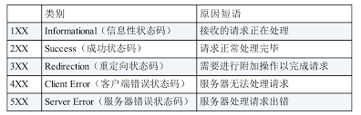

# HTTP状态码

- [1XX信息](#1xx%E4%BF%A1%E6%81%AF)
- [2XX 成功](#2xx-%E6%88%90%E5%8A%9F)
- [3XX 重定向](#3xx-%E9%87%8D%E5%AE%9A%E5%90%91)
- [4XX 客户端错误](#4xx-%E5%AE%A2%E6%88%B7%E7%AB%AF%E9%94%99%E8%AF%AF)
- [5XX 服务器错误](#5xx-%E6%9C%8D%E5%8A%A1%E5%99%A8%E9%94%99%E8%AF%AF)

---

常用14+3种状态码：

# 1XX信息

1. 100 Continue
   1. 表示目前为止一切正常, 客户端应该继续请求, 如果已完成请求则忽略. 
2. 101 Switching Protocols
   1. websocket用得到，从http升级到websocket
3. 102 processing
   1. 服务器已收到请求，但需要长时间处理（用于避免客户端超时）。如大文件上传/复杂计算时（较少见）      
4. 103 Early Hints
   1. 提前返回部分响应头\*\*，允许客户端预加载资源。如，服务器生成html完整响应前，先返回 `Link` 头预加载 CSS/JS   

* <code>103 Early Hints</code>\*\* 是服务端驱动的极速预加载\*\*，解决主文档等待期的资源加载瓶颈。  
* <code><link rel="prefetch"></code>\*\* 是客户端控制的辅助预取\*\*，适用于非关键或跨页面资源。  
* **两者层级和时机互补**：103 在协议层抢先加载，prefetch 在 HTML 层补充加载

# 2XX 成功

2XX 的响应结果表明请求被正常处理了。

1. **200 OK**
   1. 表示从客户端发来的请求再服务器端被正常处理了。
   2. 可以没有实体主体（HEAD）
2. **204 No Content**
   1. 请求已成功处理，但在返回的响应报文中不含实体的主体部分。
   2. 也不允许返回任何实体的主体。
   3. 比如返回**not-modified**，不更新当前页面
3. **206 Partial Content**
   1. 表示客户端进行了范围请求，而服务器成功执行了这部分的**GET**请求。
   2. 请求报文的请求首部字段中**Range**首部指定范围
   3. 响应报文的实体首部字段中包含由**Content-Range**指定范围的实体内容

流式 SSR 依赖分块传输（`chunked`）和 `200` 状态码实现，而 `206` 用于资源的部分请求。两者属于不同的 HTTP 交互模式，流式 SSR 本身不会使用 `206` 状态码。

# 3XX 重定向

3XX 响应结果表明浏览器**需要执行某些特殊的处理**以正确处理请求。

重定向地址放在响应首部字段的**Locatoin**字段中。

1. **300 Multiple Choice**(多种选择)
   1. 该请求有多种可能的响应,用户代理或者用户必须选择它们其中的一个。
2. **301 Moved Permanently**
   1. 永久性重定向。由于历史习惯，会将原始请求改为get
   2. 该状态码表示请求的资源已被**永久**分配了新的URI。
   3. 会被浏览器、代理/CDN 和搜索引擎缓存。**缓存时间**主要由源服务器在 301 响应中设置的 `Cache-Control` 或 `Expires` 头部决定
3. \*\*302 Found \*\*
   1. 临时性重定向。由于历史习惯，会将原始请求改为get。
   2. 该状态码表示请求的资源**本次**被分配了新的URI。
   3. 与301的区别在于：302状态码代表的资源**不是永久移动，只是临时性质**的。换句话说，已移动的资源对应的**URI将来还有可能发生改变**。
   4. 302=303+307？
4. **303 See Other**
   1. 临时性重定向。明确规定，会将原始请求改为get。
   2. 与302的区别在于：明确表示**客户端应当采用GET方法获取资源（无视原本的方法）**
   3. 也可以用302代替303，但303更合适.
   4. 当301、302、303响应状态码返回时，几乎所有浏览器都会把POST 改成 GET，并删除请求报文内的主体，之后请求会自动再次发送。**301、302标准是禁止将POST方法变成GET方法的，但实际使用时大家都会这么做。**
5. **304 Not Modified**
   1. 请求重定向到本地缓存。不包含任何主体部分。
   2. 该状态码表示，服务端资源未改变，可直接使用客户端未过期的缓存。
   3. 发生条件：客户端发送附带条件的请求，服务器端允许访问资源，但请求未满足条件。
   4. 附带条件的请求指：采用GET方法的请求报文中包含**If-Match，If-None-Match，If-Modified-Since， If-Unmodified-Since，If-Range**中的任一首部。
   5. 用于协商缓存
6. **307 Temporary Redirect**
   1. 类似302。临时重定向。明确规定，请求方法不得改变。
7. **308 Permanent Redirect**
   1. 类似301。临时重定向。明确规定，请求方法不得改变。

# 4XX 客户端错误

1. **400 Bad Request**
   1. 请求报文中存在语法错误
   2. 场景：
      1. 前端提交的字段名称或者字段类型和后台的实体类不一样
      2. 或者前端提交的参数跟后台需要的参数个数不一致，导致无法封装。
   3. 浏览器会像 200 OK 一样对待该状态码
2. **401 Unauthorized**
   1. 表示发送的请求需要有通过HTTP认证的认证信息。
   2. 若浏览器初次接收到401响应，会弹出认证用的对话窗口。若之前已进行过1次请求，则表示用户认证失败。
   3. 返回含有401的响应必须包含一个适用于被请求资源的 **WWW-Authenticate** 首部用以质询（challenge）用户信息。
3. **403 Forbidden**
   1. 对请求资源的访问被服务器拒绝了。
   2. 如果服务器想给出拒绝的详细理由，可以在实体的主体部分对原因进行描述。
4. **404 Not Found**
   1. 服务器上无法找到请求的资源。

# 5XX 服务器错误

1. **500 Internal Server Error**
   1. 服务器在执行请求时发生了错误。
   2. 也可能是Web应用存在的bug或某些临时的故障。
2. **502 Bad Gateway**
   1. 表示一台服务器在充当网关（gateway）或代理（proxy）时，从另一台上游服务器(upstream)接收无效响应。
   2. nginx 中经常遇到
3. **503 Service Unavailable**
   1. 服务器暂时处于超负载或正在进行停机维护，现在无法处理请求。
   2. 如果知道以上状况需要的时间，最好写入**Retry-After**首部字段返回给客户端。

> 更新: 2025-07-01 05:09:02  
> 原文: <https://www.yuque.com/viruspc/el3mi0/hquzl7>