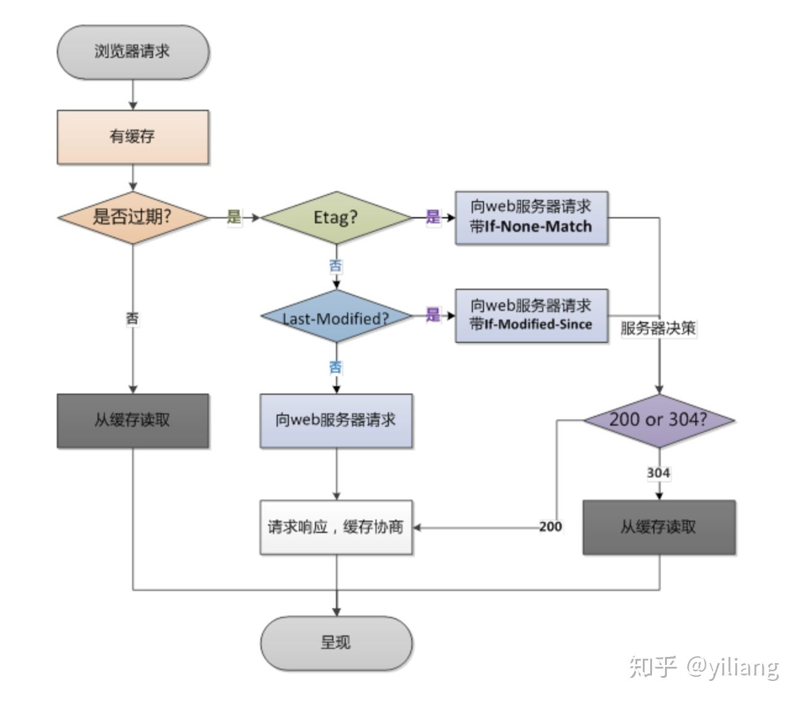
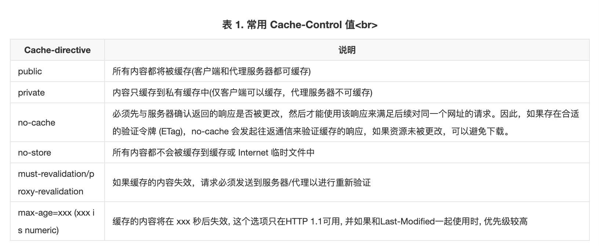

# HTTP缓存: 强缓存与协商缓存

- [报文](#%E6%8A%A5%E6%96%87)
- [概述](#%E6%A6%82%E8%BF%B0)
- [过程](#%E8%BF%87%E7%A8%8B1648659899343-78a5008a-9b43-426b-a5c1-45e5df129252pngimgh5sj0zv1fze3fytz1648659899343-78a5008a-9b43-426b-a5c1-45e5df129252-889595png)

---

# 报文
1. 响应报文相关字段：cache-control, expires, etag, last-modified
2. 请求报文相关字段（协商缓存相关）：if-match, if-non-match, if-modified-since, in-non-modified-since
3. 相关状态码: 强缓存返回200OK, 协商缓存需要经过服务器，返回200OK或304Not Modified

# 概述
1. 这里说的缓存是指浏览器（客户端）在本地磁盘中对访问过的资源保存的副本文件。
2. 缓存有两种，强缓存和协商缓存。先强缓存，强缓存未命中再协商缓存。
3. 强缓存是浏览器直接根据上次的响应报文头来判断资源是否有允许缓存和是否到期。协商缓存是，当强缓存未命中时，再传给服务器ETag或文件上次修改时间，来判断文件是否发生修改。
4. 浏览器在第一次请求后缓存资源，再次请求时，会进行下面两个步骤：
    1. 浏览器会获取该缓存资源的 header 中的信息，根据 response header 中的 expires 和 cache-control 来判断是否命中强缓存，如果命中则直接从缓存中获取资源。cache-control: 的max-age优先级大于expires
    2. 如果没有命中强缓存，浏览器就会发送请求到服务器，这次请求会带上 IF-Modified-Since 或者 IF-None-Match, 它们的值分别是第一次请求返回 Last-Modified或者 Etag，由服务器来对比这一对字段来判断是否命中。如果命中，则服务器返回 304 状态码，并且不会返回资源内容，浏览器会直接从缓存获取；否则服务器最终会返回资源的实际内容，并更新 header 中的相关缓存字段。
5. 强缓存是根据返回头中的 Expires 或者 Cache-Control 两个字段来控制的，都是表示资源的缓存有效时间。
6. 协商缓存是由服务器来确定缓存资源是否可用。 主要涉及到两对属性字段，都是成对出现的，即第一次请求的响应头带上某个字, Last-Modified 或者 Etag，则后续请求则会带上对应的请求字段 If-Modified-Since或者 If-None-Match，若响应头没有 Last-Modified 或者 Etag 字段，则请求头也不会有对应的字段。

# 过程

[https://www.zhihu.com/people/sa-dan-zhe-xue-86](https://www.zhihu.com/people/sa-dan-zhe-xue-86)

[https://blog.csdn.net/Scoful/article/details/123877869](https://blog.csdn.net/Scoful/article/details/123877869)

> 更新: 2022-09-16 01:39:53  
> 原文: <https://www.yuque.com/viruspc/el3mi0/in3sdg>