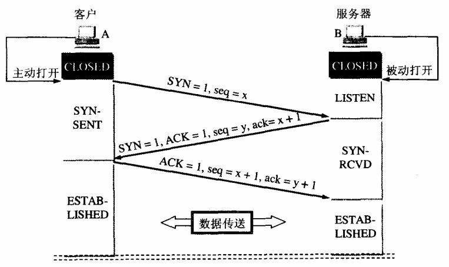
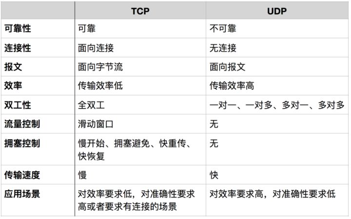
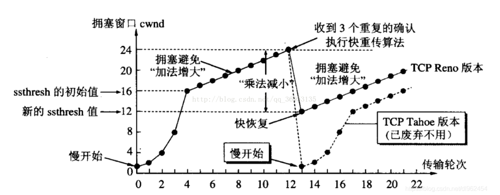
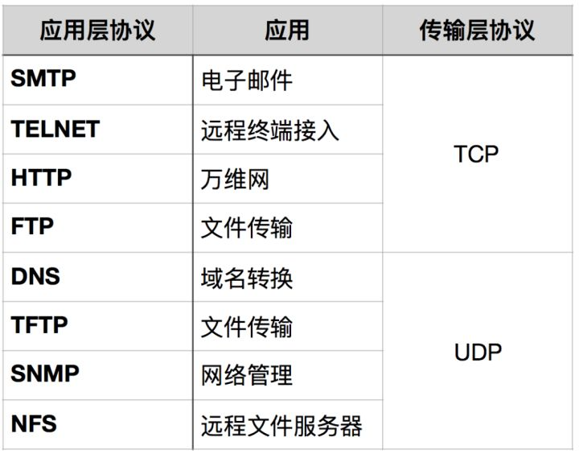

# TCP

- [三次握手](#%E4%B8%89%E6%AC%A1%E6%8F%A1%E6%89%8B)
- [TCP UDP](#tcp-udp)

---

## 三次握手

##

## TCP UDP

效率：从http的层级考虑，http1.1前，每次发送报文都要重新建立连接。1.1后有了持久连接和管线化。

Http 3 使用 quic 协议，结合了TCP的可靠性和UDP的低延迟特性，旨在提供更快、更可靠的网络传输。

| **机制** | **主要目标** | **触发条件** | **窗口调整** |
| --- | --- | --- | --- |
| **拥塞避免** | 温和增窗，避免拥塞 | 达到 `ssthresh` 后 | 每RTT线性增加1 MSS |
| **快重传** | 快速修复单包丢失 | 收到 **3个DupACK** | 立即重传数据包 |
| **快恢复** | 避免重传后吞吐量骤降 | 快重传触发后 | 窗口降至 `ssthresh` + 补偿值 |

假设cwnd原为10 MSS，ssthresh为30 MSS，发生丢包时 cwnd=40。发生丢包后：

快恢复：

ssthresh=cwnd/2=50\
cwnd = ssthresh + 3 \times MSS = 20 + 3 = 23 MSS\
数据传输：\
发送方重传丢失的报文段（占用1个MSS）。\
利用剩余的2个MSS发送新的数据段。\
5\. 后续操作

每收到重复ACK：cwnd增加1个MSS，继续发送新数据或重传其他可能丢失的报文段。\
收到新ACK：当收到确认新数据的ACK时，说明恢复过程进展顺利，退出快速恢复，进入拥塞避免阶段。

增加3个MSS的原因主要有以下几点：

1. 基于“数据包守恒”原则

TCP拥塞控制遵循“数据包守恒”原则，即网络中同时存在的数据包数量应保持相对稳定。收到三个重复ACK表明有三个“老”的数据包可能已经离开网络（被接收方接收，但ACK尚未到达发送方）。因此，发送方可以发送三个新的数据包来填补这些空缺。

> 更新: 2025-06-10 18:52:21  
> 原文: <https://www.yuque.com/viruspc/el3mi0/ldlpmy>