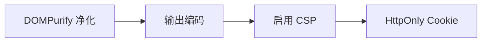

# DOM Purify

- [🛡️ **一、核心作用**](#%F0%9F%9B%A1%EF%B8%8F-%E4%B8%80%E6%A0%B8%E5%BF%83%E4%BD%9C%E7%94%A8)
- [🔧 **二、工作原理**](#%F0%9F%94%A7-%E4%BA%8C%E5%B7%A5%E4%BD%9C%E5%8E%9F%E7%90%86)
- [⚙️ **三、关键特性**](#%E2%9A%99%EF%B8%8F-%E4%B8%89%E5%85%B3%E9%94%AE%E7%89%B9%E6%80%A7)
- [🎯 **四、典型使用场景**](#%F0%9F%8E%AF-%E5%9B%9B%E5%85%B8%E5%9E%8B%E4%BD%BF%E7%94%A8%E5%9C%BA%E6%99%AF)
  * [1. **富文本编辑器内容输出**](#1-%E5%AF%8C%E6%96%87%E6%9C%AC%E7%BC%96%E8%BE%91%E5%99%A8%E5%86%85%E5%AE%B9%E8%BE%93%E5%87%BA)
  * [2. **动态渲染用户生成内容**](#2-%E5%8A%A8%E6%80%81%E6%B8%B2%E6%9F%93%E7%94%A8%E6%88%B7%E7%94%9F%E6%88%90%E5%86%85%E5%AE%B9)
  * [3. **防止 URL 重定向 XSS**](#3-%E9%98%B2%E6%AD%A2-url-%E9%87%8D%E5%AE%9A%E5%90%91-xss)
- [⚠️ **五、注意事项**](#%E2%9A%A0%EF%B8%8F-%E4%BA%94%E6%B3%A8%E6%84%8F%E4%BA%8B%E9%A1%B9)
  * [1. **必须正确配置**](#1-%E5%BF%85%E9%A1%BB%E6%AD%A3%E7%A1%AE%E9%85%8D%E7%BD%AE)
  * [2. **不能替代其他防护**](#2-%E4%B8%8D%E8%83%BD%E6%9B%BF%E4%BB%A3%E5%85%B6%E4%BB%96%E9%98%B2%E6%8A%A4)
  * [3. **特殊内容需额外处理**](#3-%E7%89%B9%E6%AE%8A%E5%86%85%E5%AE%B9%E9%9C%80%E9%A2%9D%E5%A4%96%E5%A4%84%E7%90%86)
- [📦 **六、安装使用**](#%F0%9F%93%A6-%E5%85%AD%E5%AE%89%E8%A3%85%E4%BD%BF%E7%94%A8)
  * [1. 安装](#1-%E5%AE%89%E8%A3%85)
  * [2. 基础用法](#2-%E5%9F%BA%E7%A1%80%E7%94%A8%E6%B3%95)
- [💎 **总结**](#%F0%9F%92%8E-%E6%80%BB%E7%BB%93)

---

**DOMPurify 是一款专门防御 XSS 攻击的轻量级 JavaScript 库**，它通过对 HTML/Markup 进行**安全净化（Sanitization）**，在保留安全内容的同时彻底移除恶意代码。以下是其核心解析：

***

### 🛡️ **一、核心作用**

```javascript
// 输入：含恶意脚本的脏 HTML
const dirty = `<b>合法文本</b>`;

// 净化处理
const clean = DOMPurify.sanitize(dirty); 

// 输出：移除危险属性后的安全 HTML
console.log(clean); // <b>合法文本</b>

```

***

### 🔧 **二、工作原理**

1. **解析 HTML**\
   将输入字符串转换为内存中的 DOM 树（不渲染到页面）。
2. **遍历所有节点**\
   检查每个**标签、属性、事件处理器**等。
3. **白名单过滤**\
   只保留预定义的合法元素（默认允许 `<b>`, `<i>`, `<a href>` 等基础标签）。
4. **危险内容删除**\
   自动移除：
   * 所有 JavaScript 事件处理器（`onerror`, `onclick`...）
   * 危险标签（`<script>`, `<iframe>`, `<object>`...）
   * 高风险属性（`href="javascript:..."`, `style` 中的表达式）

***

### ⚙️ **三、关键特性**

| **特性** | **说明** |
| --- | --- |
| **零依赖** | 纯 JS 实现，不依赖任何框架（仅 10KB） |
| **配置灵活** | 可自定义白名单/黑名单 |
| **兼容性强** | 支持 HTML5/SVG/MathML 及各种浏览器（含 IE9+） |
| **安全沙箱** | 在虚拟 DOM 中操作，避免真实页面被污染 |
| **防绕过设计** | 持续更新对抗新型 XSS 向量（如 `<<script>/script>` 变种） |

***

### 🎯 **四、典型使用场景**

#### 1. **富文本编辑器内容输出**

```javascript
// 用户提交的富文本内容
const userContent = `<p>Hello! </p>`;

// 安全渲染到页面
element.innerHTML = DOMPurify.sanitize(userContent); 
// 输出：<p>Hello! </p> （移除 onload）
```

#### 2. **动态渲染用户生成内容**

```javascript
// 从数据库加载评论
comments.forEach(comment => {
  const safeHtml = DOMPurify.sanitize(comment.text);
  renderComment(safeHtml); // 安全渲染
});
```

#### 3. **防止 URL 重定向 XSS**

```javascript
// 净化重定向目标
const redirectUrl = DOMPurify.sanitize(userInput, {
  ALLOWED_URI_REGEXP: /^(https?|ftp):\/\/[^\s/$.?#].[^\s]*$/i // 只允许 HTTP(S)/FTP
});
location.href = redirectUrl; // 安全跳转
```

***

### ⚠️ **五、注意事项**

#### 1. **必须正确配置**

```javascript
// 错误：过度信任导致漏洞（允许 style 属性）
DOMPurify.sanitize(dirty, {ALLOWED_ATTR: ['style']}); 

// 正确：仅允许基础配置
DOMPurify.sanitize(dirty); // 使用默认安全配置
```

#### 2. **不能替代其他防护**

* **组合使用**：



#### 3. **特殊内容需额外处理**

* **SVG**：需显式开启配置 `{USE_PROFILES: {svg: true}}`
* **自定义标签**：需手动添加白名单 `{ADD_TAGS: ['custom-tag']}`

***

### 📦 **六、安装使用**

#### 1. 安装

```bash
npm install dompurify  # 或直接引入 CDN
```

#### 2. 基础用法

```javascript
import DOMPurify from 'dompurify';

const clean = DOMPurify.sanitize(dirtyHTML, {
  ALLOWED_TAGS: ['b', 'i', 'a'],  // 白名单标签
  ALLOWED_ATTR: ['href', 'title'] // 白名单属性
});

document.getElementById('target').innerHTML = clean;
```

***

### 💎 **总结**

**DOMPurify 是前端防御 XSS 的「最后一道防线」**，尤其适用于必须渲染 HTML 的场景。其价值在于：

1. **精准平衡**：保留合法格式，移除危险代码
2. **持续进化**：紧跟浏览器安全特性更新
3. **工业级可靠**：被 React、Angular 等框架推荐，GitHub 超 **12k+ Star**

> 📌 **黄金法则**：\
> **任何来自用户/第三方的 HTML 内容，在渲染前必须通过 DOMPurify！**


> 更新: 2025-06-07 17:14:51  
> 原文: <https://www.yuque.com/viruspc/el3mi0/ygium9pkoptkh1nl>