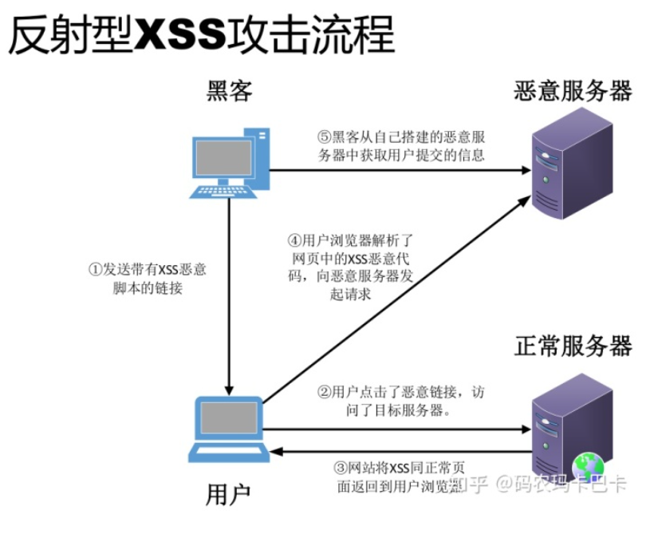
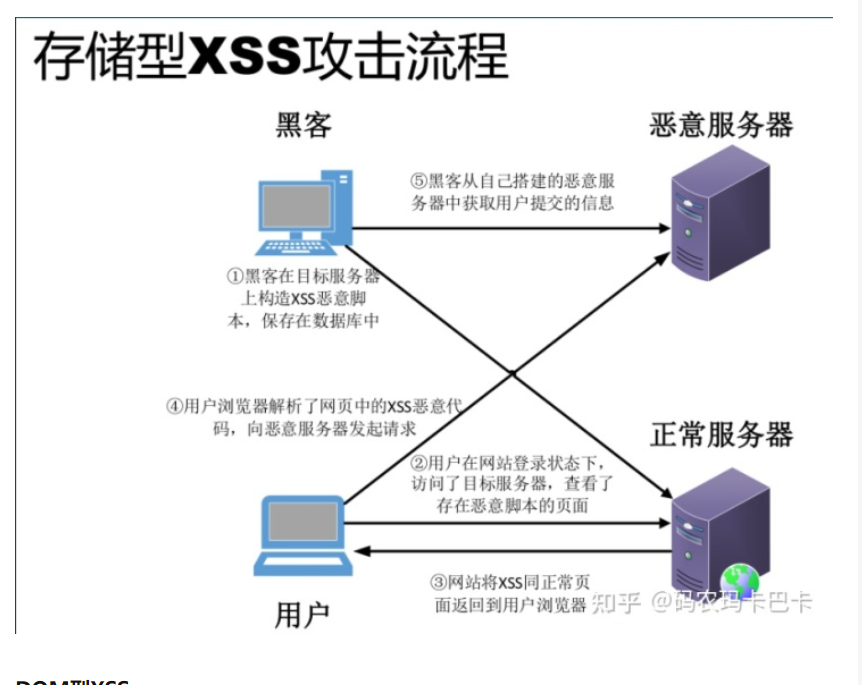

# XSS

- [安全](#%E5%AE%89%E5%85%A8)
  * [XSS 漏洞](#xss-%E6%BC%8F%E6%B4%9E)
  * [本质](#%E6%9C%AC%E8%B4%A8)
  * [攻击示例(可攻击的点)](#%E6%94%BB%E5%87%BB%E7%A4%BA%E4%BE%8B%E5%8F%AF%E6%94%BB%E5%87%BB%E7%9A%84%E7%82%B9)
  * [攻击方式分类](#%E6%94%BB%E5%87%BB%E6%96%B9%E5%BC%8F%E5%88%86%E7%B1%BB)
  * [防范方法](#%E9%98%B2%E8%8C%83%E6%96%B9%E6%B3%95)

---

# 安全
## XSS 漏洞
什么是XSS漏洞? Cross Site Scripting, (避免与CSS混淆) 跨站脚本攻击是指**向Web页面注入恶意脚本代码. **当用户浏览该页时, 嵌入其中的脚本代码会被执行, 从而达到恶意攻击用户的目的

## 本质

不可信数据输出 = 

  上下文感知编码 × 

  消毒（富文本场景） × 

  CSP强制拦截 × 

  HttpOnly Cookie（减少损失）

**关键认知**：  
**XSS 不是漏洞，而是设计缺陷** —— 任何将用户输入与代码执行混用的系统都必然被攻破。  
防御核心在于：**让数据永远只是数据，而非可执行的代码**。

## 攻击示例(可攻击的点) 
重定向参数，html标签属性，事件，

 React中的XSS   

a. angerouslySetInnerHTML、onload=字符串、href=字符串 等，都有可能造成 XSS 漏洞。 

XSS 有哪些注入的方法(根据网站特性利用上面说的三类攻击方式来注入)：   

1. 在 HTML 中内嵌的文本中，恶意内容以 script 标签形成注入。  

2. 在内联的 JavaScript 中，拼接的数据突破了原本的限制（字符串，变量，方法名等）。

  3. 在标签属性中，恶意内容包含引号，从而突破属性值的限制，注入其他属性或者标签。  

4. 在标签的 href、src 等属性中，包含 javascript: 等可执行代码。

  5. 在 onload、onerror、onclick 等事件中，注入不受控制代码。 

6.  在 style 属性和标签中，包含类似 background-image:url("javascript:..."); 的代码（新版本浏览器已经可以防范）。  

7. 在 style 属性和标签中，包含类似 expression(...) 的 CSS 表达式代码（新版本浏览器已经可以防范）。 

## 攻击方式分类
XSS攻击分为三种，反射型XSS、存储型XSS、DOM Based XSS.

1.反射性XSS(非持久性)

　　把XSS的Payload写在 **URLURL(用户输入相关参数，负责重定向的参数)**中，通过浏览器直接“反射”给用户。用户将一段含有恶意代码的请求提交给 Web 服务器，Web 服务器接收到请求时，又将恶意代码反射给了浏览器端，(然后再重定向到恶意服务器

这种攻击方式通常需要诱使用户点击某个**特定**恶意链接，才能攻击成功。(href=字符串)

直接利用重定向参数，需要先找出网站中用于重定向的参数。结局方案:禁止重定向参数的值以第一个非空单词为javascript。更好的做法是设置白名单。

利用用户输入相关参数，比如搜索栏展现用户搜索的关键字，关键字是一个参数，需要将它插入页面搜索框的位置，此时就可以插入script标签。解决方案: encode(转义) 

| 字符 | 转义后的字符 |
| --- | --- |
| & | & |
| < | < |
| > | > |
| " | " |
| ' | ' |
| / | / |

HTML 转义是非常复杂的，在不同的情况下要采用不同的转义规则。如果采用了错误的转义规则，很有可能会埋下 XSS 隐患。 应当尽量避免自己写转义库，而应当采用成熟的、业界通用的转义库。

2.存储型XSS(持久性)

　　又被称为持久性XSS,会把黑客输入的恶意脚本存储在服务器的数据库中。当其他用户浏览页面包含这个恶意脚本的页面，用户将会受到黑客的攻击。

一个常见的场景就是黑客写下一篇包含恶意JavaScript脚本的博客文章，当其他用户浏览这篇文章时，恶意的JavaScript代码将会执行

(a 的 href属性可以放脚本，所以react建议用inClick替代href), dangerousInnerHTML

3.DOM Based XSS(服务器无关) (dangerousSetInnerHTML)

　　利用后端代码的漏洞。

它的特点是在 Web 资源传输过程或者在用户使用页面的过程中修改 Web 页面的数据.

利用步骤和反射型很类似，但是唯一的区别就是，构造的URL参数不用发送到服务器端，可以达到绕过WAF、躲避服务端的检测效果。(也可以藏到url参数里, 提交表单参数)

"#"页内跳转既能让JS读取到该参数，又不让该参数传入到服务器

### 
## 防范方法

核心是禁止

总结以下原则减少漏洞（恶意脚本执行）的产生： 

1. **利用模板引擎**开启模板引擎自带的 HTML 转义功能。例如： 在 ejs 中，尽量使用 <%= data %> 而不是 <%- data %>； 在 doT.js 中，尽量使用 {{! data } 而不是 {{= data }； 在 FreeMarker 中，确保引擎版本高于 2.3.24，并且选择正确的 freemarker.core.OutputFormat。 
2. **避免内联事件** 尽量不要使用 onLoad="onload('{{data}}')"、onClick="go('{{action}}')" 这种拼接内联事件的写法。在 JavaScript 中通过 .addEventlistener() 事件绑定会更安全。
3.  **避免拼接 HTML** 前端采用拼接 HTML 的方法比较危险，如果框架允许，使用 createElement、setAttribute 之类的方法实现。或者采用比较成熟的渲染框架，如 Vue/React 等。 
4. **时刻保持警惕** 在插入位置为 DOM 属性、链接等位置时，要打起精神，严加防范。
5.  **增加攻击难度**，降低攻击后果 通过 DOM Purify、CSP、输入长度配置、接口安全措施等方法，增加攻击的难度，降低攻击的后果。 
6. **主动检测和发现** 可使用 XSS 攻击字符串和自动扫描工具寻找潜在的 XSS 漏洞。

> 更新: 2025-06-07 17:26:30  
> 原文: <https://www.yuque.com/viruspc/el3mi0/vgcxge>