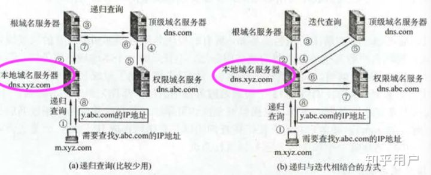

# 从输入URL到页面渲染

- [DNS](#dns)

---

# 

# DNS

+ 1、浏览器的地址栏输入URL并按下回车。
+ 2、浏览器查找当前URL是否存在缓存，并比较缓存是否过期。
+ 3、DNS解析URL对应的IP。
    - 本地DNS缓存=>本地域名服务器 =>根域名服务器 =>顶级域名服务器 -> 权限域名服务器
+ 4、根据IP建立TCP连接（三次握手）。
+ 5、HTTP发起请求。
+ 6、服务器处理请求，浏览器接收HTTP响应。
+ 7、渲染页面，构建DOM树。
+ 8、关闭TCP连接（四次挥手）。

  
 

> 更新: 2022-03-09 07:23:17  
> 原文: <https://www.yuque.com/viruspc/el3mi0/mfe6eh>