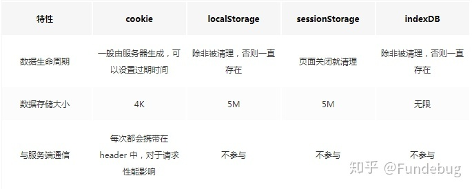

# IndexedDB

- [是什么](#%E6%98%AF%E4%BB%80%E4%B9%88)
- [特点](#%E7%89%B9%E7%82%B9)
- [indexedDB vs Cookie vs WebStorage](#indexeddb-vs-cookie-vs-webstorage)
  * [**1. 需要存储大量结构化数据**](#1-%E9%9C%80%E8%A6%81%E5%AD%98%E5%82%A8%E5%A4%A7%E9%87%8F%E7%BB%93%E6%9E%84%E5%8C%96%E6%95%B0%E6%8D%AE)
  * [**2. 高效查询与索引需求**](#2-%E9%AB%98%E6%95%88%E6%9F%A5%E8%AF%A2%E4%B8%8E%E7%B4%A2%E5%BC%95%E9%9C%80%E6%B1%82)
  * [**3. 离线优先或断网可用性**](#3-%E7%A6%BB%E7%BA%BF%E4%BC%98%E5%85%88%E6%88%96%E6%96%AD%E7%BD%91%E5%8F%AF%E7%94%A8%E6%80%A7)
  * [**4. 事务支持与数据一致性**](#4-%E4%BA%8B%E5%8A%A1%E6%94%AF%E6%8C%81%E4%B8%8E%E6%95%B0%E6%8D%AE%E4%B8%80%E8%87%B4%E6%80%A7)
  * [**5. 处理二进制或大型文件**](#5-%E5%A4%84%E7%90%86%E4%BA%8C%E8%BF%9B%E5%88%B6%E6%88%96%E5%A4%A7%E5%9E%8B%E6%96%87%E4%BB%B6)
  * [**6. 复杂客户端应用状态管理**](#6-%E5%A4%8D%E6%9D%82%E5%AE%A2%E6%88%B7%E7%AB%AF%E5%BA%94%E7%94%A8%E7%8A%B6%E6%80%81%E7%AE%A1%E7%90%86)
  * [**7. 替代服务器频繁请求**](#7-%E6%9B%BF%E4%BB%A3%E6%9C%8D%E5%8A%A1%E5%99%A8%E9%A2%91%E7%B9%81%E8%AF%B7%E6%B1%82)
  * [**何时不宜使用 IndexedDB**](#%E4%BD%95%E6%97%B6%E4%B8%8D%E5%AE%9C%E4%BD%BF%E7%94%A8-indexeddb)
  * [**技术选型对比**](#%E6%8A%80%E6%9C%AF%E9%80%89%E5%9E%8B%E5%AF%B9%E6%AF%94)
  * [**实际开发建议**](#%E5%AE%9E%E9%99%85%E5%BC%80%E5%8F%91%E5%BB%BA%E8%AE%AE)
  * [**示例代码（使用原生API）**](#%E7%A4%BA%E4%BE%8B%E4%BB%A3%E7%A0%81%E4%BD%BF%E7%94%A8%E5%8E%9F%E7%94%9Fapi)

---

## 是什么

Web Storage 是对 Cookie 的拓展，它只能用于存储少量的简单数据。当遇到大规模的、结构复杂的数据时，Web Storage 也爱莫能助了。这时候就需要IndexedDB！

## 特点

IndexedDB 具有以下特点。

还是key value存储方式，还是受同源策略限制。但是存储空间更大，更像数据库支持事务、可以直接存储图片等二进制文件（避免转base64带来的 33%的体积膨胀）。由于更大，为了避免阻塞需要异步

* 储存空间：IndexedDB最大的优势。存储空间相比localStorage要大得多，一般来说不少于250MB。
* key/value的存储方式：IndexedDB和localStorage的存储方式很类似，都是通过一个key对应一个value，而且key是唯一的方式进行存储的，但是indexedDB和localStorage有很不一样的一点，就是可以直接存储对象数组等，不需要想localStorage那样必须转为字符串。
* 支持二进制：IndexedDB不但可以存储对象，字符串等，还可以存储二进制数据（blob，arraybuffer等）。
* 同源限制：IndexedDB和localStorage一样，都是有同源策略的问题，不能跨协议、端口、域名使用。
* 异步调用：IndexedDB是使用异步调用的，当我们存储一个较大的数据时，不会因为写入数据慢而导致页面阻塞。
* 支持事务：IndexedDB支持事务，如果有用过mysql和mongoDB的人就很清楚了，能确保我们多个操作只要其中一步出现问题，可以整体回滚。

## indexedDB vs Cookie vs WebStorage

* Cookie 的本职工作并非本地存储，而是“维持状态”
* Web Storage 是 HTML5 专门为浏览器存储而提供的数据存储机制，不与服务端发生通信
* IndexedDB 用于客户端存储大量结构



***

**适合使用 IndexedDB 的场景及详细说明**

IndexedDB 是浏览器提供的一种客户端数据库，适合处理复杂、结构化且量大的数据存储需求。以下为适用场景及具体示例：

***

### **1. 需要存储大量结构化数据**

* **场景**：应用需存储远超 LocalStorage 容量（通常 5-10MB）的数据，如文档、用户生成内容或缓存资源。
  * **示例**：
    * 离线地图应用缓存多个区域的地图数据（包括矢量图、标注等）。
    * 电子书阅读器存储数百本书籍内容及用户笔记。

***

### **2. 高效查询与索引需求**

* **场景**：需通过多个字段快速检索数据，或对数据进行复杂查询。
  * **示例**：
    * 邮件客户端支持按发件人、主题、日期等多条件搜索邮件。
    * 电商平台离线商品目录支持分类、价格区间过滤。

***

### **3. 离线优先或断网可用性**

* **场景**：应用需在无网络时正常使用，待联网后同步数据。
  * **示例**：
    * 项目管理工具（如Trello）允许离线编辑任务，恢复网络后自动同步。
    * 数据采集App在野外无信号时记录数据，后续批量上传。

***

### **4. 事务支持与数据一致性**

* **场景**：需确保多个操作（如转账、库存扣减）的原子性，避免部分失败导致数据不一致。
  * **示例**：
    * 财务类应用处理账户间的资金划转。
    * 游戏保存进度时同步更新角色状态、物品库存等多个数据点。

***

### **5. 处理二进制或大型文件**

* **场景**：存储图片、音视频文件或大型文档，避免频繁下载。
  * **示例**：
    * 图片编辑器缓存用户上传的高分辨率图片。
    * 音乐播放器离线存储用户下载的歌曲文件。

***

### **6. 复杂客户端应用状态管理**

* **场景**：单页应用（SPA）需持久化复杂状态（如多步骤表单草稿、用户偏好）。
  * **示例**：
    * 在线IDE保存用户的代码文件、编辑器设置及插件配置。
    * 数据分析工具缓存用户的数据集和处理参数。

***

### **7. 替代服务器频繁请求**

* **场景**：减少对后端的重复请求，通过本地缓存提升性能。
  * **示例**：
    * 新闻App缓存已加载的文章及评论，减少服务器负载。
    * 社交平台本地存储好友列表及历史消息，快速展示。

***

### **何时不宜使用 IndexedDB**

* **简单键值存储**：数据量小且结构简单时，优先使用 `LocalStorage` 或 `SessionStorage`。
* **旧浏览器兼容性**：需支持 IE10 以下或老旧移动浏览器时，考虑 `Web SQL`（已废弃）或服务端存储。
* **敏感数据存储**：如密码、支付信息，应避免客户端存储，改用服务器加密存储。

***

### **技术选型对比**

| **存储方案** | **适用场景** | **容量限制** | **查询能力** |
| --- | --- | --- | --- |
| **IndexedDB** | 大量结构化数据、离线应用、复杂事务 | 高（通常≥250MB） | 强（索引、游标） |
| **LocalStorage** | 简单键值对、小数据量 | 低（约5-10MB） | 无（仅键存取） |
| **Cookies** | 会话管理、服务端交互标识 | 极低（约4KB） | 无 |
| **Cache API** | HTTP响应缓存（PWA场景） | 依赖浏览器策略 | 按请求匹配 |

***

### **实际开发建议**

1. **使用封装库简化操作**：\
   如 `Dexie.js` 或 `localForage`，提供更友好的 Promise API 和事务管理。
2. **数据版本迁移**：\
   设计版本升级策略，处理数据库结构变更（通过 `IDBOpenDBRequest.onupgradeneeded`）。
3. **定期清理与备份**：\
   设置过期时间或LRU策略清理旧数据，重要数据同步至服务器。
4. **错误处理与回退**：\
   捕获事务错误，并在不支持 IndexedDB 时降级到其他存储方案。

***

### **示例代码（使用原生API）**

```javascript
// 打开或创建数据库
const request = indexedDB.open('MyDatabase', 1);

request.onupgradeneeded = (event) => {
  const db = event.target.result;
  // 创建对象存储空间（表）
  const store = db.createObjectStore('books', { keyPath: 'id' });
  // 创建索引
  store.createIndex('by_author', 'author', { unique: false });
};

request.onsuccess = (event) => {
  const db = event.target.result;
  const transaction = db.transaction('books', 'readwrite');
  const store = transaction.objectStore('books');
  
  // 添加数据
  store.add({ id: 1, title: 'JavaScript指南', author: 'Alice', year: 2023 });
  
  // 查询数据（通过索引）
  const index = store.index('by_author');
  const req = index.getAll('Alice');
  req.onsuccess = () => console.log(req.result);
};
```

***

**总结**：当应用需要处理大量结构化数据、支持离线操作或复杂查询时，IndexedDB 是最佳选择。合理设计数据模型并搭配封装库，可显著提升开发效率和用户体验。

[放弃localStorage,拥抱IndexedDB](https://zhuanlan.zhihu.com/p/95076534)

[深入了解浏览器存储：对比Cookie、Local/sessionStorage与IndexedDB](https://zhuanlan.zhihu.com/p/61704951)


> 更新: 2025-05-26 05:07:25  
> 原文: <https://www.yuque.com/viruspc/el3mi0/zgntwq>