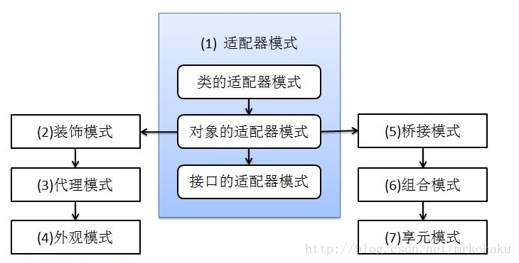
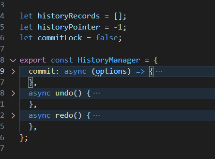
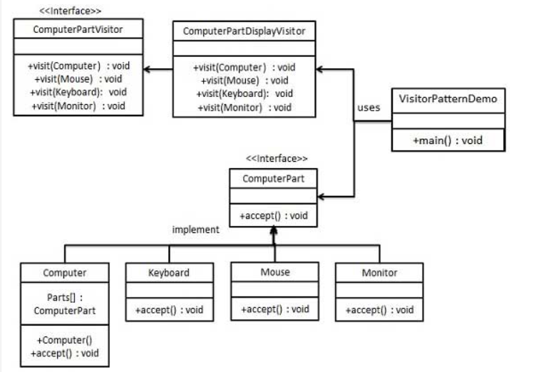

# 设计模式

- [设计模式](#%E8%AE%BE%E8%AE%A1%E6%A8%A1%E5%BC%8F)
- [创建型模式](#%E5%88%9B%E5%BB%BA%E5%9E%8B%E6%A8%A1%E5%BC%8F)
  * [单例模式](#%E5%8D%95%E4%BE%8B%E6%A8%A1%E5%BC%8F)
    + [为什么说单例模式是反模式](#%E4%B8%BA%E4%BB%80%E4%B9%88%E8%AF%B4%E5%8D%95%E4%BE%8B%E6%A8%A1%E5%BC%8F%E6%98%AF%E5%8F%8D%E6%A8%A1%E5%BC%8F)
  * [工厂模式](#%E5%B7%A5%E5%8E%82%E6%A8%A1%E5%BC%8F)
    + [简单工厂](#%E7%AE%80%E5%8D%95%E5%B7%A5%E5%8E%82)
    + [工厂方法](#%E5%B7%A5%E5%8E%82%E6%96%B9%E6%B3%95)
  * [抽象工厂模式](#%E6%8A%BD%E8%B1%A1%E5%B7%A5%E5%8E%82%E6%A8%A1%E5%BC%8F)
  * [建造者模式](#%E5%BB%BA%E9%80%A0%E8%80%85%E6%A8%A1%E5%BC%8F)
  * [原型模式](#%E5%8E%9F%E5%9E%8B%E6%A8%A1%E5%BC%8F)
    + [概念](#%E6%A6%82%E5%BF%B5)
    + [实现方法: 深拷贝与浅拷贝](#%E5%AE%9E%E7%8E%B0%E6%96%B9%E6%B3%95-%E6%B7%B1%E6%8B%B7%E8%B4%9D%E4%B8%8E%E6%B5%85%E6%8B%B7%E8%B4%9D)
    + [优点](#%E4%BC%98%E7%82%B9)
    + [缺点](#%E7%BC%BA%E7%82%B9)
    + [适用场景](#%E9%80%82%E7%94%A8%E5%9C%BA%E6%99%AF)
- [结构型模式](#%E7%BB%93%E6%9E%84%E5%9E%8B%E6%A8%A1%E5%BC%8F)
  * [Proxy, Decorator, Adapter and Bridge Patterns](#proxy-decorator-adapter-and-bridge-patterns)
  * [适配器模式](#%E9%80%82%E9%85%8D%E5%99%A8%E6%A8%A1%E5%BC%8F)
  * [装饰器模式](#%E8%A3%85%E9%A5%B0%E5%99%A8%E6%A8%A1%E5%BC%8F)
  * [代理模式](#%E4%BB%A3%E7%90%86%E6%A8%A1%E5%BC%8F)
  * [外观模式](#%E5%A4%96%E8%A7%82%E6%A8%A1%E5%BC%8F)
  * [桥接模式](#%E6%A1%A5%E6%8E%A5%E6%A8%A1%E5%BC%8F)
  * [组合模式](#%E7%BB%84%E5%90%88%E6%A8%A1%E5%BC%8F)
  * [享元模式](#%E4%BA%AB%E5%85%83%E6%A8%A1%E5%BC%8F)
- [行为型模式](#%E8%A1%8C%E4%B8%BA%E5%9E%8B%E6%A8%A1%E5%BC%8F)
  * [责任链模式](#%E8%B4%A3%E4%BB%BB%E9%93%BE%E6%A8%A1%E5%BC%8F)
  * [命令模式](#%E5%91%BD%E4%BB%A4%E6%A8%A1%E5%BC%8F)
    + [优点](#%E4%BC%98%E7%82%B9-1)
    + [适用环境](#%E9%80%82%E7%94%A8%E7%8E%AF%E5%A2%83)
    + [与其他模式的配合使用](#%E4%B8%8E%E5%85%B6%E4%BB%96%E6%A8%A1%E5%BC%8F%E7%9A%84%E9%85%8D%E5%90%88%E4%BD%BF%E7%94%A8)
  * [状态模式](#%E7%8A%B6%E6%80%81%E6%A8%A1%E5%BC%8F)
  * [模板模式](#%E6%A8%A1%E6%9D%BF%E6%A8%A1%E5%BC%8F)
  * [策略模式](#%E7%AD%96%E7%95%A5%E6%A8%A1%E5%BC%8F)
  * [观察者模式](#%E8%A7%82%E5%AF%9F%E8%80%85%E6%A8%A1%E5%BC%8F)
  * [备忘录模式](#%E5%A4%87%E5%BF%98%E5%BD%95%E6%A8%A1%E5%BC%8F)
  * [迭代器模式](#%E8%BF%AD%E4%BB%A3%E5%99%A8%E6%A8%A1%E5%BC%8F)
  * [中介者模式](#%E4%B8%AD%E4%BB%8B%E8%80%85%E6%A8%A1%E5%BC%8F)
  * [访问者模式](#%E8%AE%BF%E9%97%AE%E8%80%85%E6%A8%A1%E5%BC%8F)

---

# 设计模式


每个设计模式都应该由两部分组成：第一部分是应用场景，即这个模式可以解决哪类问题；第二部分是解决方案，即这个模式的设计思路和具体的代码实现。不过，代码实现并不是模式必须包含的。

实际上，设计模式之间的主要区别还是在于设计意图，也就是应用场景。单纯地看设计思路或者代码实现，有些模式确实很相似，比如策略模式和工厂模式。


# 创建型模式
## 单例模式
懒汉模式，饿汉模式


### 为什么说单例模式是反模式


1. 依赖注入

  与其创造实例，不如依赖注入。不方便单元测试。

2. 单一职责选择

  单例模式违背的单一原则： 单例类自己控制了自己的创建和生命周期。

3. 并发

  容易被锁


为什么说Singleton 模式现在成为了反模式（Anti-Pattern）？  https://blog.csdn.net/hintcnuie/article/details/53692679

https://zhuanlan.zhihu.com/p/345126462

## 工厂模式


Factroy要解决的问题是：希望能够创建一个对象，但**创建过程比较复杂**，希望对外隐藏这些细节。

请特别留意“创建过程比较复杂“这个条件。如果不复杂，用构造函数就够了。


### 简单工厂
##### 
### 工厂方法
<font style="color:rgb(18, 18, 18);">可以用if-else根据输入的不同来返回不同的实例。这种做法扩展性差，违背了开闭原则，也影响了可读性</font>

```java
public interface IKeyboardFactory {
    Keyboard getInstance();
}

public class HPKeyboardFactory implements IKeyboardFactory {
    @Override
    public Keyboard getInstance(){
        return new HPKeyboard();
    }
}

public class LenovoFactory implements IKeyboardFactory {
    @Override
    public Keyboard getInstance(){
        return new LenovoKeyboard();
    }
}
```

## 抽象工厂模式
工厂的工厂

+ 简单工厂：唯一工厂类，一个产品抽象类，工厂类的创建方法依据入参判断并创建具体产品对象。
+ 工厂方法：多个工厂类，一个产品抽象类，利用多态创建不同的产品对象，避免了大量的if-else判断。
+ 抽象工厂：多个工厂类，多个产品抽象类，产品子类分组，同一个工厂实现类创建同组中的不同产品，减少了工厂子类的数量。


## 建造者模式


意图：将一个复杂的构建与其表示相分离，使得同样的构建过程可以创建不同的表示。


主要解决：主要解决在软件系统中，有时候面临着"一个复杂对象"的创建工作，其通常由各个部分的子对象用一定的算法构成；由于需求的变化，这个复杂对象的各个部分经常面临着剧烈的变化，但是将它们组合在一起的算法却相对稳定。


应用实例:


1. 去肯德基，汉堡、可乐、薯条、炸鸡翅等是不变的，而其组合是经常变化的，生成出所谓的"套餐"。
2. StringBuilder


与工厂模式的区别：  
建造者模式更加关注与零件装配的顺序。


## 原型模式


### 概念


原型模式是创建型模式的一种。

简而言之，就是把一个已经创建的实例作为原型，通过复制该原型对象来创建一个和原型相同或相似的新对象。

如果对象的创建成本比较大，而同一个类的不同对象之间差别不大（大部分字段都相同），在这种情况下，我们可以利用对已有对象（原型）进行复制（或者叫拷贝）的方式，来**创建新对象**，以达到节省创建时间的目的。这种基于原型来创建对象的方式就叫作原型设计模式，简称原型模式。


### 实现方法: 深拷贝与浅拷贝


原型模式有两种实现方法，**深拷贝**和**浅拷贝**。浅拷贝只会复制对象中基本数据类型数据和引用对象的内存地址，不会递归地复制引用对象，以及引用对象的引用对象……而深拷贝得到的是一份完完全全独立的对象。所以，深拷贝比起浅拷贝来说，更加耗时，更加耗内存空间。

如果要拷贝的对象是不可变对象，浅拷贝共享不可变对象是没问题的，但对于可变对象来说，浅拷贝得到的对象和原始对象会共享部分数据，就有可能出现数据被修改的风险，也就变得复杂多了。

没有充分的理由，不要为了一点点的性能提升而使用浅拷贝。

JavaScript中可以使用JSON.stringify和JSON.parse来实现深拷贝(不含函数的情况下)，Java中可以使用序列化和反序列化来实现深拷贝。


### 优点


1. Prototype 模式允许动态增加或减少产品类。由于创建产品类实例的方法是产批类内部具有的，因此增加新产品对整个结构没有影响。
2. Prototype 模式提供了简化的创建结构。工厂方法模式常常需要有一个与产品类等级结构相同的等级结构，而Prototype 模式就不需要这样。
3. Portotype 模式具有给一个应用软件动态加载新功能的能力。由于Prototype 的独立性较高，可以很容易动态加载新功能而不影响老系统。
4. 产品类不需要非得有任何事先确定的等级结构，因为Prototype 模式适用于任何的等级结构。


### 缺点


每一个类必须配备一个克隆方法。而且这个克隆方法需要对类的功能进行通盘考虑，这对全新的类来说不是很难，但对已有的类进行改造时，不一定是件容易的事。


### 适用场景


1. 当一个系统应该独立于它的产品创建，构成和表示
2. 当要实例化的类是在运行时刻指定时，例如，通过动态装载
3. 为了避免创建一个与产品类层次平行的工厂类层次时
4. 当一个类的实例只能有几个不同状态组合中的一种时。建立相应数目的原型并克隆它们可能比每次用合适的状态手工实例化该类更方便一些  
JavaScript 是一种基于原型的面向对象编程语言。


# 结构型模式
## Proxy, Decorator, Adapter and Bridge Patterns


[https://www.baeldung.com/java-structural-design-patterns](https://www.baeldung.com/java-structural-design-patterns)


## 适配器模式
1. 类适配器: 继承+调用父类方法
2. 对象适配器: 实例化对象为成员变量，调用实例化对象方法
3. 接口适配器(缺省适配模式): 对于一个接口，可能有很多方法，我们只需要里面的一部分。可以新建一个适配器类/适配器抽象类实现全部接口/不需要的接口，方法体为空。然后需要的类继承适配器类，重写需要的方法。





java适配器模式之接口适配器 [https://blog.csdn.net/hujun_123456/article/details/80591021](https://blog.csdn.net/hujun_123456/article/details/80591021)

https://blog.csdn.net/firefile/article/details/90313967


## 装饰器模式
功能增强，redux中间件, Python decorator


## 代理模式
为其他对象提供一种代理以控制对这个对象的访问。在某些情况下，一个对象不适合或者不能直接引用另一个对象，而代理对象可以在客户端和目标对象之间起到中介的作用

和适配器模式不同的地方在于，代理提供的接口和原本的接口是一样的，代理模式的作用是不把实现直接暴露给client，而是通过代理这个层，代理能够做一些处理。

## 外观模式
定义了一个将子系统的一组接口集成在一起的高层接口, 以提供一个一致的界面. 


通过这个界面, 用户其他系统可以方便地调用子系统中的功能, 而忽略子系统内部发生的变化了.


## 桥接模式
将Abstrction与implementation 解耦合.


多个维度变化时, 拆分各个维度, 再用组合的方式结合到一起. 


与适配器相反. 适配器先有两端东西再有桥, 桥接现有桥再有两边东西


```java
/** 通过方法来注入依赖 **/
class Client {
    public static void main(string[] args){
        Brush b = new BigBrush();  // or Small
        b.setColor(new Red());  // or Green
        b.paint();
    }
}

/** 通过构造函数来注入依赖 **/
class Client2 {
    public static void main(string[] args){
        Brush b = new BigBrush(new Red());  // or Small + Green ...
        b.paint();
    }
}
```

## 组合模式
为组合中的对象声明接口, 在适当的情况下, 实现所有类共有接口的默认行为. 声明一个接口用于访问和管理组合模式的子部件.


组合模式依据树形结构来组合对象，用来表示部分以及整体层次。


将对象组合成树形结构以表示"部分-整体"的层次结构。组合模式使得用户对单个对象和组合对象的使用具有一致性。


## 享元模式
<font style="color:rgb(51, 51, 51);">主要用于减少创建对象的数量，以减少内存占用和提高性能。它提供了减少对象数量从而改善应用所需的对象结构的方式。</font>

<font style="color:rgb(51, 51, 51);"></font>

<font style="color:rgb(51, 51, 51);">运用共享技术有效地支持大量细粒度的对象。</font>

<font style="color:rgb(51, 51, 51);"></font>

<font style="color:rgb(51, 51, 51);">享元模式使用了单例模式。</font>

<font style="color:rgb(51, 51, 51);"></font>

何时使用： 1、系统中有大量对象。 2、这些对象消耗大量内存。 3、这些对象的状态大部分可以外部化。 4、这些对象可以按照内蕴状态分为很多组，当把外蕴对象从对象中剔除出来时，每一组对象都可以用一个对象来代替。 5、系统不依赖于这些对象身份，这些对象是不可分辨的。


如何解决：用唯一标识码判断，如果在内存中有，则返回这个唯一标识码所标识的对象。


关键代码：用 HashMap 存储这些对象。


应用实例： 1、JAVA 中的 String，如果有则返回，如果没有则创建一个字符串保存在字符串缓存池里面。 2、数据库的数据池。


```java
import java.util.HashMap;
 
public class ShapeFactory {
   private static final HashMap<String, Shape> circleMap = new HashMap<>();
 
   public static Shape getCircle(String color) {
      Circle circle = (Circle)circleMap.get(color);
 
      if(circle == null) {
         circle = new Circle(color);
         circleMap.put(color, circle);
         System.out.println("Creating circle of color : " + color);
      }
      return circle;
   }
}
```

<font style="color:rgb(51, 51, 51);"></font>

# 行为型模式
## 责任链模式
击鼓传花


## 命令模式


命令模式把一个请求的所有信息封装为一个独立的对象，从而使你可以将命令作为参数传递给方法。使用它可以对请求排队或记录请求日志，还支持可撤消的操作。

为了把客户端和接收端解耦合，命令模式需要一个命令队列，如果需要undo还需要命令栈来保存执行过的命令。

在大部分编程语言中，函数没法儿作为参数传递给其他函数，也没法儿赋值给变量。借助命令模式，我们可以将函数封装成对象。如果只需要执行需要undo之类的功能的话，js 可以直接用回调函数？

undo需要命令本身支持undo


```java
public class Client{
    public static void main(String[] args){
        Receiver receiver = new Receiver();
        Command commandOne = new CommandOne(receiver);
        Command commandTwo = new CommandTwo(receiver);
        Invoker invoker = new Invoker();
        invoker.addCommand(commandOne);
        invoker.addCommand(commandTwo);
        invoker.execute();
    }
}

public class Receiver{
    public Receiver(){
    //
    }
    public void actionOne(){
    	System.out.println("ActionOne h as b een t aken.");
    }
    public void actionTwo(){
    	System.out.println("ActionTwo h as b een t aken.");
    }
    public void undoActionOne(){}
    public void undoActionTwo(){}
}

public interface Command{
    execute();
    undo();
}
public class CommandOne implements Command{
    Receiver receiver;
    public CommandOne(Receiver receiver){
    	this.receiver = receiver;
    }
    public execute(){
    	this.receiver.actionOne();
    }
    public undo(){
    	this.receiver.actionTwo();
    }
}
class Invoker{
    Queue queue = new Queue();
    Stack stack = new Stack();
    addCommand(Command command){
    	queue.enqueue(command)
    }
    execute(){}
    redo(){}
}
```




### 优点


1. 命令模式将调用操作的请求对象与知道如何实现该操作的接收对象解耦。
2. 具体命令角色可以被不同的请求者角色重用。
3. 你可将多个命令装配成一个复合命令。
4. 增加新的具体命令角色很容易，因为这无需改变已有的类。”


### 适用环境


1. 需要抽象出待执行的动作，然后以参数的形式提供出来——类似于过程设计中的回调机制。而命令模式正是回调机制的一个面向对象的替代品。
2. 在不同的时刻指定、排列和执行请求。一个命令对象可以有与初始请求无关的生存期。
3. 需要支持取消操作。
4. 支持修改日志功能。这样当系统崩溃时，这些修改可以被重做一遍。
5. 需要支持事务操作。


### 与其他模式的配合使用


1. 看上边的Invoker的实现是否很像代理模式呢，Invoker的这种实现其实就是一种代理模式。
2. 需求：有个固定命令组合会多次被执行。解决：加入合成模式，实现方法如下，定义一个宏命令类。
3. 需求：须要redo  undo解决：加入备忘录模式
4. 需求：命令很多类似的地方解决：使用原型模式，利用clone

## 状态模式


主要解决：对象的行为依赖于它的状态（属性），并且可以根据它的状态改变而改变它的相关行为。


状态模式一般用来实现状态机，而状态机常用在游戏、工作流引擎等系统开发中。状态机又叫有限状态机，它由3个部分组成：状态、事件、动作。其中，事件也称为转移条件。事件触发状态的转移及动作的执行。不过，动作不是必须的，也可能只转移状态，不执行任何动作。  


针对状态机，我们总结了三种实现方式。 

+ 第一种实现方式叫**分支逻辑法**。利用if-else或者switch-case分支逻辑，参照状态转移图，将每一个状态转移原模原样地直译成代码。对于简单的状态机来说，这种实现方式最简单、最直接，是首选。  
+ 第二种实现方式叫**查表法**。对于状态很多、状态转移比较复杂的状态机来说，查表法比较合适。通过二维数组来表示状态转移图，能极大地提高代码的可读性和可维护性。  
+ 第三种实现方式就是利用**状态模式**。对于状态并不多、状态转移也比较简单，但事件触发执行的动作包含的业务逻辑可能比较复杂的状态机来说，我们首选这种实现方式。

## 模板模式


定义一个操作中的算法的骨架，而将一些步骤延迟到子类中。模板方法使得子类可以不改变一个算法的结构即可重定义该算法的某些特定步骤。


常见使用方式: 定义一个抽象类, 在里面定义一些普通方法和抽象方法 , 普通方法子类通用, 抽象方法各个子类自己实现.


将通用代码抽出来放到模板里, 避免在每个类中重复定义. 关键代码在抽象类实现，其他步骤在子类实现。


## 策略模式


主要解决：在有多种算法相似的情况下，使用 if...else 所带来的复杂和难以维护。


在策略模式（Strategy Pattern）中，一个类的行为或其算法可以在运行时更改。


在策略模式中，我们创建表示各种策略的对象和一个行为随着策略对象改变而改变的 context 对象。策略对象改变 context 对象的执行算法。


依赖注入, 一个context, 根据注入策略对象的不同, 采用不同策略(方法).


策略模式 vs 模板模式: [https://stackoverflow.com/questions/669271/what-is-the-difference-between-the-template-method-and-the-strategy-patterns](https://stackoverflow.com/questions/669271/what-is-the-difference-between-the-template-method-and-the-strategy-patterns)


## 观察者模式
拉和推两种


## 备忘录模式
备忘录模式（Memento Pattern）保存一个对象的某个状态，以便在适当的时候恢复对象。


Memento 是一个用于保存状态的普通对象, 可以在初始化时设置state和getState.

Originator 是状态发生变化的对象. 它有方法可以 1. 将自己的当前状态(需要保存的属性)放到Memento中暂存. 2. 利用某个Memento中恢复状态.


下面代码中的CareTaker还用到了命令模式.

```java
public class MementoPatternDemo {
   public static void main(String[] args) {
      Originator originator = new Originator();
      CareTaker careTaker = new CareTaker();
      originator.setState("State #1");
      originator.setState("State #2");
      careTaker.add(originator.saveStateToMemento());
      originator.setState("State #3");
      careTaker.add(originator.saveStateToMemento());
      originator.setState("State #4");
 
      System.out.println("Current State: " + originator.getState());    
      originator.getStateFromMemento(careTaker.get(0));
      System.out.println("First saved State: " + originator.getState());
      originator.getStateFromMemento(careTaker.get(1));
      System.out.println("Second saved State: " + originator.getState());
   }
}
```

## 迭代器模式


提供一种方法顺序访问一个聚合对象中各个元素, 而又无须暴露该对象的内部表示。

```java
public interface Iterator {
   public boolean hasNext();
   public Object next();
}
```

js iterator:

```typescript
interface Iterator{
  next: () => {
    done: boolean;
    value: any;
  };
}
```


## 中介者模式
中介者模式和外观模式都是迪米特法则的应用. 降低类和类之间的耦合.


优点： 1、降低了类的复杂度，将一对多转化成了一对一。 2、各个类之间的解耦。 3、符合迪米特原则。


缺点：中介者会庞大，变得复杂难以维护。


使用场景： 1、系统中对象之间存在比较复杂的引用关系，导致它们之间的依赖关系结构混乱而且难以复用该对象。 2、想通过一个中间类来封装多个类中的行为，而又不想生成太多的子类。


将**网状结构分离为星型结构**


优点

+ 减少类间依赖，降低了耦合
+ 符合迪米特原则


缺点

+ 中介者会膨胀的很大，而且逻辑复杂


```java
public class Client {

    public static void main(String[] args) {
        
        UnitedNationsSecurityCouncil UNSC = new UnitedNationsSecurityCouncil();
        
        USA usa = new USA(UNSC);
        Iraq iraq = new Iraq(UNSC);
        
        UNSC.setUsa(usa);
        UNSC.setIraq(iraq);
        
        usa.declare("不准研制核武器");
        iraq.declare("我们没有核武器");
    }

}
```

## 访问者模式
元素的执行算法可以随着访问者改变而改变。 具体算法都在访问者里, 不同访问者执行不同算法.


优点： 1、符合单一职责原则。 2、优秀的扩展性。 3、灵活性。


缺点： 1、具体元素对访问者公布细节，违反了迪米特原则。 2、具体元素变更比较困难。 3、违反了依赖倒置原则，依赖了具体类，没有依赖抽象。




[https://www.zhihu.com/question/27125796/answer/1615074467](https://www.zhihu.com/question/27125796/answer/1615074467)

[https://www.cnblogs.com/alsf/p/8506912.html](https://www.cnblogs.com/alsf/p/8506912.html)

[https://refactoring.guru/design-patterns](https://refactoring.guru/design-patterns)

[https://www.runoob.com/design-pattern/design-pattern-tutorial.html](https://www.runoob.com/design-pattern/design-pattern-tutorial.html)


> 更新: 2022-03-08 11:47:39  
> 原文: <https://www.yuque.com/viruspc/el3mi0/fzv0sp>