# 一些观点

- [均线](#%E5%9D%87%E7%BA%BF)
- [MACD](#macd)
- [ATR](#atr)
- [价格行为](#%E4%BB%B7%E6%A0%BC%E8%A1%8C%E4%B8%BA)

---

### 均线
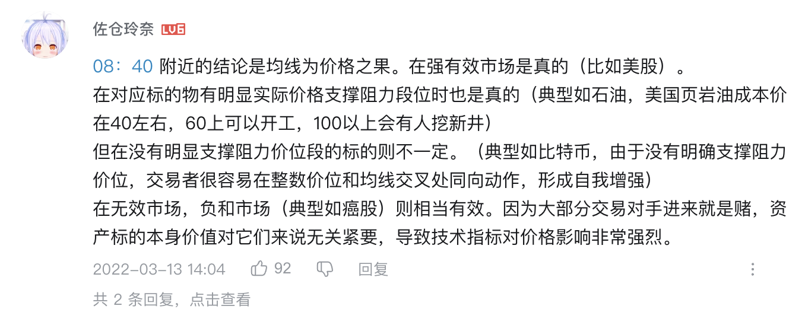

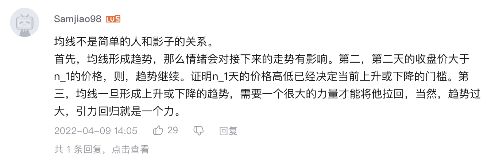

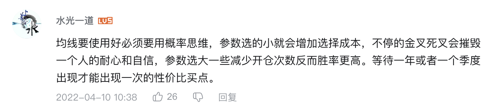

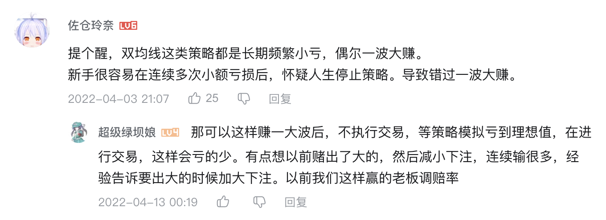

### MACD
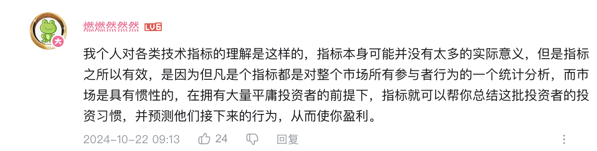

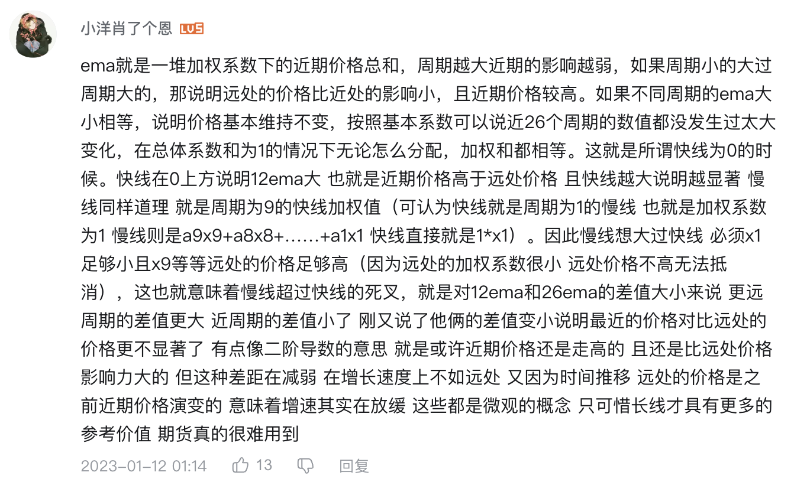

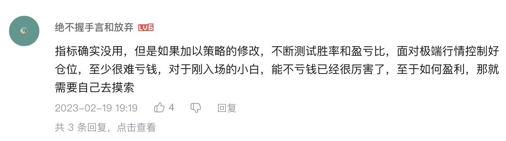

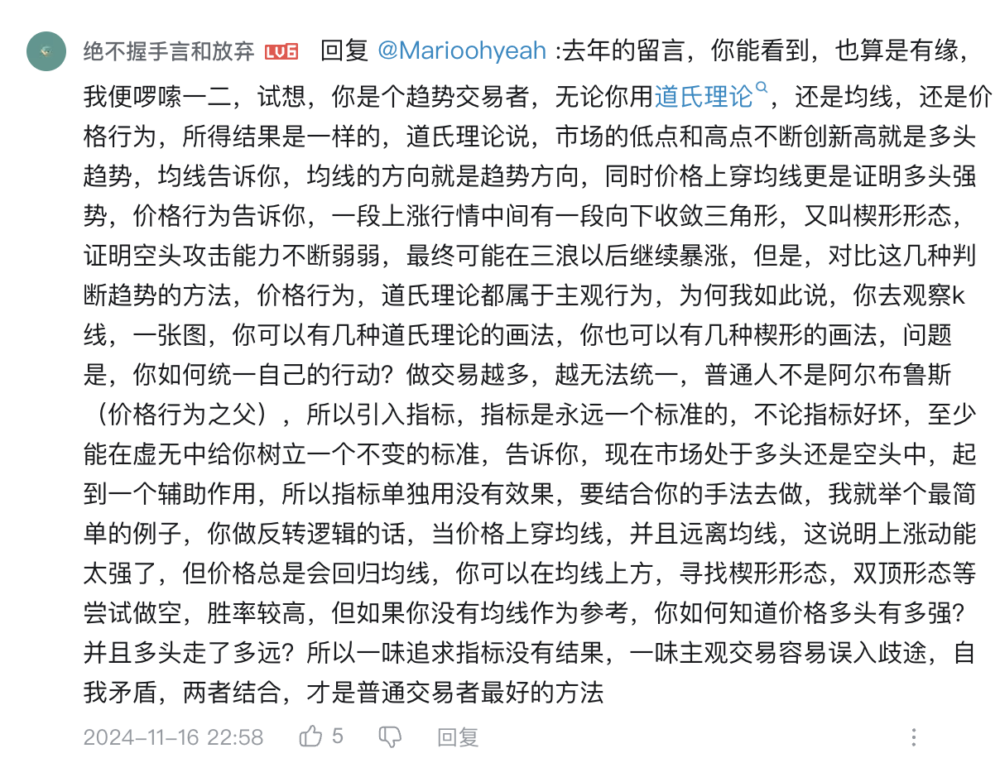

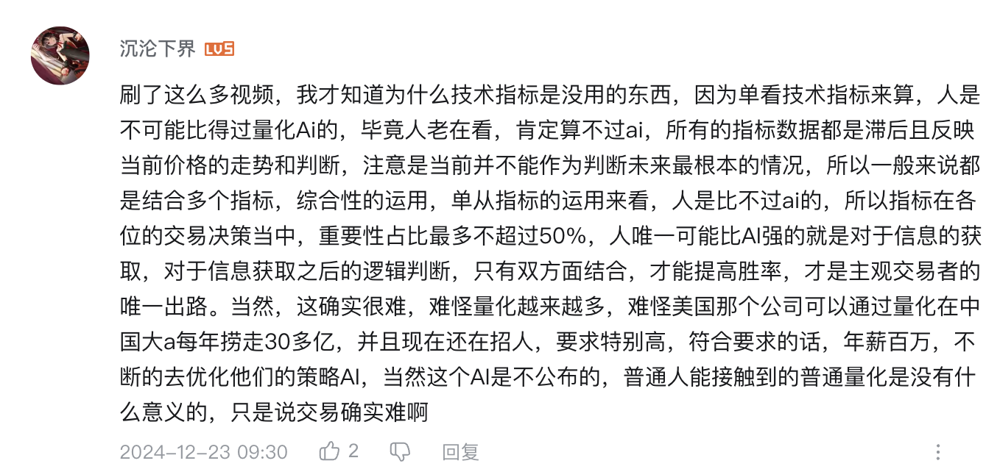

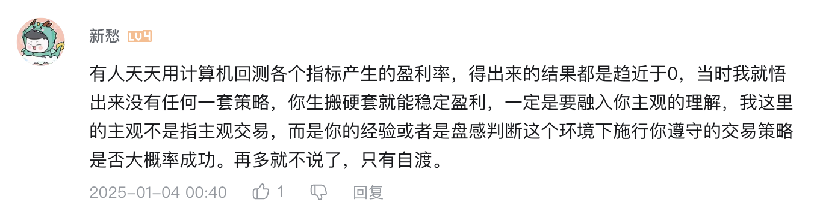

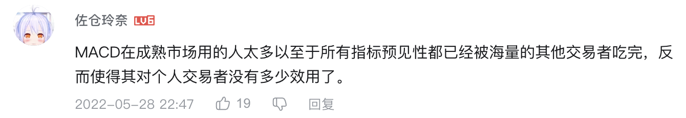

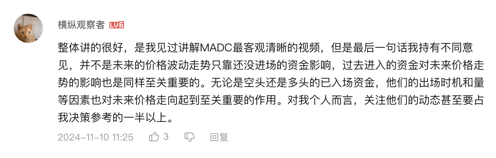

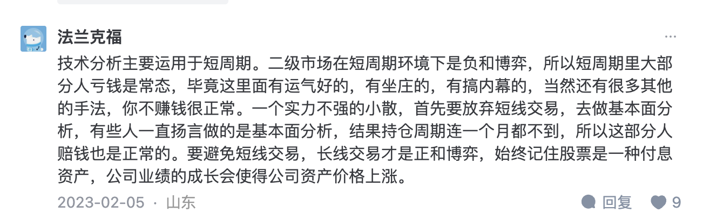

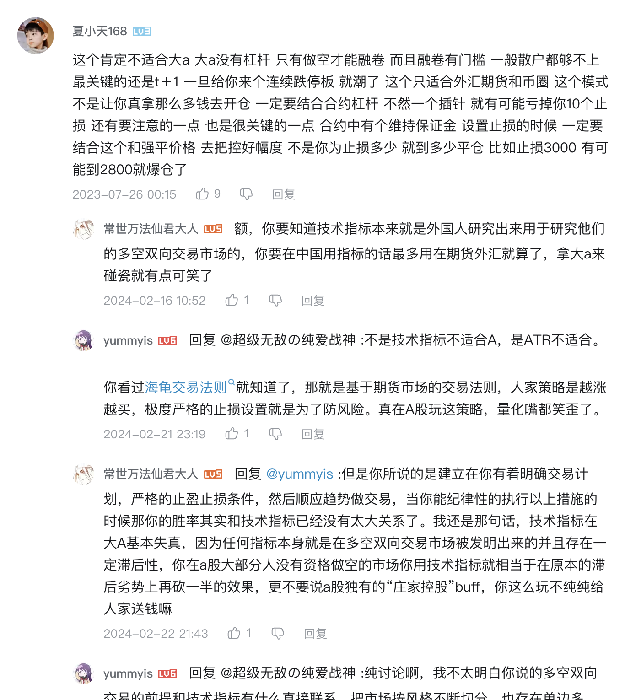

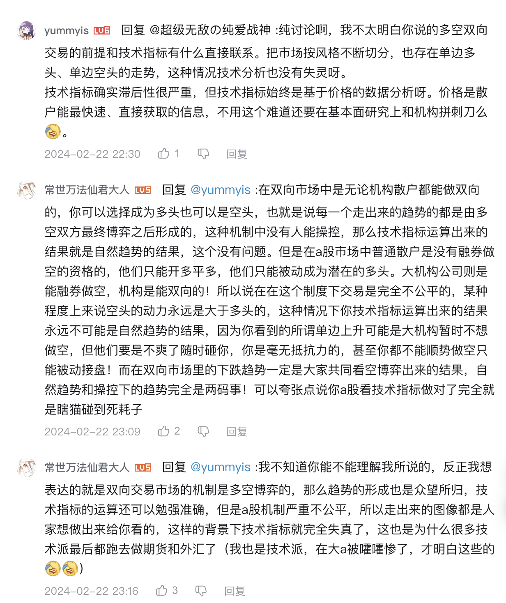

### ATR
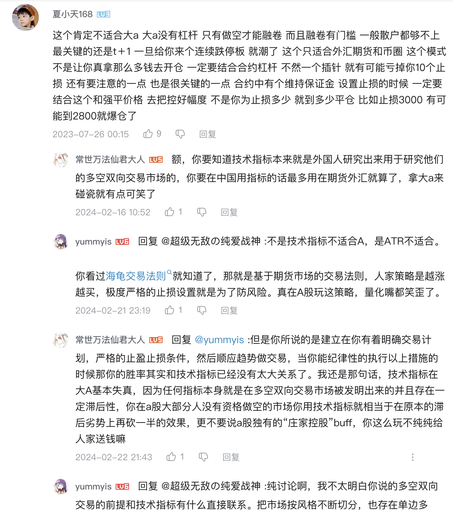

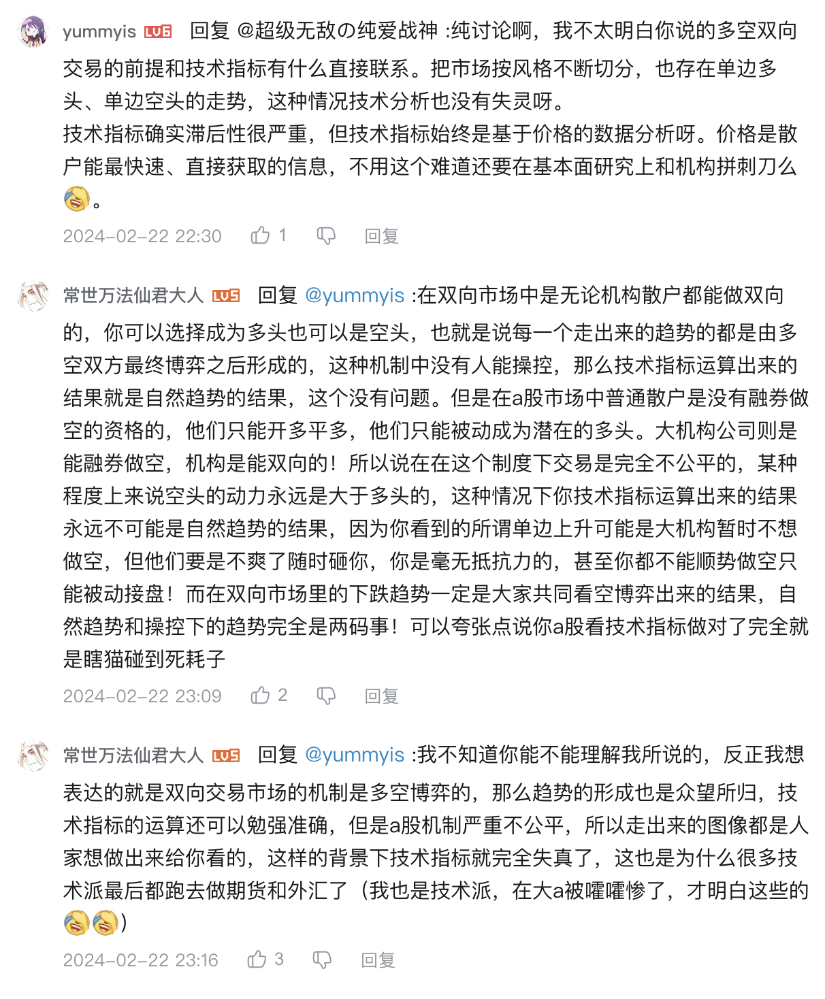A股市场的普通股票交易机制是 T+1（当天买入的股票只能次日卖出），且散户只能通过账户中的资金买入股票，无法直接借入股票卖出。

这就决定了散户只能通过买入股票来获利，无法像做空那样先卖出后买回。

### 价格行为
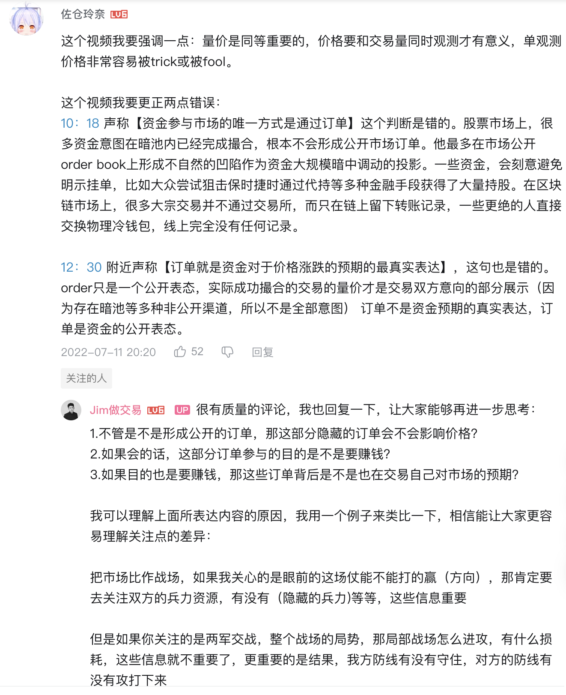

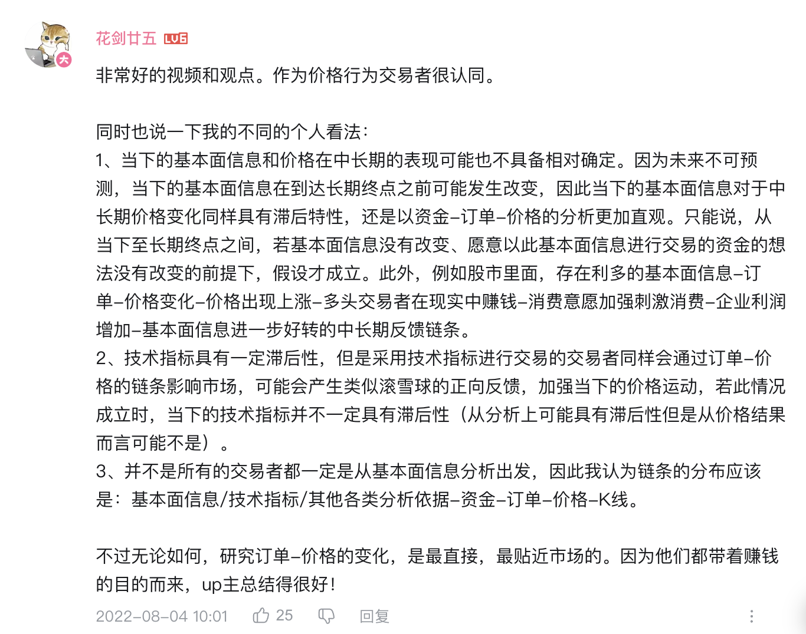

> 更新: 2025-01-13 16:55:58  
> 原文: <https://www.yuque.com/viruspc/el3mi0/hgluocv5u745c795>