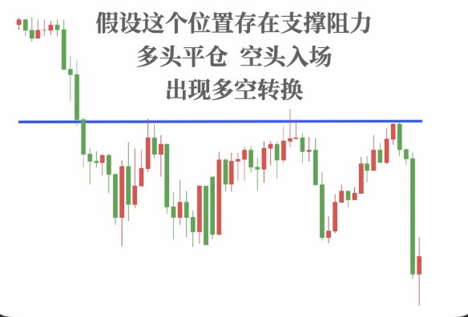
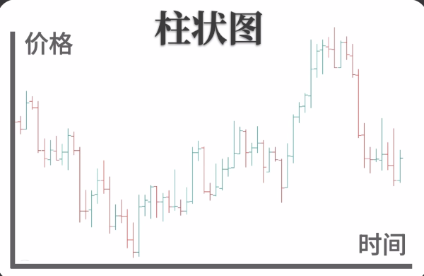
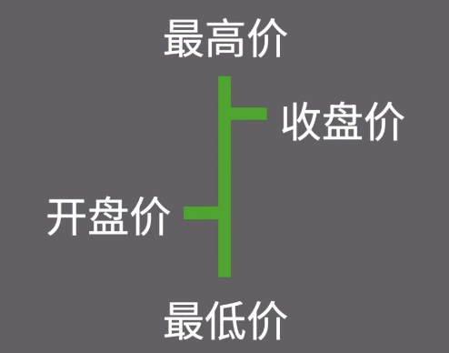

# K线图 与 柱状线

- [K线图](#k%E7%BA%BF%E5%9B%BE)
- [柱状线（竹节图）](#%E6%9F%B1%E7%8A%B6%E7%BA%BF%E7%AB%B9%E8%8A%82%E5%9B%BE)

---

### K线图

反转形态最大的意义：验证关键位置的支撑阻力

K线描述的是客观的价格走势

K线形态起到的是信号作用

信号的使用要结合相应的位置

### 柱状线（竹节图）

> 更新: 2025-01-05 03:49:35  
> 原文: <https://www.yuque.com/viruspc/el3mi0/mcwgfm5b3vn0w2rc>