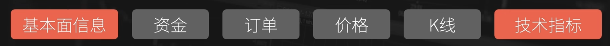
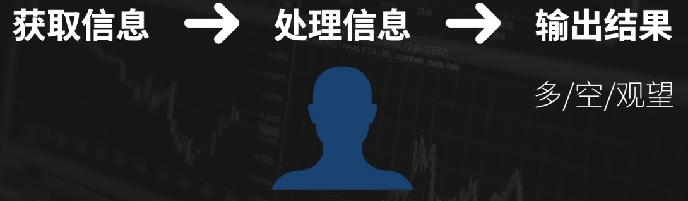
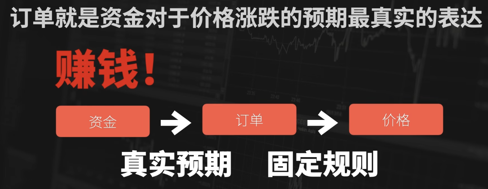
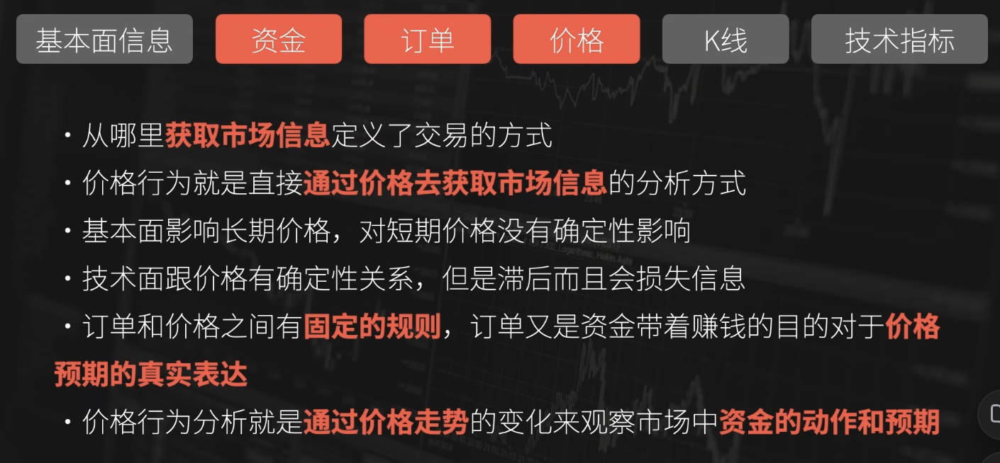

# 价格行为

- [什么是价格行为](#%E4%BB%80%E4%B9%88%E6%98%AF%E4%BB%B7%E6%A0%BC%E8%A1%8C%E4%B8%BA)
- [为什么研究价格行为](#%E4%B8%BA%E4%BB%80%E4%B9%88%E7%A0%94%E7%A9%B6%E4%BB%B7%E6%A0%BC%E8%A1%8C%E4%B8%BA)
- [总结](#%E6%80%BB%E7%BB%93)
- [附录：Pin Bar 和 K线图](#%E9%99%84%E5%BD%95pin-bar-%E5%92%8C-k%E7%BA%BF%E5%9B%BE)
  * [Pin Bar 是 K 线图的一种形态](#pin-bar-%E6%98%AF-k-%E7%BA%BF%E5%9B%BE%E7%9A%84%E4%B8%80%E7%A7%8D%E5%BD%A2%E6%80%81)
  * [Pin Bar 的形态特征](#pin-bar-%E7%9A%84%E5%BD%A2%E6%80%81%E7%89%B9%E5%BE%81)
    + [Pin Bar 与普通 K 线的区别](#pin-bar-%E4%B8%8E%E6%99%AE%E9%80%9A-k-%E7%BA%BF%E7%9A%84%E5%8C%BA%E5%88%AB)
  * [Pin Bar 在 K 线图中的作用](#pin-bar-%E5%9C%A8-k-%E7%BA%BF%E5%9B%BE%E4%B8%AD%E7%9A%84%E4%BD%9C%E7%94%A8)
    + [(1) 反转信号](#1-%E5%8F%8D%E8%BD%AC%E4%BF%A1%E5%8F%B7)
    + [(2) 趋势延续信号](#2-%E8%B6%8B%E5%8A%BF%E5%BB%B6%E7%BB%AD%E4%BF%A1%E5%8F%B7)
  * [4. Pin Bar 在 K 线图中的位置](#4-pin-bar-%E5%9C%A8-k-%E7%BA%BF%E5%9B%BE%E4%B8%AD%E7%9A%84%E4%BD%8D%E7%BD%AE)
    + [(1) 关键支撑或阻力位](#1-%E5%85%B3%E9%94%AE%E6%94%AF%E6%92%91%E6%88%96%E9%98%BB%E5%8A%9B%E4%BD%8D)
    + [(2) 趋势线或均线附近](#2-%E8%B6%8B%E5%8A%BF%E7%BA%BF%E6%88%96%E5%9D%87%E7%BA%BF%E9%99%84%E8%BF%91)
    + [(3) 区间震荡中](#3-%E5%8C%BA%E9%97%B4%E9%9C%87%E8%8D%A1%E4%B8%AD)
  * [5. 如何在 K 线图中交易 Pin Bar](#5-%E5%A6%82%E4%BD%95%E5%9C%A8-k-%E7%BA%BF%E5%9B%BE%E4%B8%AD%E4%BA%A4%E6%98%93-pin-bar)
    + [(1) 反转交易策略](#1-%E5%8F%8D%E8%BD%AC%E4%BA%A4%E6%98%93%E7%AD%96%E7%95%A5)
    + [(2) 趋势延续交易策略](#2-%E8%B6%8B%E5%8A%BF%E5%BB%B6%E7%BB%AD%E4%BA%A4%E6%98%93%E7%AD%96%E7%95%A5)
  * [6. Pin Bar 的注意事项](#6-pin-bar-%E7%9A%84%E6%B3%A8%E6%84%8F%E4%BA%8B%E9%A1%B9)
  * [7. 总结](#7-%E6%80%BB%E7%BB%93)
- [参考资料](#%E5%8F%82%E8%80%83%E8%B5%84%E6%96%99)

---

## 什么是价格行为
**直接通过价格来获取市场信息，这就是价格行为（Price Action）**

近些年，越来越多的投资者在基本面分析和技术面分析之外，逐渐接触到价格行为，并投入到相关研究。

进一步深究什么是价格行为（Price Action）？

许多人对其理解就是裸K、支撑阻力、PinBar（流星线、锤子线），这里讲者从自己的视角讲对价格行为的理解。

不管是股票市场、期贷市场、外汇市场还是数字货币市场，每一个市场、每一个标的的走势背后都有一个链条：

1. 每个市场都会有自己**基本面**的信息
2. 会有资金参与到市场中
3. 所有资金都要通过订单来参与市场的交易
4. 订单在交易所内按照一定的规则，经过复杂运作后，形成不断涨跌变化的价格
5. 按照固定规则，把价格绘制成K线
6. 以价格为基础，计算出各种**技术指标**

基本面分析、技术面分析，是链条两端的分析方法。

在市场当中进行交易，无非就是多空两个方向，以及买卖两个动作。

市场中，分析也好交易也好，每个人都必要做的事情是：

链条中每一部分都会产生信息

+ 如果是研究行业发展、研究公司的财务数据，通过基本面的环节来获取信息，就是在做基本面分析
+ 如果你是在研究均线的斜率、MACD的能量柱，通过获取技术指标的信息来作为分析决策的依据，就是在做技术面分析
+ 什么是价格行为分析？就是**直接通过价格去获取市场信息的分析方法**。

一个标的的基本面会影响参与其中的资金的属性，一个有内在价值的标的，会有更多投资的资金，一个为了风险对冲而存在的标的，会有更多投机的资金。资金参与市场都要通过订单，订单的情况直接影响价格的涨跌，所以价格涨跌是资金运作之后我们能够观察到的最直接的结果。而价格行为，就是通过直接观察价格走势，来获取市场信息，进行分析决策的方式。

至于观察的是涨跌的波段还是K线，研究的事K线形态还是支撑阻力，只要是通过价格来直接获取市场信息的方式，都是属于价格行为。只不过像技术面会用到不同的技术指标和策略，价格行为也会有不同的分析方式和不同的分析工具。

## 为什么研究价格行为

+ 基本面分析：好行业、好公司、好价格、长期持有。基本面跟**长期价格**走势**有关系**，跟**短期价格**走势**没有确定性关系**。
    - 适合长线交易。长期来看，价格随价值波动。
        * 长线交易赚的是企业增量的钱；中短线交易赚取的是短期价差的博弈的资金。
    - 做交易前考虑好自己赚的是什么钱。
        * 如果是长线交易，就应该去研究基本面。
        * 如果是中短线交易，不应该看基本面。一家公司的发展都要经历一定的过程，不管是政策落地还是战略决策的执行，到最后取得成果都是一个漫长的过程。消息、热点、政策利好带来的短时间的波动，本质上也是资金的博弈
+ 技术面分析：技术指标跟价格走势有确定性关系，但是**滞后**而且会**损失信息**。
+ 价格行为研究：放在中短线交易来讲，基本面影响的是长线，跟中短期的价格没有确定性关系；技术面跟中短期价格走势有确定性关系，但滞后且损失信息，都很难在中短线博弈中取得优势。

市场是由资金构成的，而资金参与市场的唯一方式就是订单，

1. 信息差天然存在
2. 信息会经过人为的过滤和处理

=》市场中无时无刻不充斥着不同的观点

信息和资金订单的动作没有确定性关系。资金受哪些消息影响，产生了订单动作，没有办法找到确定性关联。唯一确定的是资金进入市场是为了赚钱。

订单的背后是资金的预期。多单是价格上涨的预期，空单是价格下跌的预期。

=》可以在价格涨跌的变化之中，看懂市场中资金的动作，以及资金的真实预期。

## 总结

## 附录：Pin Bar 和 K线图
### Pin Bar 是 K 线图的一种形态
+ **K 线图**：K 线图是由一系列的单根 K 线组成的，每根 K 线记录了某一时间周期内的开盘价、收盘价、最高价和最低价。
+ **Pin Bar**：Pin Bar 是 K 线的一种特殊形态，其特征是影线特别长，而实体部分很小。

Pin Bar 的形态可以出现在任何时间周期的 K 线图中（如日线图、小时图、分钟图等），它是市场价格波动的一种表现形式。

---

### Pin Bar 的形态特征
Pin Bar 是一种单根 K 线形态，其特征如下：

+ **长影线**：Pin Bar 的长影线占整根 K 线的 2/3 或以上。
    - **上影线长**：表示价格曾尝试向上突破，但被空头压制。
    - **下影线长**：表示价格曾尝试向下突破，但被多头拉回。
+ **实体部分很小**：Pin Bar 的开盘价和收盘价非常接近，位于 K 线的一端。
+ **影线方向**：Pin Bar 的长影线方向反映了市场尝试突破的方向，但最终失败。

#### Pin Bar 与普通 K 线的区别
| **特征** | **普通 K 线** | **Pin Bar** |
| :--- | :--- | :--- |
| 实体部分 | 大小不固定 | 实体部分较小 |
| 影线长度 | 上下影线长度不固定 | 一侧影线特别长，另一侧影线很短或没有 |
| 市场含义 | 记录价格波动 | 表示市场的反转或趋势延续信号 |

### Pin Bar 在 K 线图中的作用
Pin Bar 是 K 线图中重要的价格行为形态，交易者通过观察 Pin Bar 来判断市场情绪和潜在的价格走势。

#### (1) 反转信号
Pin Bar 通常出现在趋势的顶部或底部，显示市场尝试突破失败，随后可能发生反转：

+ **上影线长的 Pin Bar（看跌）**：
    - 出现在上升趋势的顶部，表示多头尝试推动价格上涨失败，空头力量占据主导。
    - 预示价格可能反转向下。
+ **下影线长的 Pin Bar（看涨）**：
    - 出现在下降趋势的底部，表示空头尝试推动价格下跌失败，多头力量占据主导。
    - 预示价格可能反转向上。

#### (2) 趋势延续信号
Pin Bar 也可以出现在趋势中，表示市场短暂回调后可能继续沿原趋势方向运行：

+ **看涨 Pin Bar**：下影线长，表示价格回调后继续上涨。
+ **看跌 Pin Bar**：上影线长，表示价格反弹后继续下跌。

---

### 4. Pin Bar 在 K 线图中的位置
Pin Bar 的位置决定了它的意义和可靠性，以下是常见的情况：

#### (1) 关键支撑或阻力位
+ 当 Pin Bar 出现在支撑位或阻力位时，其信号更为可靠。
    - **支撑位的看涨 Pin Bar**：下影线长，表明支撑位有效，价格可能反弹。
    - **阻力位的看跌 Pin Bar**：上影线长，表明阻力位有效，价格可能回落。

#### (2) 趋势线或均线附近
+ 当 Pin Bar 出现在趋势线或均线附近时，可以作为趋势延续的信号。
    - **上升趋势中的看涨 Pin Bar**：表明价格短暂回调后可能继续上涨。
    - **下降趋势中的看跌 Pin Bar**：表明价格短暂反弹后可能继续下跌。

#### (3) 区间震荡中
+ 在震荡市场中，Pin Bar 可以作为反转信号。
    - **区间底部的看涨 Pin Bar**：价格可能从区间底部反弹。
    - **区间顶部的看跌 Pin Bar**：价格可能从区间顶部回落。

---

### 5. 如何在 K 线图中交易 Pin Bar
Pin Bar 是一种重要的交易信号，以下是常见的交易策略：

#### (1) 反转交易策略
+ **条件**：
    - Pin Bar 出现在关键支撑位或阻力位。
    - Pin Bar 的影线方向与趋势方向相反。
+ **操作**：
    - 看涨 Pin Bar：在 Pin Bar 的高点上方设置买入订单，止损设置在 Pin Bar 的低点下方。
    - 看跌 Pin Bar：在 Pin Bar 的低点下方设置卖出订单，止损设置在 Pin Bar 的高点上方。

#### (2) 趋势延续交易策略
+ **条件**：
    - Pin Bar 顺应趋势方向出现。
    - Pin Bar 的影线方向与回调方向一致。
+ **操作**：
    - 看涨 Pin Bar：在 Pin Bar 的高点上方设置买入订单，止损设置在 Pin Bar 的低点下方。
    - 看跌 Pin Bar：在 Pin Bar 的低点下方设置卖出订单，止损设置在 Pin Bar 的高点上方。

---

### 6. Pin Bar 的注意事项
1. **位置很重要**：
    - Pin Bar 出现在关键位置（如支撑位、阻力位、趋势线）时更可靠。
    - 随机出现在其他位置的 Pin Bar 可能是噪音信号。
2. **结合整体市场结构**：
    - Pin Bar 需要结合市场趋势、区间震荡或其他技术指标进行分析，不能单独作为交易依据。
3. **风险管理**：
    - 每次交易都要设置止损，以控制风险。
4. **时间周期选择**：
    - 高时间周期（如日线图、4 小时图）的 Pin Bar 信号通常更可靠。

---

### 7. 总结
Pin Bar 是 K 线图中的一种特殊形态，交易者通过观察 Pin Bar 的形态、位置和方向来判断市场的反转或趋势延续信号。以下是 Pin Bar 和 K 线图的核心关系总结：

+ Pin Bar 是 K 线的一种形态，通过影线和实体的关系反映市场的价格行为。
+ Pin Bar 的意义取决于其在 K 线图中的位置（如支撑位、阻力位、趋势线等）。
+ 交易者可以结合 Pin Bar 和其他技术分析工具，制定可靠的交易策略。

通过理解 Pin Bar 和 K 线图的关系，可以更好地掌握市场的价格行为，从而做出更准确的交易决策

## 参考资料
+ [https://priceaction.com/price-action-university/strategies/pin-bar/](https://priceaction.com/price-action-university/strategies/pin-bar/)

> 更新: 2025-01-13 16:52:56  
> 原文: <https://www.yuque.com/viruspc/el3mi0/duo2gaad8s7xm8lp>