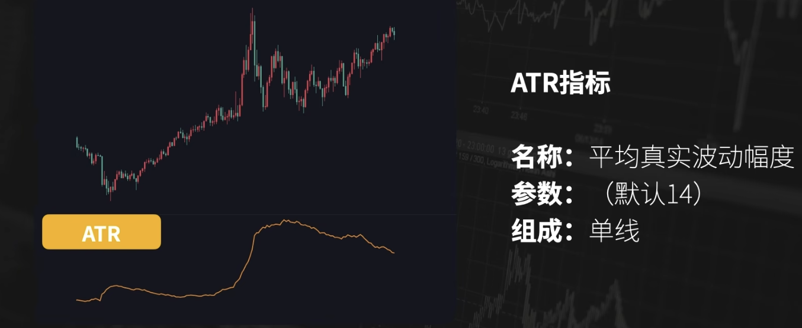
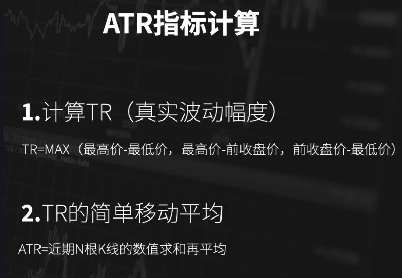
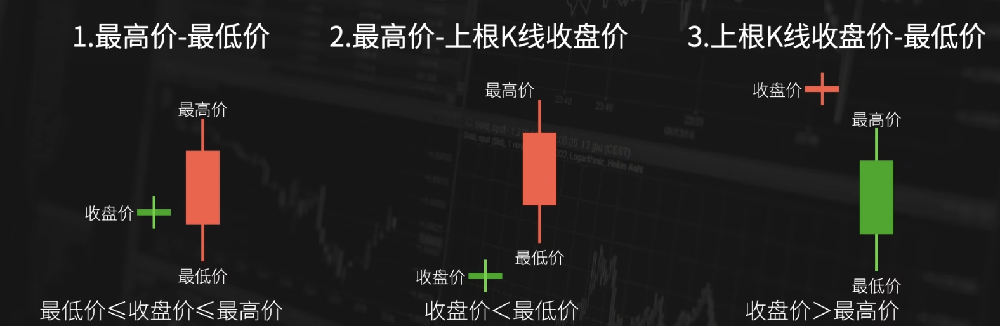
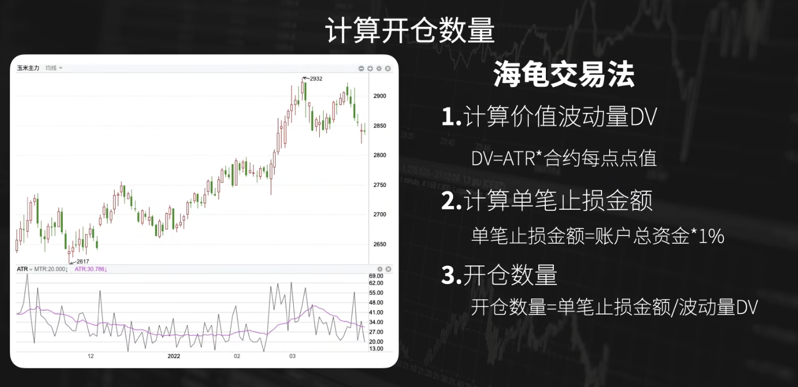
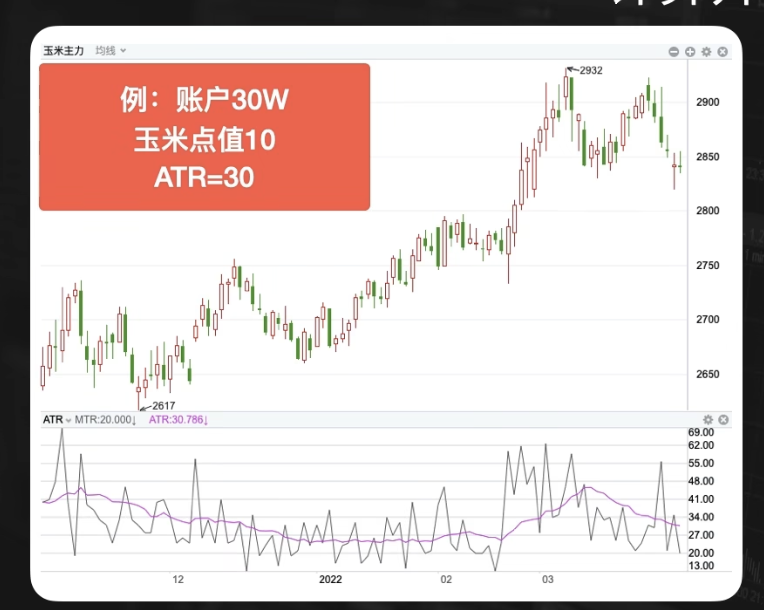
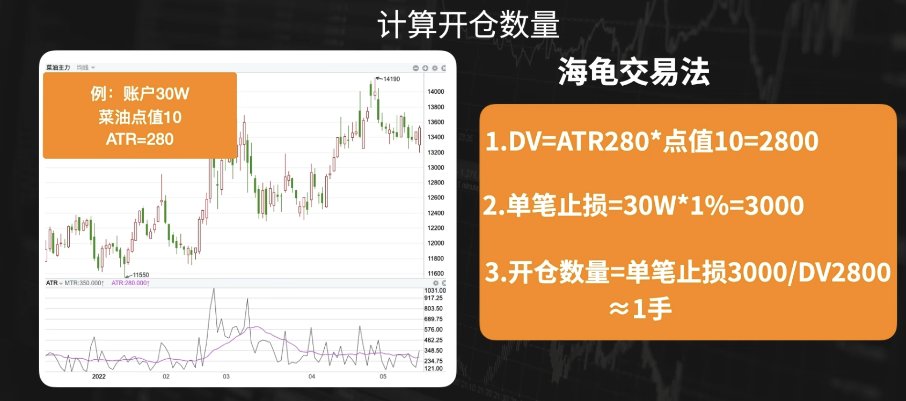
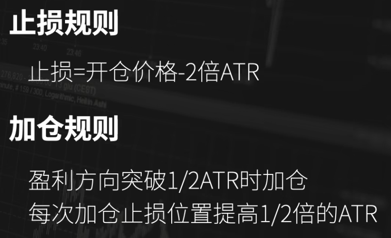
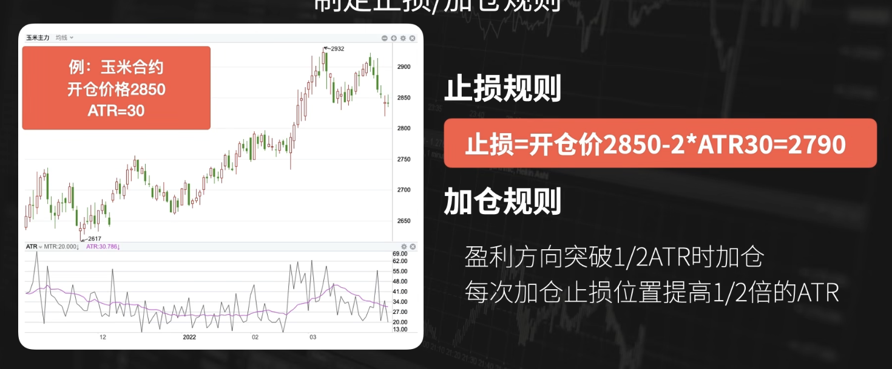
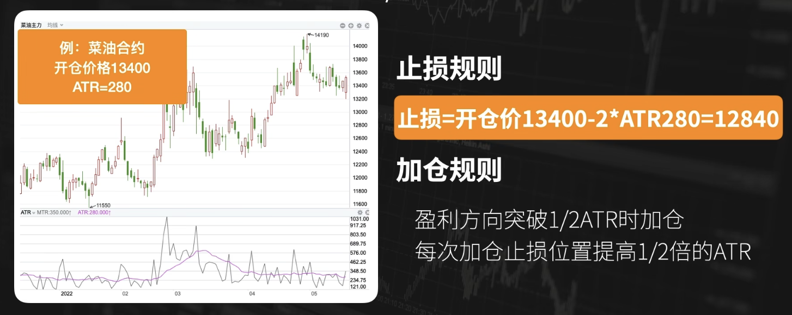
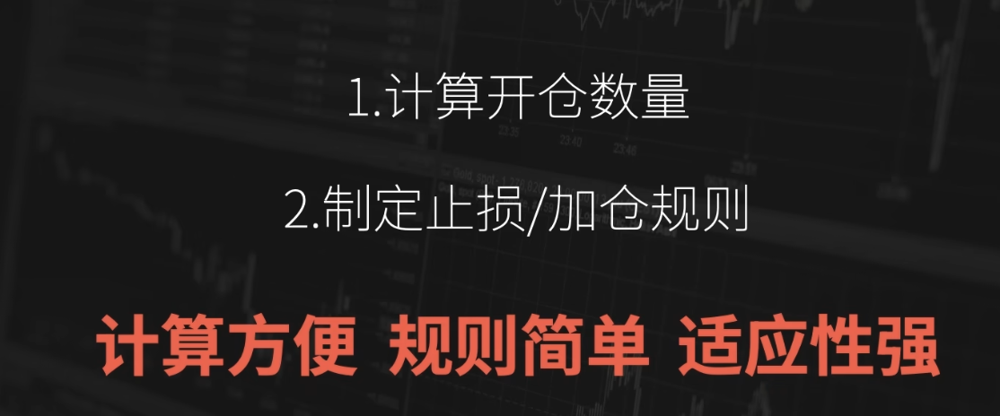

# ATR - 仓位/止损

- [原理](#%E5%8E%9F%E7%90%86)
- [应用（海龟交易法）](#%E5%BA%94%E7%94%A8%E6%B5%B7%E9%BE%9F%E4%BA%A4%E6%98%93%E6%B3%95)
  * [计算开仓数量](#%E8%AE%A1%E7%AE%97%E5%BC%80%E4%BB%93%E6%95%B0%E9%87%8F)
  * [制定止损/加仓规则](#%E5%88%B6%E5%AE%9A%E6%AD%A2%E6%8D%9F%E5%8A%A0%E4%BB%93%E8%A7%84%E5%88%99)
- [总结](#%E6%80%BB%E7%BB%93)
- [参考资料](#%E5%8F%82%E8%80%83%E8%B5%84%E6%96%99)

---

在海龟交易法中，利用ATR（**Average True Range**）指标计算仓位，设置止损的规则，都有很多可以借鉴学习的地方。

## 原理

单线

1. TR（True Range，真实波动幅度）依赖3个数值
    1. 最高价-最低价：最低价<=上一日收盘价<=最高价 时
    2. 最高价-前收盘价：上一日收盘价<最低价。盘面中变现为向上跳空。
    3. 前收盘价-最低价：上一日收盘价>最高价。盘面中变现为向下跳空。

## 应用（海龟交易法）
ATR在海龟交易法中的两个主要应用：计算开仓数量 和 制定止损/加仓规则

### 计算开仓数量
对于开仓入场的数量，不同人有不同的习惯：

+ 固定手数
    - 问题：不同的品种，每一手合约价值是不同的，波动幅度是不同的
+ 根据账户资金和保证金
    - 问题：保证金有时会有调整
+ 以损定量
    - 分配同样的资金，去交易不同的品种。同样一笔交易，如果你在合约价值很大的品种上出现了一次亏损，可能在波动较小的品种上，多笔盈利都无法覆盖掉这笔亏损。更好的方式是以损定量。
    - 固定每一笔亏损的价格，然后计算出现交易机会之后的开仓数量。
    - 海龟交易法中，利用ATR指标来计算仓位。

1. DV=ATR*合约每点价值。即估计股票**一手**的**单日**价格波动幅度。
2. 每一次开仓的止损，控制在账户总资金的1%以内。即定一个能接受的**单日亏损金额**。
3. 然后用每一笔开仓的止损，去除以价值波动量DV，就得到了每一笔的开仓数量。即算买入多少手，使得1天刚好亏损指定金额。

可见，这是在以损定量。这样做的一个好处是，所有的股票入仓时，都保证单日亏损金额大致相同，尽量避免前面提到的“多笔盈利都无法覆盖掉某笔亏损”的情况。

PS：当然，实践中如果判断某个股票在大涨阶段，可以适当提升当日亏损金额。

例如，看当前的玉米合约。玉米合约一手合约是10吨，1吨的价格是2850，最小的波动是1元，那合约的每一点的价值就是10（解释一下，这个场景下每一点就是每波动一元，1手10吨可以理解为一手10股。即价格每波动1元，一手波动10元）。

假如用户的资金量是30万，如何计算开仓数量？

1. 价值波动量DV = ATR * 合约每点点值 = 30 * 10 = 300
2. 单笔止损金额 = 账户总资金 * 1% = 3000
3. 开仓数量 = 单笔止损金额 / DV = 3000 / 300 = 10 手

10手*10吨*2850 = 28.5万。但注意这里不是满仓。期货是保证金交易，玉米10手合约的价值是28.5万元，但是你交易时的开仓费用只是10手*2850元/手＝2.85万元，相当于你用2.85万元，就做了一笔28.5万元价值的生意，杠杆是10倍。

菜油的例子：

为什么用这样的方式来计算仓位？

1. 只需要通过简单的规则，就可以针对不同的交易品种，快速的计算出比较合理的开仓的数量
2. 不管品周波动幅度是大是小、合约的价值是大是小，都**可以保证每一笔交易亏损的话，数额是大致相当的**。

### 制定止损/加仓规则
海龟交易法中，ATR的第二大应用，是制定止损/加仓规则。

加仓最多增加4个单位。

为什么用ATR作为止损和加仓的规则？

+ ATR数值能够动态的反应当前标的的真实波动幅度
+ 能够轻松制定出具备适应性的规则

交易不同的标的时，很多人用固定的点数作为止损（比如亏损5%），不过这样的方式也是会存在一定问题：

+ 一个品种的波动幅度是动态变化的。比如玉米之前价格是3000，设置止损位100；现在玉米价格是1500，是否还要用100点幅度作为止损幅度？
+ 不同品种间，波动幅度不同、合约价值不同、价格不同。在交易不同品种时，最好针对每一品种单独去考虑止损幅度大小。而ATR就是根据最近的波动幅度动态变化的，海龟交易法用结合ATR的简单规则去适应各个品种。

例子：

只需要一条简单的标准，就可以制定出止损的规则，并且可以应用在不同的品种上面。所以说ATR指标是一个适合构建止损规则的指标。

## 总结

可以根据标的的近期波动幅度，来计算开仓数量、止损和加仓规则。适应不同品种。

ATR不仅仅是应用在海龟交易法。

## 参考资料
[【Jim】十分钟搞懂【ATR指标】技术分析基础丨止损规则丨计算仓位_哔哩哔哩_bilibili](https://www.bilibili.com/video/BV1PT41157Fb?spm_id_from=333.788.videopod.sections&vd_source=a637826c55b409b420b4b6584a6e8379)

> 更新: 2025-01-15 15:23:59  
> 原文: <https://www.yuque.com/viruspc/el3mi0/ggnyqvuf4h6zvc9p>