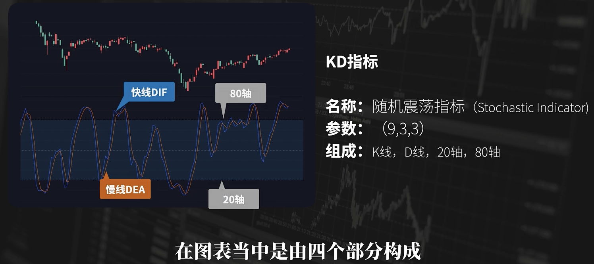
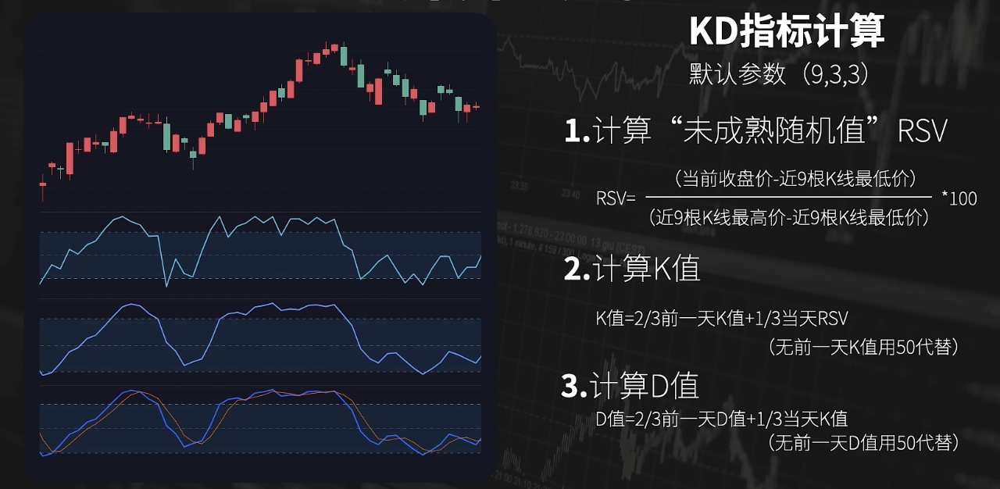
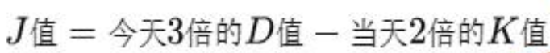
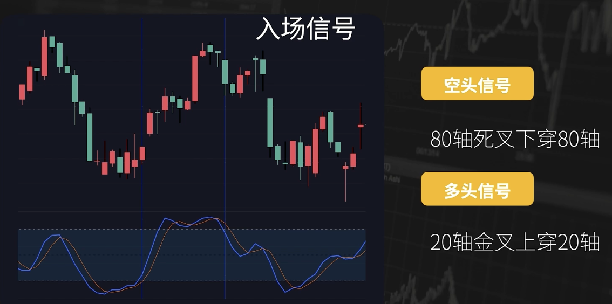
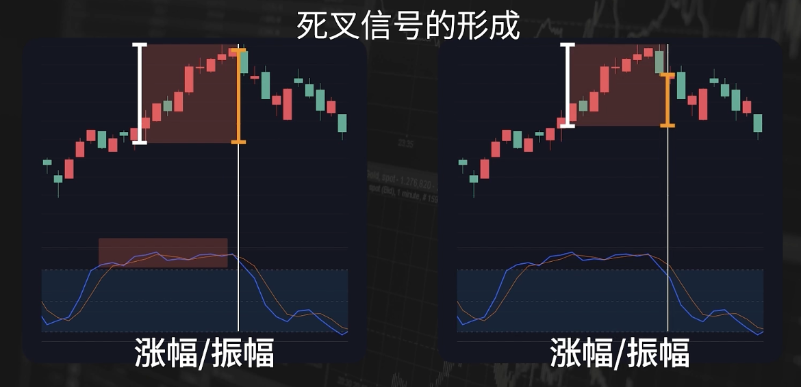
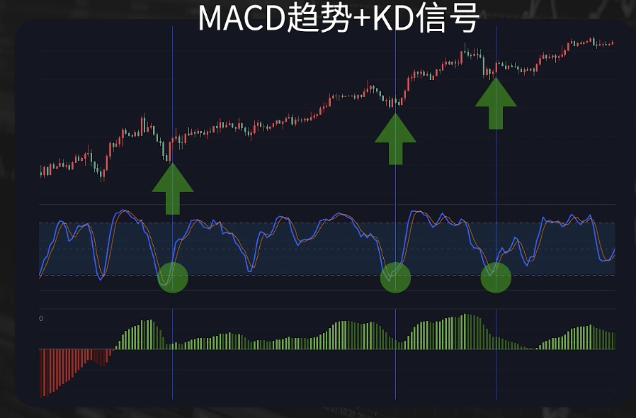

# KD（J）- 入场信号

- [背景](#%E8%83%8C%E6%99%AF)
- [定义和公式](#%E5%AE%9A%E4%B9%89%E5%92%8C%E5%85%AC%E5%BC%8F)
- [应用](#%E5%BA%94%E7%94%A8)
  * [入场信号](#%E5%85%A5%E5%9C%BA%E4%BF%A1%E5%8F%B7)
  * [MACD趋势+KD信号](#macd%E8%B6%8B%E5%8A%BFkd%E4%BF%A1%E5%8F%B7)
- [总结](#%E6%80%BB%E7%BB%93)

---

## 背景
均线和MACD都是趋势指标，更多是用来判断趋势的方向。

KDJ指标属于震荡型指标，不用来判断趋势，而是用来提供入场信号。 

所以很多用法，是将均线、MACD这类判断趋势的指标，和KD这种提供信号的指标结合运用，组合形成完整的交易策略。

## 定义和公式

KD指标也叫做随机震荡指标，数值范围0-100。

默认参数：9（RSV），3（K），3（D）

在图表中，由4个部分构成：

1. 20轴
2. 80轴
3. 快线 
4. 慢线

计算公式如下：

+ **RSV（**Raw Stochastic Value）：当日收盘价相对近9日收盘价的位置。分子可以理解为当前价格的**涨幅**，分母可以理解为近9日的**振幅**。
    - 未成熟随机值是股票的一个概念，RSV指标主要用来分析市场是处于“超买”还是“超卖”状态：RSV高于80%时候市场即为超买状况，行情即将见顶，应当考虑出仓；RSV低于20%时候，市场为超卖状况，行情即将见底，此时可以考虑进仓。
+ K：RSV的周期为3的指数加权移动平均。（显然是短周期）
+ D：K值的周期为3的指数加权移动平均。
+ J：有时还会补充一个J值：
    - 

核心是RSV

 

## 应用
### 入场信号

入场：上穿20轴，形成金叉

出场：下穿80轴，形成死叉，

为什么KD指标可以用来作为入场的信号？因为KD指标可以对一段连续涨跌之后的价格的反向运动做出快速的反应。

价格一直上涨，KD值会一直维持在80轴上方。

价格出现反转，会使的RSV值急剧减小，在80轴上方出现死叉，下穿80轴。

注意，KD信号非常灵敏，出现的金叉死叉信号非常多。 从参数也能看出，KD反映的周期较短。 所以KD只是在你确定交易方向，寻找交易机会时，提供的入场信号。

所以KD，一般结合其他指标来用。最简单的做法，就是用均线，或者MACD等指标去判断市场的方向，然后用KD指标去入场。

### MACD趋势+KD信号
可以把MACD和KD相结合，形成简单策略。

MACD在0轴上方，判断是多头趋势；KD指标出现到达20轴的金叉，并且上穿20轴时，作为入场做多的信号。  

下图可以看到，可以找到不错的位置

## 总结
KD指标对价格反应灵敏，是个很好的提供入场信号的工具。

KD指标在震荡行情中表现较好，能够有效捕捉超买（K值和D值高于80）和超卖（K值和D值低于20）的状态。但容易发出频繁的买卖信号，其中可能包含大量的假信号。

但能够给到最大的作用也只是信号的作用，你仍然需要其他工具去判断方向，需要其他条件去判断入场时机。

另外，对市场的“道”和“法”的理解，才是决定了你交易的水平和阶段。

> 更新: 2025-01-11 13:50:51  
> 原文: <https://www.yuque.com/viruspc/el3mi0/llb69xsvk2ewgx5c>