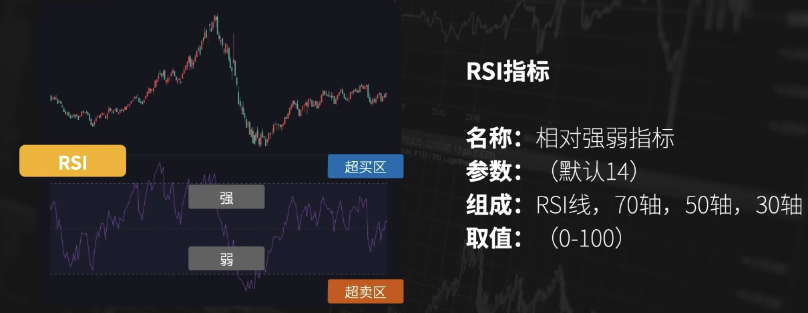
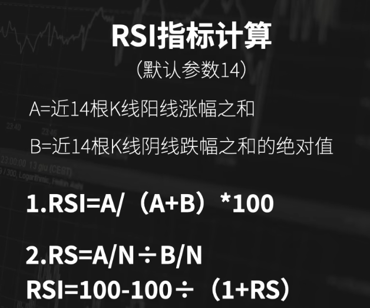
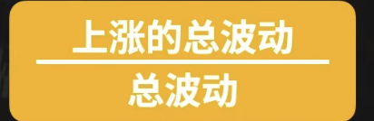
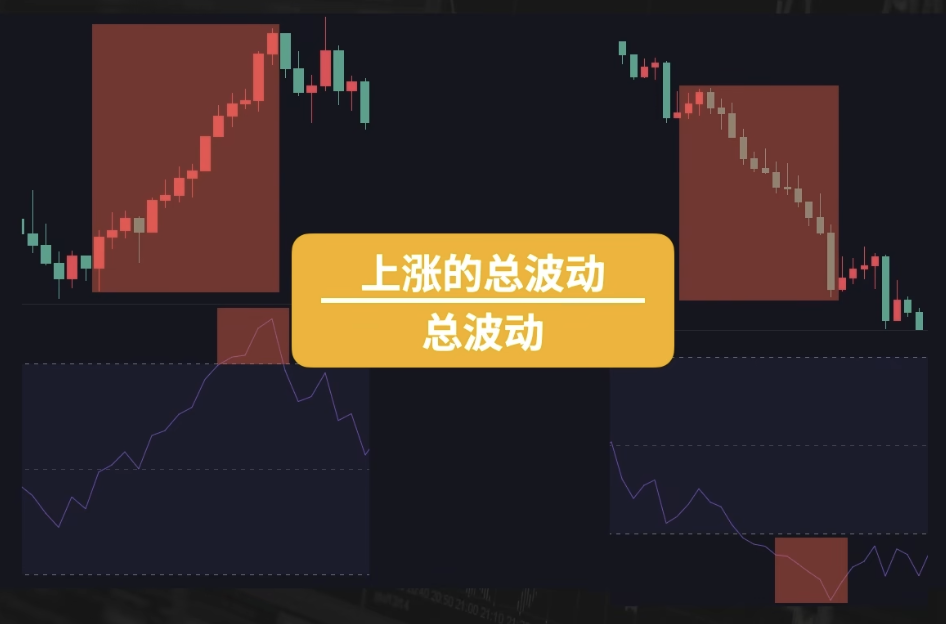
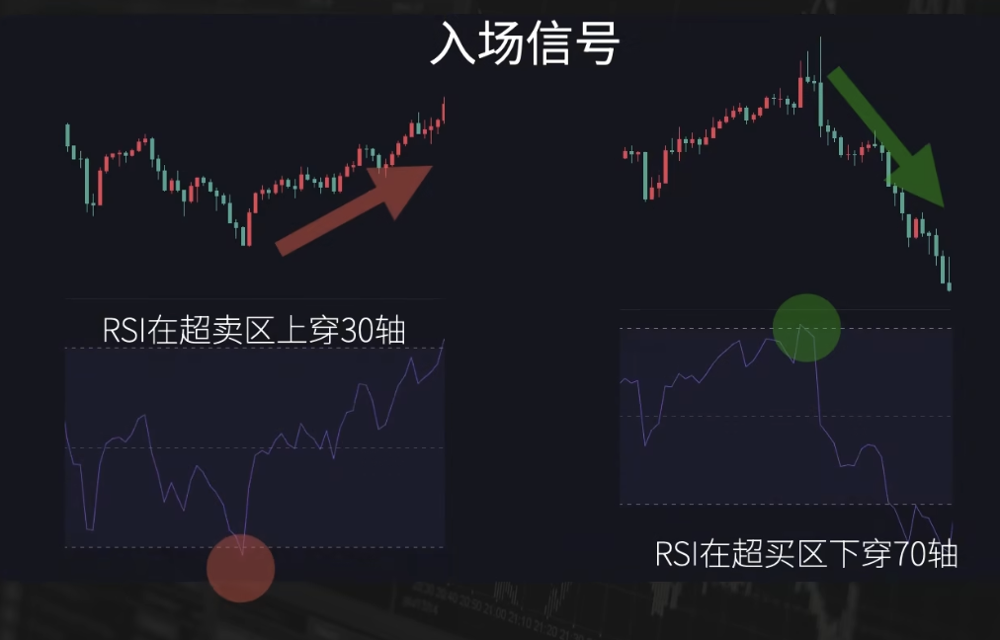
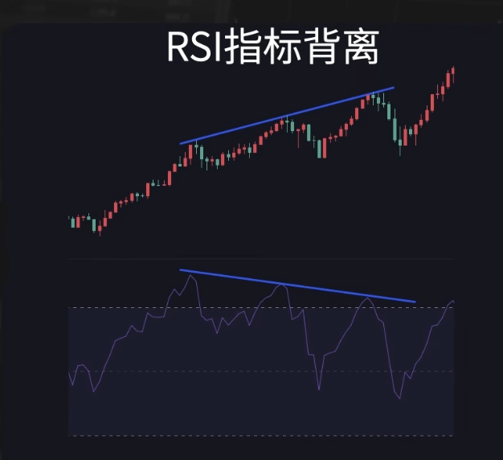
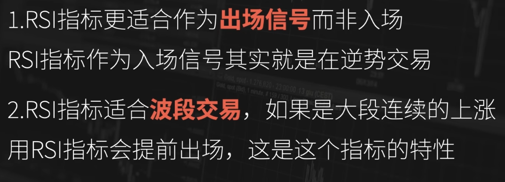

# RSI - 震荡市场出场信号

- [原理](#%E5%8E%9F%E7%90%86)
- [应用](#%E5%BA%94%E7%94%A8)
  * [在超买区超卖区找入场出场信号](#%E5%9C%A8%E8%B6%85%E4%B9%B0%E5%8C%BA%E8%B6%85%E5%8D%96%E5%8C%BA%E6%89%BE%E5%85%A5%E5%9C%BA%E5%87%BA%E5%9C%BA%E4%BF%A1%E5%8F%B7)
  * [把RSI指标的背离作为入场出场信号](#%E6%8A%8Arsi%E6%8C%87%E6%A0%87%E7%9A%84%E8%83%8C%E7%A6%BB%E4%BD%9C%E4%B8%BA%E5%85%A5%E5%9C%BA%E5%87%BA%E5%9C%BA%E4%BF%A1%E5%8F%B7)
- [总结](#%E6%80%BB%E7%BB%93)
- [题外话](#%E9%A2%98%E5%A4%96%E8%AF%9D)

---

Relative Strength Index 

## 原理

通常会把取值范围分为4个部分：

1. 极弱：0～30，也叫超卖区。市场可能下跌过度，价格可能反弹或反转。通常被视为入场信号或做多信号。
2. 弱：30～50，意义不大
3. 强：50～70，意义不大
4. 极强：70～100，也叫超买区。市场可能上涨过度，价格可能回调或反转，通常被视为出场信号或做空信号。

RSI有以上两种计算公式，计算步骤不同但结果一样。

RSI的本质：

不同的走势中，RSI的数值变化？

上图中，价格连续上涨后，RSI进入到超买区；价格连续下降后，RSI进入到超卖区。

PS：一个存疑的说法：有些特殊RSI的计算过程中，有做加权移动平均。距离越近的K线涨跌幅，影响越大。

## 应用
+ 入场出场信号

### 在超买区超卖区找入场出场信号

不太合适的：

1. 超卖区，市场可能下跌过度，价格可能反弹或反转。通常被视为入场信号或做多信号。但一般不直接用。
2. 超买区。市场可能上涨过度，价格可能回调或反转，通常被视为出场信号或做空信号。但一般不直接用。

比较合适的：

3. 超卖区上穿30轴，做多。
4. 超买区下穿70轴，做空。

什么时候进入超卖区？近14根K线连续下跌。什么时候上穿30轴？出现较大幅度的阳线，或多根阳线。

连续下跌的趋势停滞，就要入场做多吗？并不是，所以不太适合作为入场信号。指标更有价值的超买区和超卖区，对应的行情是连续上涨和连续下跌。而超买区下穿70轴和超卖区上穿30轴对应的都是连续涨跌之后的停滞，所以**RSI更适合作为出场信号而非入场信号。**

### 把RSI指标的背离作为入场出场信号
背离描述的是价格上涨节奏的减缓。

RSI指标的背离：价格不断创新高，RSI指标的峰值不断创新低。出场信号。

和MACD的背离原理相通。

背离不是作为行情反转的信号，RSI背离更适合作为出场的信号。

## 总结

RSI指标的价值，在于行情涨跌的连续性做了量化。

连续上涨之后如果继续上涨，RSI指标就会一直在70轴上方的超买区，这个也被叫做RSI的钝化。用这个指标作为入场信号，相当于一直以逆势的思维来交易，不是很好的用法。

+ RSI 认为价格上涨过快、过多时会进入超买区域，但在强趋势中，这并不一定意味着价格会反转。
+ 在强趋势中，超买状态可能会持续很长时间。

更适合作为出场信号。

适合波段的行情，当出现信号说明趋势变缓，作为出场信号没问题。如果你是长期交易者那没意义。如果是一大段连续的上涨，RSI就会提前出场。

作为出场信号比较好用，作为进场信号不好用，一般急涨变缓后有回调需求比较少见急缓急这种上涨，但是下跌急缓急这种就比较常见，慢涨急跌。

## 题外话
有人说RSI的作者否定了RSI，其实是误解。Wilder 并没有完全否定 RSI，而是认为 RSI（以及他提出的其他指标）在某些情况下存在局限性，需要结合其他方法或指标使用。他在后续的研究中提出了一些改进和补充建议。

RSI失效场景：

+ 价格持续上涨或下跌时，RSI 可能长期处于超买或超卖区域，导致错误的反转信号。
+ 在强趋势中，RSI 的超买信号可能并不意味着价格会立即下跌，而是趋势可能会继续。

Wilder 在其著作中还提出了其他技术指标（如 ADX 和 Parabolic SAR），这些指标旨在解决 RSI 在某些场景中的不足。

+ 例如，ADX（平均趋向指数）可以帮助判断市场的趋势强度，从而避免在强趋势中误用 RSI 的超买或超卖信号。

RSI适合的场景：

+ 震荡市场：RSI 在震荡行情中非常有效，可以通过超买（>70）和超卖（<30）信号帮助投资者寻找买卖点。
+ 趋势判断：通过观察 RSI 的趋势（如 RSI 是否突破50分界线），也可以辅助判断市场的整体趋势。

> 更新: 2025-01-12 15:31:36  
> 原文: <https://www.yuque.com/viruspc/el3mi0/zodeg29akyg55faf>