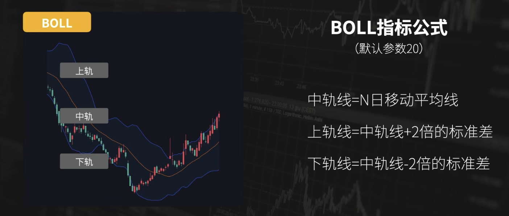
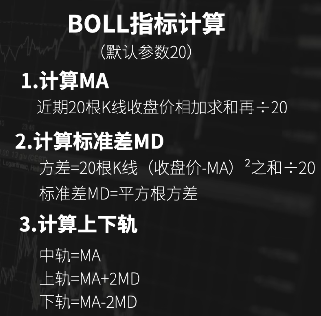
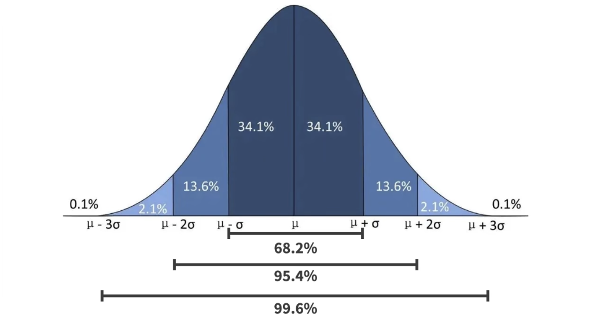
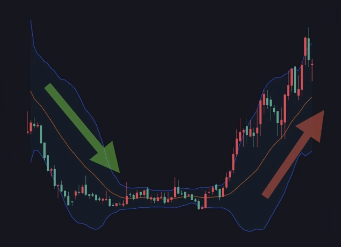
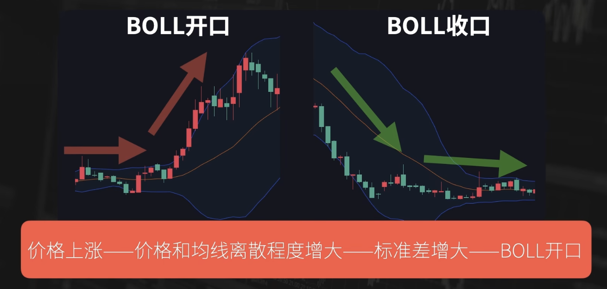
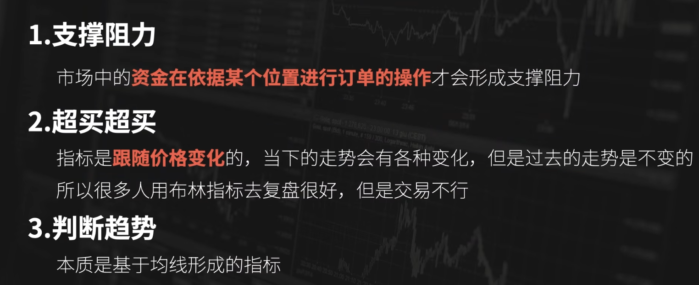
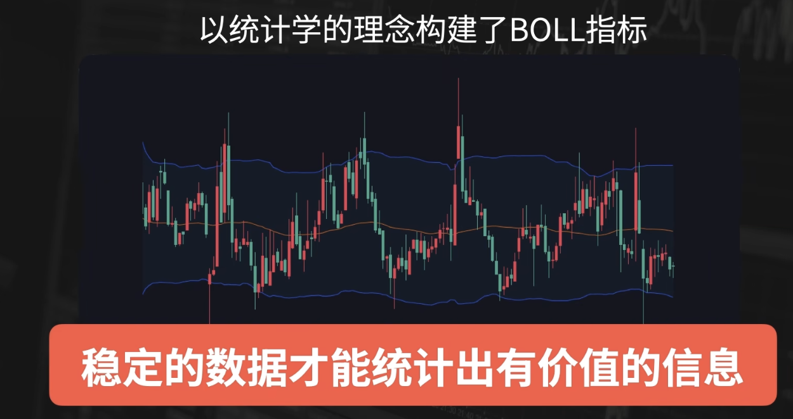

# BOLL（布林指标/布林带/布林支撑）

- [原理](#%E5%8E%9F%E7%90%86)
- [应用](#%E5%BA%94%E7%94%A8)
  * [支撑阻力](#%E6%94%AF%E6%92%91%E9%98%BB%E5%8A%9B)
  * [超买超卖](#%E8%B6%85%E4%B9%B0%E8%B6%85%E5%8D%96)
  * [趋势判断](#%E8%B6%8B%E5%8A%BF%E5%88%A4%E6%96%AD)
- [扩展](#%E6%89%A9%E5%B1%95)

---

## 原理

布林通道内，可以覆盖95%的价格。

## 应用
### 支撑阻力
很多人认为布林通道的上下轨是有支撑阻力的。上轨对价格有压力的作用，上轨对价格有支撑的作用。

### 超买超卖
2倍标准差可以覆盖95%的行情，

所以把上涨超过布林带上轨的状态叫做超买；下跌超过布林带下轨的状态叫做超卖、

很多人会根据超买和超卖，再制定相应规则。

### 趋势判断
布林带根据20周期均线计算得到，根据斜率可以判断当下的趋势是多头还是空头。

## 扩展

+ 支撑阻力：资金会根据布林带来进行订单操作吗？不。所以，布林带其实不具备支撑阻力
+ 超买超卖：复盘有用，预测不好用。
+ 判断趋势：本质是均线，可以判断趋势，多了上下轨观察效果不同而已。

根据统计学正态分布，什么时候boll指标有用？稳定的数据有用，也就是震荡行情有用。

> 更新: 2025-01-12 15:47:37  
> 原文: <https://www.yuque.com/viruspc/el3mi0/cqxte4vplkzib57q>