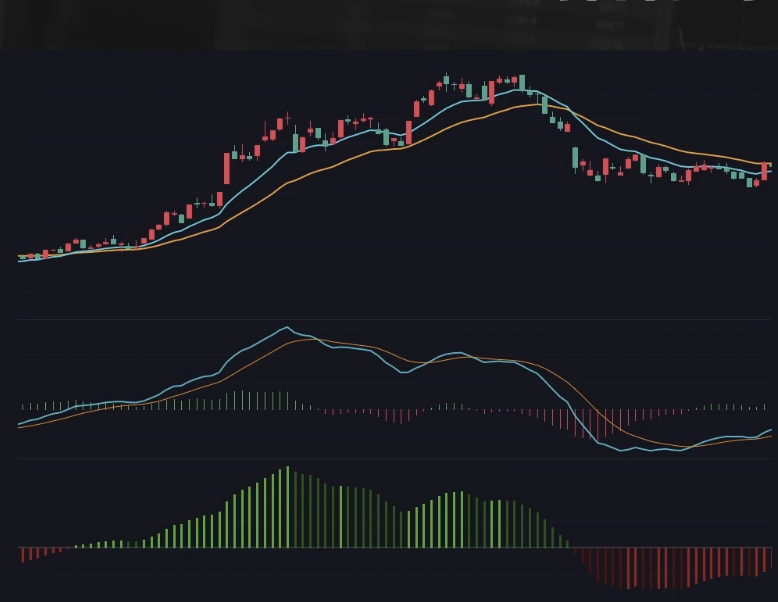
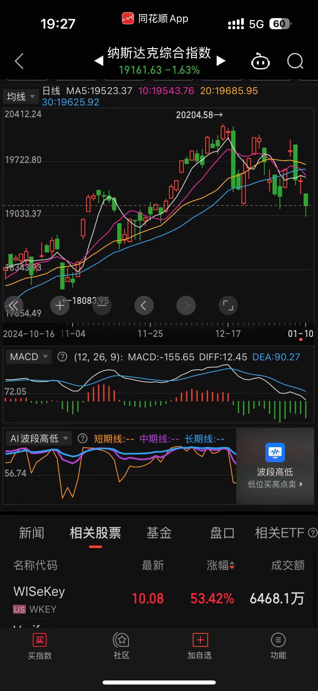
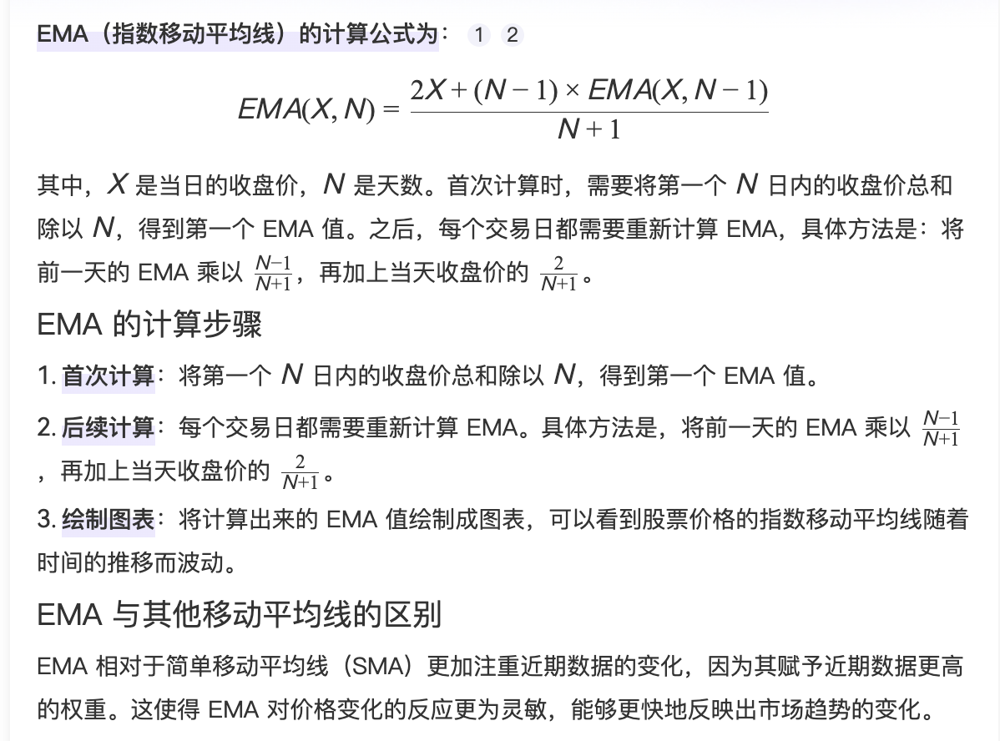
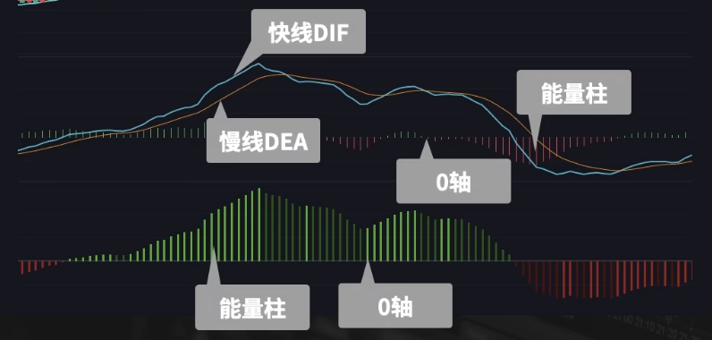
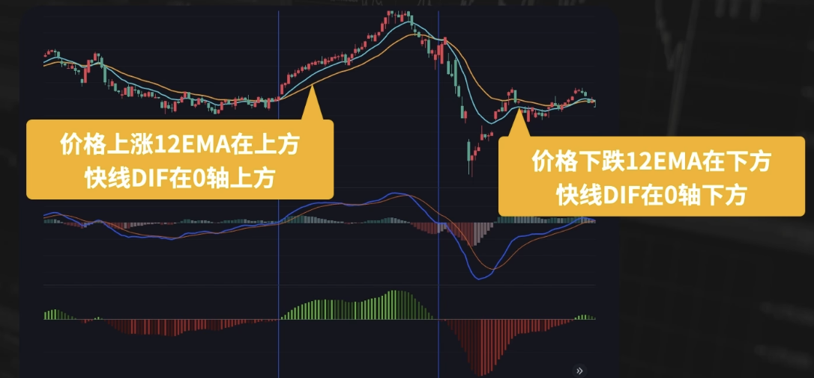
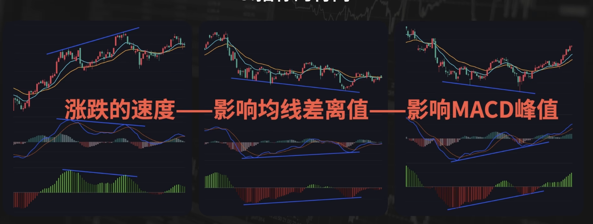
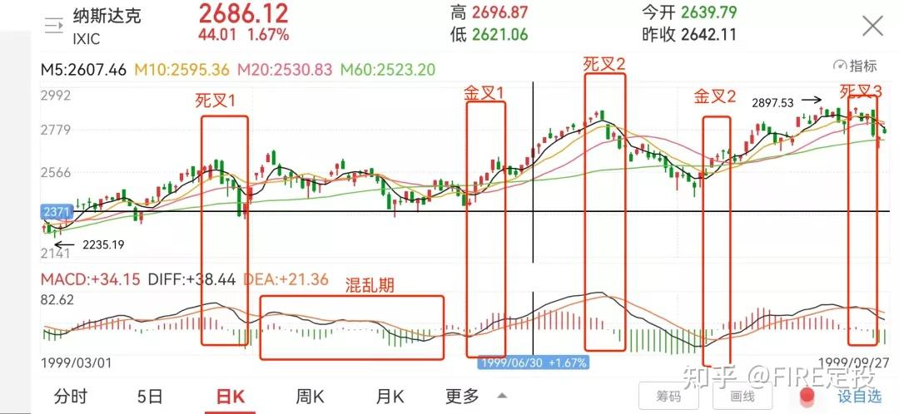

# MACD

- [原理](#%E5%8E%9F%E7%90%86)
  * [EMA](#ema)
  * [MACD](#macd)
- [应用与策略](#%E5%BA%94%E7%94%A8%E4%B8%8E%E7%AD%96%E7%95%A5)
  * [根据快线DIF位置判断趋势](#%E6%A0%B9%E6%8D%AE%E5%BF%AB%E7%BA%BFdif%E4%BD%8D%E7%BD%AE%E5%88%A4%E6%96%AD%E8%B6%8B%E5%8A%BF)
  * [金叉死叉作为多空信号](#%E9%87%91%E5%8F%89%E6%AD%BB%E5%8F%89%E4%BD%9C%E4%B8%BA%E5%A4%9A%E7%A9%BA%E4%BF%A1%E5%8F%B7)
  * [快线位置+交叉信号](#%E5%BF%AB%E7%BA%BF%E4%BD%8D%E7%BD%AE%E4%BA%A4%E5%8F%89%E4%BF%A1%E5%8F%B7)
  * [指标背离判断行情反转](#%E6%8C%87%E6%A0%87%E8%83%8C%E7%A6%BB%E5%88%A4%E6%96%AD%E8%A1%8C%E6%83%85%E5%8F%8D%E8%BD%AC1736597599791-991d370b-bb91-4b85-9ddf-ae17549d3e9cpngimgfy47cdeolwsuvr-j1736597599791-991d370b-bb91-4b85-9ddf-ae17549d3e9c-226523png)
- [用法扩展](#%E7%94%A8%E6%B3%95%E6%89%A9%E5%B1%95)
  * [差离值的正负](#%E5%B7%AE%E7%A6%BB%E5%80%BC%E7%9A%84%E6%AD%A3%E8%B4%9F)
  * [差离值的变化](#%E5%B7%AE%E7%A6%BB%E5%80%BC%E7%9A%84%E5%8F%98%E5%8C%96)
  * [指标的背离](#%E6%8C%87%E6%A0%87%E7%9A%84%E8%83%8C%E7%A6%BB)
- [案例](#%E6%A1%88%E4%BE%8B)
- [总结](#%E6%80%BB%E7%BB%93)
- [参考资料](#%E5%8F%82%E8%80%83%E8%B5%84%E6%96%99)

---

DIF: 12EMA - 26EMA

DEA: 9EMA on DIF

能量柱: DIF - DEA

MACD（Moving Average Convergence and Divergence）是Geral Appel 于1979年提出的，利用收盘价的短期（常用为12日）指数移动平均线与长期（常用为26日）指数移动平均线之间的聚合与分离状况，对买进、卖出时机作出研判的技术指标。

MACD是任何股票软件都必备的技术指标，应用广泛，一个研究技术分析绕不开的指标。也有人把MACD叫做指标之王。

## 原理
### EMA
介绍MACD之前，先看什么是EMA。

指数平均数指标(Exponential Moving Average，EXPMA或EMA) 指数平均数指标也叫EXPMA指标，它也是一种趋向类指标，其构造原理是仍然对价格收盘价进行算术平均，并根据计算结果来进行分析，用于判断价格未来走势的变动趋势。

EMA相当于加权平均的SMA（Simple Moving Average，之前讲的简单移动平均线），距离当下越近的价格，权重越大。

公式如下，主要包含X和N两个入参。X来自数据，代表当天的收盘价；N由人为设置，代表**周期**。

如何理解公式？

假设用前一天的EMA值（ EMA(X, N-1) ）来替代前面所有日子的收盘价，可以得到公式：

$ EMA(X,N) = \frac{X + (N-1) \times EMA(X, N-1)}{N} $

为了让当天的收盘价影响更大，计算时额外增加一天，新增的一天的收盘价与当天相同。

$ EMA(X,N) = \frac{X + X + (N-1) \times EMA(X, N-1)}{N+1} = \frac{2X + (N-1) \times EMA(X, N-1)}{N+1} $

从EMA的定义可以看出，相比SMA，EMA对价格波动的敏感度更高。看多或看空信号的发出，能够得到相应的提前。

### MACD
MACD基于EMA，而EMA基于SMA。MACD是从移动平均线衍生出来的。 

MACD在不同平台的呈现会有差异，常见的有单线MACD和双线MACD。国内大都以双线为主：

MACD技术指标通常由DIF线、DEA线、能量柱及零轴四个元素组成（这里说的是双线，单线只有能量柱和0轴）。元素解释的解释如下：

+ 名称：指数平滑异同移动平均线
+ 参数：一般来说，N有3个默认参数：12，26，9。
+ 组成：
    - 双线
        * 快线DIF（Difference Average）：12EMA - 26EMA。表示的是两根均线的差离值。
            + 两根均线的差离值越大，快线的数值也就越大
            + 两根均线相交，快线就在0轴
            + **12EMA上穿26EMA形成金叉，快线就会从0轴的下方上穿至0轴的上方。**
        * 慢线DEA（Difference Exponential Average）：DIF的9EMA。在快线DIF上，计算周期为9的EMA得到。
            + 慢线跟随快线变化，滞后于快线。
        * 能量柱： n * （快线DIF - 慢线DEA）
            + 快线和慢线的差离值。快线在慢线之上，能量柱就在0轴的上方。有的软件用1倍差离值，有的用2倍。
        * 0轴。
    - 单线
        * 能量柱
            + 和双线不同，单线的能量柱表示DIF的数值。（双线的DEF滞后于DIF，能量柱也就相对滞后些）
        * 0轴

## 应用与策略
### 根据快线DIF位置判断趋势
根据快线的位置、快线和慢线的状态来判断价格走势。

快线上穿0轴，在0轴的上方，说明多头较强，买入；反之空头较强，卖出。

### 金叉死叉作为多空信号
通常，也用MACD快线和慢线的交叉作为多空的信号。

快线上穿慢线形成金叉，作为多头信号；快线下穿慢线形成死叉，作为空头信号。 

### 快线位置+交叉信号

把快线的位置和交叉的信号结合运用。更稳重一些。

当快线在0轴的上方，说明市场处于多头的趋势，

### 指标背离判断行情反转
 背离指的是，价格连续的上涨，不断地创新高，但MACD指标快线的峰值在减少。这就形成了指标和价格的背离。背离往往被用来判断行情反转。

## 用法扩展
MACD指标的核心在于快线DIF，

快线的数值 = 两根均线的差离值，

要从两根均线的差离值上入手，理解价格走势和两根均线差离值变化的关系。

### 差离值的正负

观察12EMA和26EMA两根均线的相对位置 === 观察快线和0轴的相对位置，本质是一样的。

### 差离值的变化
什么时候差离值会变大，什么时候会变小？和价格上涨的速度有关。

减速上涨，或上涨转下跌，都会出现偏离值。

### 指标的背离
 背离描述了，价格在不断创新高上涨，但上涨速度减缓。

引出2个问题：

1. 上涨速度减缓是否意味着行情要反转？
    1. 有可能，不一定。只是对过去的描述，不代表未来。
2. 是否一定要借助MACD来观察背离？
    1. 不一定，裸K看趋势也可以看出。

## 案例
美国1999-2020年间有三次加息（1999年6月30日，2004年6月30日，2015年12月16日）。

每次加息期间，MACD指标+根据金叉死叉作为多空信号的策略（上面的第二个策略），都是有效的。

[https://zhuanlan.zhihu.com/p/455166102](https://zhuanlan.zhihu.com/p/455166102)

## 总结
MACD类似均线，客观但滞后。

趋势不一定用MACD判断，用均线、裸K直接观察价格都可以。

那为什么用指标？更加直观。

同花顺上有时会展示MACDFS，和MACD有什么区别？

MACD和MACDFS没区别，MACD是K线图的，MACDFS是算分时图的，就是一个指标，算法参数都一样，MACDFS就是分时的MACD。

## 参考资料
+ [【Jim】十分钟搞懂【MACD】技术指标丨交易投资基础_哔哩哔哩_bilibili](https://www.bilibili.com/video/BV12Z4y1b72D?spm_id_from=333.788.videopod.sections&vd_source=a637826c55b409b420b4b6584a6e8379)
+ [MACD指标](https://baike.baidu.com/item/MACD%E6%8C%87%E6%A0%87/6271283)
+ [指数平均数指标](https://baike.baidu.com/item/%E6%8C%87%E6%95%B0%E5%B9%B3%E5%9D%87%E6%95%B0%E6%8C%87%E6%A0%87/1847442)
+ [再次复盘历史上美国加息时，纳斯达克的表现！展示MACD金叉死叉在美股投资中有效性如何](https://zhuanlan.zhihu.com/p/455166102)

> 更新: 2025-08-11 02:46:08  
> 原文: <https://www.yuque.com/viruspc/el3mi0/kg8d50bp3x6d9k8w>