# 均线

- [原理](#%E5%8E%9F%E7%90%86)
- [作用](#%E4%BD%9C%E7%94%A8)
  * [趋势追踪](#%E8%B6%8B%E5%8A%BF%E8%BF%BD%E8%B8%AA)
  * [助涨助跌](#%E5%8A%A9%E6%B6%A8%E5%8A%A9%E8%B7%8C)
  * [支撑阻力](#%E6%94%AF%E6%92%91%E9%98%BB%E5%8A%9B)
- [分析市场（均线的使用）](#%E5%88%86%E6%9E%90%E5%B8%82%E5%9C%BA%E5%9D%87%E7%BA%BF%E7%9A%84%E4%BD%BF%E7%94%A8)
- [构建策略](#%E6%9E%84%E5%BB%BA%E7%AD%96%E7%95%A5)
  * [黄金交叉与死亡交叉](#%E9%BB%84%E9%87%91%E4%BA%A4%E5%8F%89%E4%B8%8E%E6%AD%BB%E4%BA%A1%E4%BA%A4%E5%8F%89)
  * [多头排列、空头排列与死亡排列](#%E5%A4%9A%E5%A4%B4%E6%8E%92%E5%88%97%E7%A9%BA%E5%A4%B4%E6%8E%92%E5%88%97%E4%B8%8E%E6%AD%BB%E4%BA%A1%E6%8E%92%E5%88%97)
  * [逐浪上升与逐浪下降](#%E9%80%90%E6%B5%AA%E4%B8%8A%E5%8D%87%E4%B8%8E%E9%80%90%E6%B5%AA%E4%B8%8B%E9%99%8D)
  * [向上爬坡](#%E5%90%91%E4%B8%8A%E7%88%AC%E5%9D%A1)
  * [死亡谷](#%E6%AD%BB%E4%BA%A1%E8%B0%B7)
- [案例](#%E6%A1%88%E4%BE%8B)
- [总结](#%E6%80%BB%E7%BB%93)
- [参考资料](#%E5%8F%82%E8%80%83%E8%B5%84%E6%96%99)

---

涉及不同时间尺度的聚合查询（rollup and drill down）。

历史数据，趋势

综合观察长、中、短期移动平均线，可以判断市场的多重倾向。

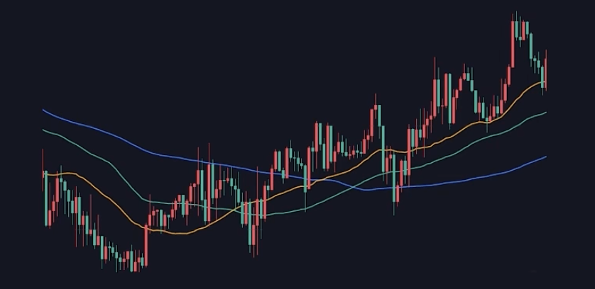

## 原理
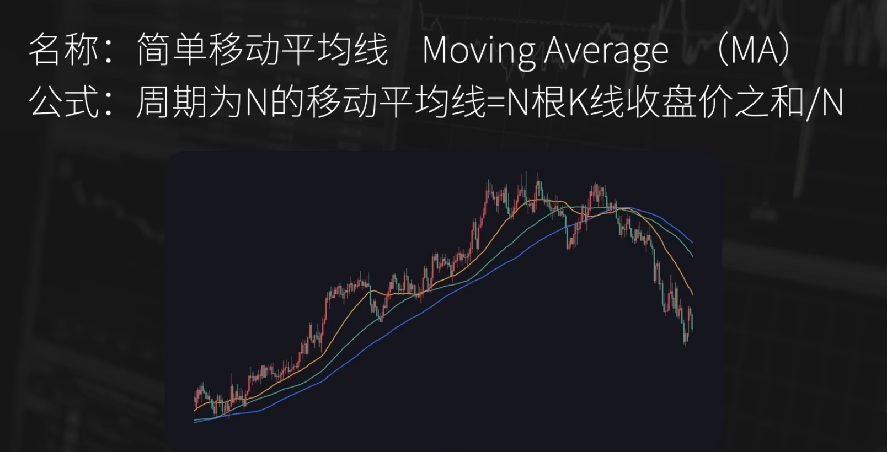

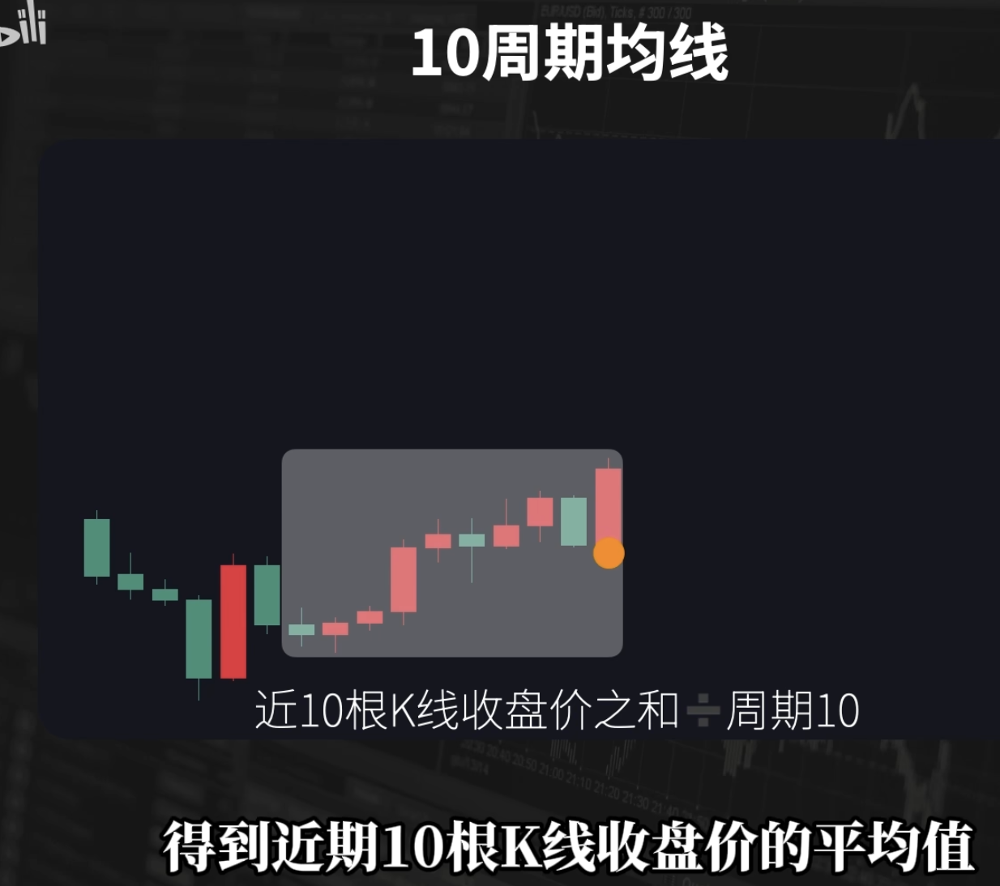

几个关键点：

+ 周期：短周期均线 中周期均线 长周期均线
+ 用法：单根均线 双均线 均线组合
+ 作用：追踪趋势 助涨助跌 支撑阻力等

价格和均线的关系？

+ 价格走势**决定**均线走势，均线**滞后**于价格。

均线简单、直观、客观，但滞后于价格走势

所以不要太依赖均线做交易，均线是结果，我们更应该去研究造成结果的原因。

## 作用
### 趋势追踪
+ 1.均线**描述过去**的走势，不是预测未来
+ 均线跟随价格，描述的是价格上涨的**节奏**
    - 价格跌破均线，也不一定代表价格的转变，可能只是上涨节奏的变缓。
+ 判断趋势**有更高效的方式**
    - 比如道氏理论中对趋势的定义：高点不断创新高，低点不断抬升。通过对价格高低点的观察，同样可以判断出趋势。

### 助涨助跌
均线是否有**助涨助跌**作用？

= 均线的状态会**影响**价格波动

= 市场中的资金是**依据**均线进行**交易**

更多的是果而非因。

但考虑到市场上许多人都依靠均线做交易，可能间接存在助涨助跌的作用

### 支撑阻力
支撑阻力两个核心要素：1. 锚定效应 2. 订单驱动

市场中的资金**依据某个位置**进行**订单的操作**就形成了支撑阻力

+ 如果价格到达均线，但价格没有发生变化，那么就没有足够多的资金在依赖这条均线在进行交易。反之，市场是认可这条均线的支撑阻力的。

支撑阻力需要价格走势的验证

## 分析市场（均线的使用）
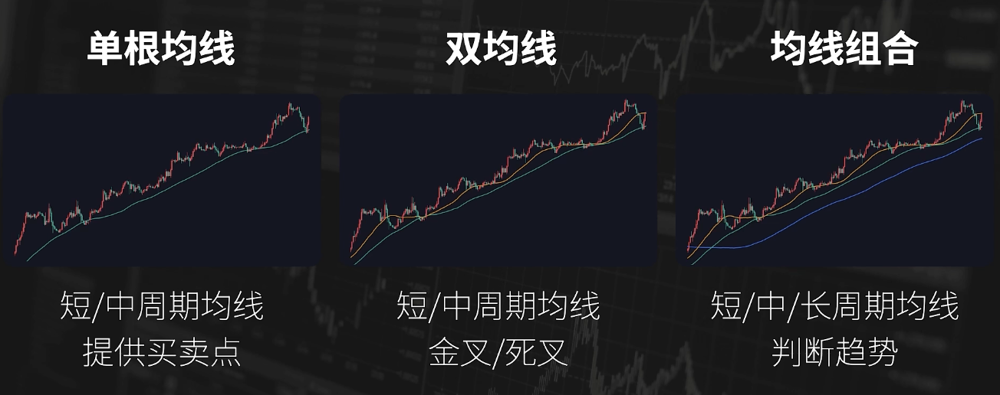

单根均线：一般运用的是短周期均线或中周期均线，观察的是价格和均线的位置关系，主要用来提供买卖点。常见的买卖规则：

1. 葛南维八大法则，四大买点，四大卖点。
2. 价格上穿均线形成的黄金交叉；价格在均线的上方，
3. 在均线附近收到支撑形成的回测不破；
4. 价格在均线上方，小幅度下破均线，又迅速收盘至均线上方，形成的小幅突破；价格距离均线过远，形成的怪力过大，

双均线：一般运用的是短周期均线和中周期均线，也是用来提供买卖的信号。常见的买卖规则：

1. 短期均线上穿长期均线形成的金叉，或者相反的死叉。金叉买入，死叉卖出

多均线：一般运用多根有一定时间跨度的 短周期到长周期 的均线。主要通过均线的多头排列、空头排列来描述趋势的行情。

价格走势和均线的关系？（因果）

价格走势决定均线状态。一定斜率的连续上涨走势，添加合适的均线，都可以使得均线的斜率向上，并且得到相应的位置关系。一定时间的连续上涨或短时间的大幅上涨，都会使得均线组合出现多头排列的状态。

走势和均线之间是有确定关系的，**每一种均线状态都有对应价格走势**；但从获取市场信息的角度来看，均线和其他技术指标都是滞后的。

当用均线作为入场出场 的信号时， 要清楚均线状态给到的信息背后都有相对应的价格走势。

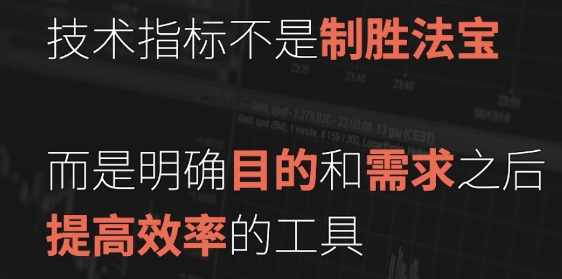

 

## 构建策略

研究均线的组合和参数，来判断趋势，找到入场出场的信号。

### 黄金交叉与死亡交叉
黄金交叉牛市，买入；死亡交叉熊市，卖出。

一涨就买？不，金叉再买。

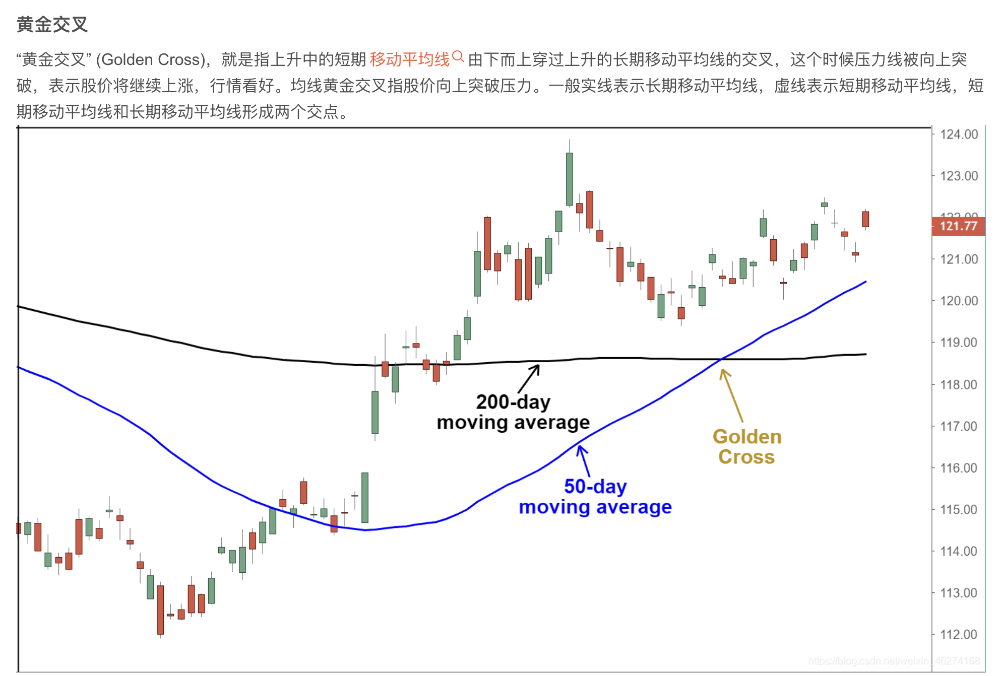

### 多头排列、空头排列与死亡排列
短期均线在最上面，中期均线在中间，长期均线在最下面，并且三条均线同时向上移动的排列形态即为多头排列，这是非常典型的买进信号，在多头排列的强烈支撑之下，价格会大幅上涨。

三根均线同时以圆弧状向下运行，且从上到下时间越来越短，一般来说，一旦均线形成空头排列，尤其是经历过一段大幅上涨后的空头排列，意味着价格将会继续下跌。

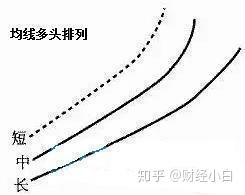

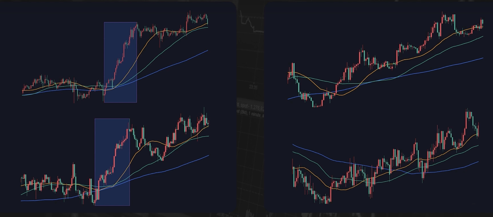

### 逐浪上升与逐浪下降
短期、中期均线沿着长期均线的上升轨迹呈波浪向上运行，意味着价格有较大的上升空间，虽然中间会有小幅下跌，但空方没有持续能力，多方占据优势。

### 向上爬坡
是一个基础技术指标，当短期移动平均线超过长期移动平均线时。当这个事件发生时，一般认为是一个牛市的信号，也就是看涨信号，买入。而这个短期，一般是50个周期，比如50天；而长期，一般说200个周期，比如200天。在数字货币里面，这个周期也可以是50、200小时或分钟。当然，这里的50或200个周期，也是可以修改的。

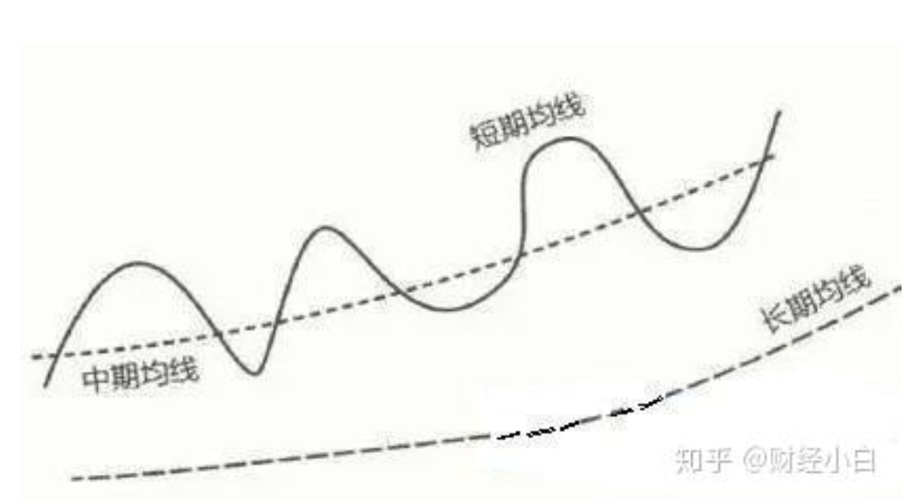

### 死亡谷
当上升的均线系统整体发生逆转的时候，就会形成死亡谷，短期均线向下穿过中/长期均线，中期均线向下穿过长期均线，形成一个头冲下的不规则三角形或者叫扇形区域。如果死亡谷出现在价格大幅上涨之后，代表着接下来会有个极大的下降空间。

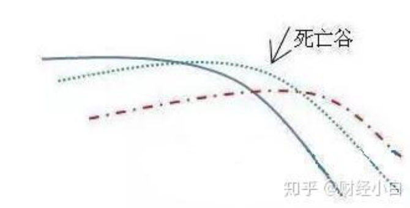  

## 案例
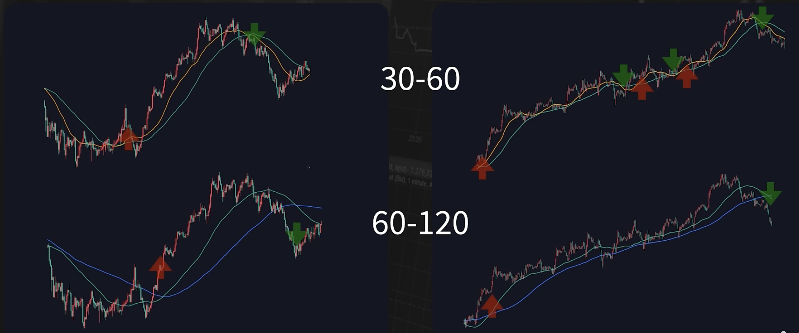

在不同参数的均线下，应用相同的规则：金叉信号做多，死叉信号平仓出场。

参数更大的均线组合，入场和出场的位置都会之后一些，稳定性更高一些。 

参数更小的均线组合，会有更多入场和出场的信号，盈利和亏损的空间更大。

不同行情适合不同的参数。**在适合的行情下，都可以拿到属于规则内的利润**。

什么样的参数、策略更好？其实这个不取决于均线的参数或组合， 而是取决于你交易的标的和当下的行情

如果说交易的标的在某一个周期，经常会走趋势的行情。**在趋势的行情中，用各种均线的趋势策略，都更容易盈利**。只不过不同的规则会拿到不同的利润。如果这个标的经常出现小段的连续上涨，那参数更小的均线策略更加适合；如果标的经常出现的是有一定调整幅度的大段连续上涨， 那用参数更大的均线策略更加适合。（PS：也要注意选择成本，短线交易选择成本更高）

**决定盈亏的要素是什么？取决于你交易的标的，出现这样的走势概率有多大、出现入场信号的频率有多高、出现入场信号之后的成功率又有多少。**

用均线或者其他技术指标构建的策略，都会有自己适合的行情，可以拿到对应的利润。但是，**一个标的是否经常出现这样的行情，才决定了这个策略能不能盈利**。

所以，用技术指标构建策略是，研究的精力还是要回到市场当中，回到交易的标的，回到行情的走势上去深入的研究一个标的，去做统计，去找规律，看这个标的有什么特性，经常出现什么样的走势（pattern）。然后，回到技术指标，用具体的规则、寻找能够经常在这样的走势中盈利的具体的参数，从而构建交易策略。

根据 标的 + 行情 来选择 技术指标。

## 总结
+ 简单、直观、客观，但滞后于价格走势。不要太依赖均线做交易，均线是结果，我们更应该去研究造成结果的原因。
+ 技术指标构建的策略都有**适合的****行情**可以拿到利润
+ 策略盈亏取决于**标的**出现这样行情的**概率， 频率，成功率**（PS：参数选的小会增加选择成本）
+ 要先**研究市场，研究标的**在什么情况下经常出现什么样的走势。然后，再用合适的指标参数去构建策略，交易这样的走势

做交易，除了研究技术指标的参数和组合、深入研究标的，还有没有其他的研究方向？

也有，那就是价格行为。通过价格去识别市场中资金的动作和预期。

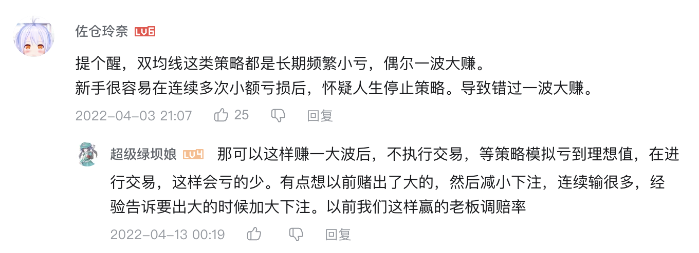

## 参考资料
+ [https://www.bilibili.com/video/BV1Sa411b7qW/?spm_id_from=333.1387.search.video_card.click&vd_source=a637826c55b409b420b4b6584a6e8379](https://www.bilibili.com/video/BV1Sa411b7qW/?spm_id_from=333.1387.search.video_card.click&vd_source=a637826c55b409b420b4b6584a6e8379)
+ [https://www.bilibili.com/video/BV12L4y1L7TA?spm_id_from=333.788.videopod.sections&vd_source=a637826c55b409b420b4b6584a6e8379](https://www.bilibili.com/video/BV12L4y1L7TA?spm_id_from=333.788.videopod.sections&vd_source=a637826c55b409b420b4b6584a6e8379)

> 更新: 2025-01-10 16:42:12  
> 原文: <https://www.yuque.com/viruspc/el3mi0/fvy90thuhtqy6nm1>