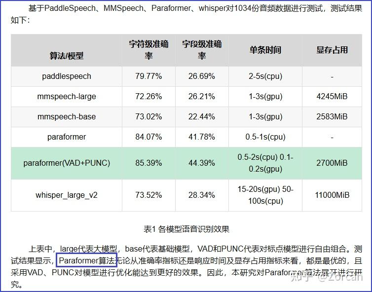

# VAD/ASR/TTS

- [**一、语音技术分类**](#%E4%B8%80%E8%AF%AD%E9%9F%B3%E6%8A%80%E6%9C%AF%E5%88%86%E7%B1%BB)
- [VAD](#vad)
- [**ASR**](#asr)
- [TTS](#tts)
- [**说话人确认：**](#%E8%AF%B4%E8%AF%9D%E4%BA%BA%E7%A1%AE%E8%AE%A4)
- [**Speaker diarization**](#speaker-diarization)
- [**二、调研目标**](#%E4%BA%8C%E8%B0%83%E7%A0%94%E7%9B%AE%E6%A0%87)
- [**三、调研过程**](#%E4%B8%89%E8%B0%83%E7%A0%94%E8%BF%87%E7%A8%8B)
- [**说话人确认（**Speaker Verification**）**](#%E8%AF%B4%E8%AF%9D%E4%BA%BA%E7%A1%AE%E8%AE%A4speaker-verification)
- [**说话人日志：**](#%E8%AF%B4%E8%AF%9D%E4%BA%BA%E6%97%A5%E5%BF%97)
  * [**2.1评测结果**](#21%E8%AF%84%E6%B5%8B%E7%BB%93%E6%9E%9C)
  * [**2.2 huggingface的榜单:**](#22-huggingface%E7%9A%84%E6%A6%9C%E5%8D%95)
- [**ASR：**](#asr)
- [**说话人日志+ASR结合：**](#%E8%AF%B4%E8%AF%9D%E4%BA%BA%E6%97%A5%E5%BF%97asr%E7%BB%93%E5%90%88)

---

[https://zhuanlan.zhihu.com/p/1888206510829573218](https://zhuanlan.zhihu.com/p/1888206510829573218)

## **一、语音技术分类**
## [VAD](https://zhida.zhihu.com/search?content_id=255589812&content_type=Article&match_order=1&q=VAD&zhida_source=entity)：声音活动检测
Voice Activity Detection

具体来说，它是检测人类语音存在与否的技术，主要用于语音处理领域。VAD能够有效区分语音和非语音部分，

VAD系统通常包括两个部分：

特征提取；

语音/非语音判决。

  

## [**ASR**](https://zhida.zhihu.com/search?content_id=255589812&content_type=Article&match_order=1&q=ASR&zhida_source=entity)**：**自动语音识别技术
Automatic Speech Recognition

一般都要经过vad，然后计算出每个分段音频的embedding特征，再进行聚类，从而获得最终标注结果。

计算embedding特征，一般可以采用声纹提取模型，比如wespeaker。

其中聚类模型，是所有发音人分离方法中，非常重要的一环。常采用层次聚类，谱聚类，以及kmeans。

  

## [TTS](https://zhida.zhihu.com/search?content_id=255589812&content_type=Article&match_order=1&q=TTS&zhida_source=entity)：文字转语音
Text-to-Speach，相当于嘴巴

  

## **说话人确认：**
说话人确认（[Speaker Verification](https://zhida.zhihu.com/search?content_id=255589812&content_type=Article&match_order=1&q=Speaker+Verification&zhida_source=entity)）是一种生物特征识别技术，属于语音信号处理领域的一部分。它通过分析语音信号中的特征（如音色、语调、频率等），判断某段语音是否来自某个特定的人。

  

## [**Speaker diarization**](https://zhida.zhihu.com/search?content_id=255589812&content_type=Article&match_order=1&q=Speaker+diarization&zhida_source=entity)**：说话人分类**
从多个说话人中分离出各个人的音频部分。

  

  

## **二、调研目标**
需求/目的：从一段语音中分离出各个人的说话的部分，并且识别为文字。

说话人分割识别转录包含两个阶段的技术/模块：

1. Speaker diarization：说话人分类

输入：语音

输出：说话人的区分，**不同人在说话的时间段**，role编号

  

1. ASR：自动语音识别技术

输入：语音

输出：语音对应的说话人的**语音——>文字** **文字转录**

  

  

  

## **三、调研过程**
## **说话人确认（**Speaker Verification**）**
只对比确认，不定位到时间

| models | stars星数/活跃度 | 支持的语言 | 评测排行/效果 | 输入/输出 |
| :--- | :--- | :--- | :--- | :--- |
| CAM++说话人确认-中文-3DSpeaker-16k | 43.2k | 本模型使用公开的中文说话人数据集3DSpeaker进行训练，包含约1w个说话人。 | | 输入：两端音频输出：相似度，确认 |
| CAM++说话人确认-中文-通用-200k-Spkrs | 11.5M | 中文（使用大型中文说话人数据集进行训练，包含约200k个说话人。） | 相比主流的说话人识别模型ResNet34和ECAPA-TDNN，获得了更高的准确率，同时具有更快的推理速度。可以处理多人同时说话人的情况等 | |
| ERes2Net说话人确认-中文-通用-200k-Spkrs | 3.4M | 中文（使用大型中文说话人数据集进行训练，包含约200k个说话人，可以对16k采样率的中文音频进行识别。） | 见下面1.1评测（效果比v2版本还好） | |
| ERes2NetV2说话人确认-中文-通用-200k-Spkrs | 144.3k | 中文（使用大型中文说话人数据集进行训练，包含约200k个说话人，可以对16k采样率的中文音频进行识别。） | | |
| ERes2Net-Large说话人确认-中文-3D-Speaker-16k | 53.4k | 中文数据集（使用开源数据集3D-Speaker数据集进行训练，包含约10k个说话人，可以对16k采样率的中文音频进行识别。） | | |
| ERes2Net说话人确认-英文-VoxCeleb-16k-离线-pytorch | 55.1k | 英文（用公开的英文说话人数据集VoxCeleb2开发集进行训练，共计5994个说话人，可以对16k采样率的英文音频进行说话人识别。） | | |
| CAM++说话人确认-英文-VoxCeleb-16k | 32.9k | 英文（使用公开的英文说话人数据集VoxCeleb2进行训练，包含5994个说话人。） | | |

以下是对测评的一些标准的解释：

+ CN-Celeb ：是一个用于说话人识别和确认任务的中文语音数据集。
+ EER ：等错误率，是衡量说话人识别系统性能的一个重要指标。它表示当误接受率（False Acceptance Rate, FAR）等于误拒绝率（False Rejection Rate, FRR）时的错误率。EER值越低，说明系统的性能越好。
+ Spks trained：表示训练这些模型所使用的说话人数量。这里的“Spks”是“Speakers”的缩写，即说话人。
+ **CN-Celeb Test：**表示在CN-Celeb测试集上得到的EER值，单位为百分比（%）。

  

  

  

  

  

## **说话人日志：**
输出：时间区间，说话人标签

| models | star 星数/活跃度 | 支持语言 | 测评效果/排行 | 输入/输出 | 模型结构 |
| :--- | :--- | :--- | :--- | :--- | :--- |
| [Pyannote.audio](https://zhida.zhihu.com/search?content_id=255589812&content_type=Article&match_order=1&q=Pyannote.audio&zhida_source=entity) 库（python库） | github7.1k | 中文英文多种语言 | | 输入：音频格式文件，wav、.mp3 等，但建议使用 .wav 格式以确保兼容性。采样率 ：音频必须是 16kHz 的采样率。否则需要重采样。声道 ：音频必须是 单声道（Mono） 。立体声（Stereo），需转换单声道输出：时间区间，说话人标签 | 链接：[https://github.com/pyannote/pyannote-audio](https://link.zhihu.com/?target=https%3A//github.com/pyannote/pyannote-audio) 镜像安装：pip install -i <[https://pypi.tuna.tsinghua.edu.cn/simple](https://link.zhihu.com/?target=https%3A//pypi.tuna.tsinghua.edu.cn/simple) > pyannote.audiopyannote中所有的网络均采用了PyanNet结构（PyanNet结构，即VAD，SCD，OSD，SE。） |
| CAM++说话人日志-对话场景角色区分-通用 | 313.3k | 通用中文（内部的模块用的是中文的模块） | 支持多人 | | 包含模块： VAD模型，FSMN语音端点检测-中文-通用-16k 说话人模型，CAM++说话人确认-中文-通用-200k-Spkrs 说话人转换点定位模型，CAM++说话人转换点定位-两人-中文 |
| CAM++说话人转换点定位-两人-中文 | 187.1k | 中文（使用大规模的中文两人合成音频数据集进行训练。） | | | |
| ERes2Net-Large说话人日志-对话场景角色区分-通用 | 18.7k | 通用中文（内部模块用的中文版模块） | | 输入：音频输出：说话人日志 | VAD模型，FSMN语音端点检测-中文-通用-16k说话人模型，ERes2Net-Large说话人确认-中文-通用-200k-Spkrs说话人转换点定位模型，Xvector说话人转换点定位-两人-中文 |
| [SOND](https://zhida.zhihu.com/search?content_id=255589812&content_type=Article&match_order=1&q=SOND&zhida_source=entity) 说话人日志-英文-Callhome-8k-离线-pytorch2023年3月8论文 | 11.2k | 英文 | Speaker Overlap-aware Neural Diarization（SOND）是达摩院语音团队提出的一种高效建模语音重叠的说话人日志模型。本项目提供了在 Callhome 英文开源数据集上预训练的 SOND 模型，可以被应用于智能会议分析、对话分析等相关的学术研究。英文会议对话场景，端到端说话人日志模型，解决 "who spoke when" ICASSP 2023，在 [Callhome 数据集](https://zhida.zhihu.com/search?content_id=255589812&content_type=Article&match_order=1&q=Callhome+%E6%95%B0%E6%8D%AE%E9%9B%86&zhida_source=entity) 上获得 SOTA 结果。 | | |
| | | | | | |

用于测评的数据集的解释：

+ [AISHELL-4](https://zhida.zhihu.com/search?content_id=255589812&content_type=Article&match_order=1&q=AISHELL-4&zhida_source=entity)：这是一个**中文**语音数据集。
+ [AliMeeting](https://zhida.zhihu.com/search?content_id=255589812&content_type=Article&match_order=1&q=AliMeeting&zhida_source=entity) (channel 1)：阿里巴巴会议数据集，通常为**中文**。
+ [AMI](https://zhida.zhihu.com/search?content_id=255589812&content_type=Article&match_order=1&q=AMI&zhida_source=entity) (IHM) 和 AMI (SDM)：AMI是**英文**对话数据集。
+ AVA-AVD：这个数据集通常包含多种语言的数据。
+ CALLHOME (part 2)：CALLHOME数据集包含了多种语言的电话对话录音。
+ DIHARD 3 (full)：DIHARD数据集包含了多种语言的数据。
+ [Earnings21](https://zhida.zhihu.com/search?content_id=255589812&content_type=Article&match_order=1&q=Earnings21&zhida_source=entity)：英文，其他特定行业语言。
+ [Ego4D](https://zhida.zhihu.com/search?content_id=255589812&content_type=Article&match_order=1&q=Ego4D&zhida_source=entity) (dev.)：Ego4D是一个多模态数据集，多种语言。
+ [MSDWild](https://zhida.zhihu.com/search?content_id=255589812&content_type=Article&match_order=1&q=MSDWild&zhida_source=entity)：MSDWild数据集通常包含多种语言的数据。
+ RAMC：中文
+ REPERE (phase2)：REPERE数据集的具体语言没有明确标注。
+ VoxConverse (v0.3)：VoxConverse数据集包含多种语言的数据。

  

  

  

  

### **2.1评测结果**
| Model | Params | VoxCeleb1-O | CNCeleb | 3D-Speaker |
| :--- | :--- | :--- | :--- | :--- |
| Res2Net | 4.03 M | 1.56% | 7.96% | 8.03% |
| ResNet34 | 6.34 M | 1.05% | 6.92% | 7.29% |
| ECAPA-TDNN | 20.8 M | 0.86% | 8.01% | 8.87% |
| ERes2Net-base | 6.61 M | 0.84% | 6.69% | 7.21% |
| CAM++ | 7.2 M | 0.65% | 6.78% | 7.75% |
| ERes2NetV2 | 17.8M | 0.61% | 6.14% | 6.52% |
| ERes2Net-large | 22.46 M | 0.52% | 6.17% | 6.34% |

  

### **2.2 huggingface的榜单:**
榜单（只考虑英文，前四都不支持中文）：[https://huggingface.co/spaces/hf-audio/open_asr_leaderboard](https://link.zhihu.com/?target=https%3A//huggingface.co/spaces/hf-audio/open_asr_leaderboard)

测评：[https://zhuanlan.zhihu.com/p/716884477](https://zhuanlan.zhihu.com/p/716884477)

  

  

## **ASR：**
| models | star 星数/活跃度 | 支持语言 | 输入/输出 | 测评效果/排行 | 缺点 |
| :--- | :--- | :--- | :--- | :--- | :--- |
| whisper（openAI） | | 中文英文 | | 对于中文来说，FunAsr 明显优于 Whisper（毕竟 Whisper 支持多种语言） | 中文效果差[https://zhuanlan.zhihu.com/p/685844552](https://zhuanlan.zhihu.com/p/685844552) |
| Whisper-large-v3-turbo | 271.7k | 训练集大部分英文（加入粤语token） | | | |
| Whisper语音识别-多语言-large-v3 | 284.0k | | | | |
| whisper-large-v3 | 161.6k | 训练集大部分英文（加入粤语token） | | | |
| faster-whisper-large-v3 | 8.0K | | | | |
| paraformer-zh（达摩院） | | 中文（非自回归架构，并行解码，速度极快，看模型架构支持双编码） | | | 时间较早，包含在FunASR工具包里 |
| Paraformer语音识别-中文-通用-16k-离线-large-长音频版 | 33.2M | 中文（在希尔贝壳中文普通话开源语音数据库AISHELL，数据上进行评估，在一个工业级的20,000小时的普通话语音识别任务上进行评估和测试的） | | 多个中文公开数据集上取得SOTA效果学术数据集AISHELL-1、AISHELL-2、WenetSpeech，公开评测项目SpeechIO TIOBE白盒测试场景的效果。 | modelscope上讨论有很多争议 |

测试数据：采用开中文音频数据1034份，音频数据格式为mp3，且每一份都有对应的真实文本信息。音频数据大多为10s以内的短音频数据，数据内容分为简单的主谓宾语句、人名、数字、短语等等，具体示例如下：

  

  

  

  

## **说话人日志+ASR结合：**
| models | stars 星数，活跃度 | 支持语言 | 效果 | 结构/缺点 |
| :--- | :--- | :--- | :--- | :--- |
| qwen-Audio-Turbo-Latest | 闭源多模态模型 | 音频中支持的语言包括中文、英语、粤语、法语、意大利语、西班牙语、德语和日语。 | 接受多种音频（包括说话人语音、自然声音、音乐、歌声）和文本作为输入，并输出文本。通义千问Audio不仅能对输入的音频进行转录，还具备更深层次的语义理解、情感分析、音频事件检测、语音聊天等能力。 | 音频文件大小不超过10 MB。音频的时长建议不超过30秒，如果超过30秒，模型会自动截取前30秒的音频。音频文件的格式支持大部分常见编码的音频格式，例如AMR、WAV（CodecID: GSM_MS）、WAV（PCM）、3GP、3GPP、AAC、MP3等。输出的样式：看到的说话人编号有点问题 |
| qwen-omni-turbo | 闭源全模态 | | | |
| whisper+Pyannote | 有这种类型的项目，但是效果一般 | | | 性能一般项目1：链接：[https://colab.research.google.com/drive/12W6bR-C6NIEjAML19JubtzHPIlVxdaUq](https://link.zhihu.com/?target=https%3A//colab.research.google.com/drive/12W6bR-C6NIEjAML19JubtzHPIlVxdaUq) 项目2：[https://medium.com/@xriteshsharmax/speaker-diarization-using-whisper-asr-and-pyannote-f0141c85d59a](https://link.zhihu.com/?target=https%3A//medium.com/%40xriteshsharmax/speaker-diarization-using-whisper-asr-and-pyannote-f0141c85d59a) |
| Paraformer分角色语音识别-中文-通用（cam++➕paraformer) | 5.9M | 中文通用 | | |

> 更新: 2025-07-04 10:38:58  
> 原文: <https://www.yuque.com/viruspc/el3mi0/eixt7dbgclp9ox0c>