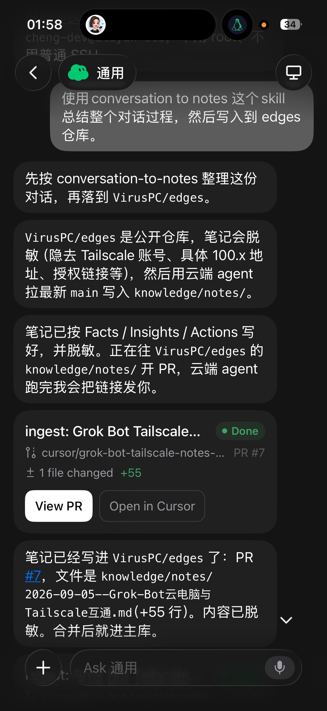
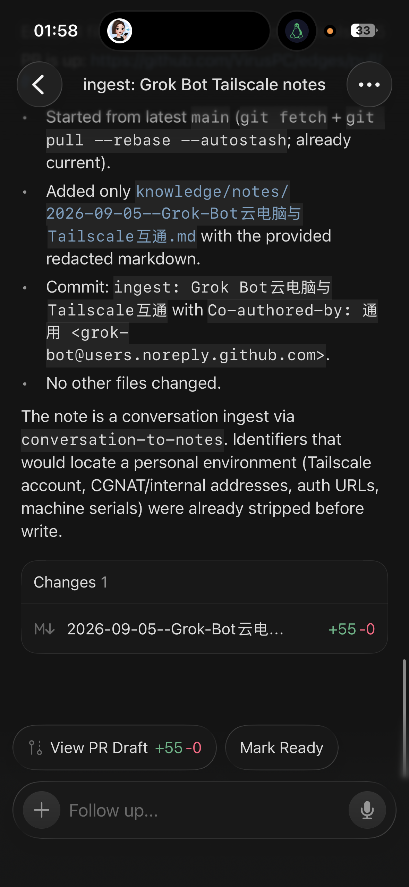

# Grok Bot App 与 Cursor App 的联动互补

> Ingested on 2026-09-05
>
> 本文为通用产品/工作流观察。配图为手机端任务卡与云端 agent 完成页截图，已确认无凭据、无内网地址、无个人身份标识。

【讨论主题】
在刚完成「对话 → conversation-to-notes → 写入 VirusPC/edges」的闭环后，对 Grok Bot 手机端与 Cursor 云端/桌面端如何分工互补的即时判断。

【主要结论】
(事实与共识)

- Grok Bot App 侧承担：对话理解、选型 skill（如 conversation-to-notes）、脱敏决策、发起入库任务，并在聊天里回传 PR 状态卡（含 View PR / Open in Cursor）。
- Cursor App / 云端 agent 侧承担：拉最新 main、落盘 markdown、提交（含 Co-authored-by）、开 PR；手机端可一键跳进 Cursor 继续审改。
- 二者不是重复能力，而是互补：聊天入口负责意图与编排，IDE/云端 agent 负责仓库写操作与开发者工作流。
- 实证：同一条「总结对话并写入 edges」指令，在手机 Grok Bot 里完成编排后，出现 Done 的 ingest 任务卡与 Cursor agent 完成页（+55 行笔记文件）。
- Grok Bot 本身不能直接「打开」用户的 Cursor App；聊天里的 Open in Cursor / 任务卡，来自 Cursor 云端 agent（CloudAgent）产物。
- 同一仓库写入可以有两条路径：(1) 云端 agent 改仓并出任务卡；(2) 在 Grok Bot 侧用 gh API 直接建 commit/PR。后者不会出现 Cursor 任务卡，也就没有手机端一键进 Cursor review 的入口。
- 本条笔记的首版曾用 gh API 直推（为了顺带提交截图），因此当时没有云端 agent 卡；现按用户要求改回以云端 agent 维护本 PR。

【认知更新】
(洞察与 Edge 雏形)

- **移动对话编排 + 云端改仓** 是一套完整闭环，而不是两个孤立 App。
- 「联动」要闭环，编排侧必须把写仓交给云端 agent，而不是在 Bot 里抄近路；否则互补只写在笔记里，体验上断掉。
- 对知识库场景，「在聊天里说一句」应默认能落到可评审的 PR，而不是停在聊天记录里。
- 状态卡上的「Open in Cursor」把手机决策和桌面深改接上了，降低上下文切换成本。

【行动指南】
(决策与后续动作)

- 以后凡「总结/整理对话」，默认走 conversation-to-notes，并写入 `VirusPC/edges` 的 `knowledge/notes/`（公开库先脱敏）。
- 以后凡写入 VirusPC/edges（及同类需要用户 review 的仓库改动），默认走 Cursor 云端 agent，方便在任务卡上 View PR / Open in Cursor 审内容。
- 除非用户明确要求，不要用 grok-bot 本机 gh API 直提 commit 作为常规入库手段。
- 需要审 PR 或改笔记时，优先从 Grok Bot 任务卡进 Cursor，而不是另开一轮口述。
- 继续观察：哪些任务适合只停在 Grok Bot，哪些必须丢给 Cursor 云端 agent。

【补充说明】
(其他重要细节或备注)

- 配图 1：Grok Bot 手机端展示 conversation-to-notes 入库流程与 PR #7 任务卡。
- 配图 2：Cursor 侧 agent 完成页，写明 fetch/pull、写入路径、Co-authored-by、脱敏说明与 +55/-0。
- 与同日笔记「Grok Bot 云电脑与 Tailscale 互通」同一条工作流上的产品层复盘。

【相关链接】
- 同日入库 PR（Tailscale 互通笔记）：https://github.com/VirusPC/edges/pull/7
- conversation-to-notes skill（仓库内）：`extensions/skills/conversation-to-notes`

