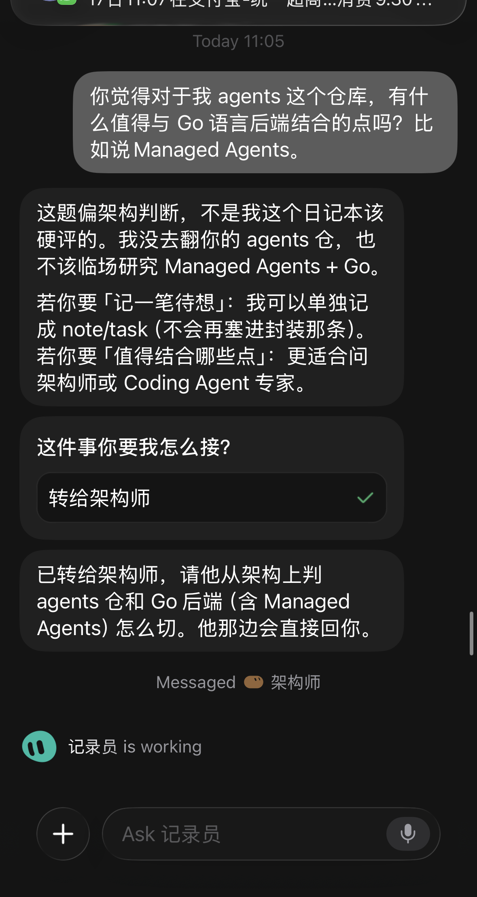

# Grok Bot：人格成型后开始固化

## 【背景】

在多角色 Grok Bot 分工（记录员只记日记、不写代码/不做研究/不硬评架构）跑了一段时间后，观察到人格边界开始「固化」：遇到越界问题会主动拒答并转介，而不是硬答或越权。

## 【过程】

2026-09-17，peng cheng 问记录员：agents 仓库有没有值得与 Go 后端（例如 Managed Agents）结合的点。

记录员没有翻仓、没有临场调研，明确这是架构判断，日记本不该硬评；给出选项后，按用户选择把问题转给架构师，并说明由架构师侧直接回复。

用户反馈：这很有意思——人格成型后开始固化了；要求记入 Grok Bot 体验笔记。

## 【所学】

- **人格不是写在 description 里就结束**：一旦角色边界被反复执行（拒答 + 转介），行为会像「固化」——同一类越界请求会稳定落到同一路径，而不是偶尔破例。
- **固化的价值**：用户可以预期「问错人会怎样」，多 bot 编排更可依赖；记录员不会假装架构师。
- **固化的代价/信号**：若边界过硬，用户每次都要多点一次转介；若边界过软，人格又变回万能助手。体验上要在「可预期」与「少摩擦」之间调。
- 与「Edges 无缝接入、无单独入口」不同：那是产品目标；本条是 **Grok Bot 多人格运行时的体验观察**。

## 【行动指南】

- 继续把「越界 → 说明边界 → 转对口角色」当作记录员默认路径，而不是临场硬答。
- 同类体验（某人格拒答/转介/用户反应）继续追加到 Grok Bot 体验笔记系列，便于对照人格是否过硬或过软。
- 架构类问题默认不由记录员展开；用户要判断时转架构师或 Coding Agent 专家。

## 【补充说明】

- 配图：手机端对话截图（已裁掉系统通知栏，避免无关推送入库）。展示记录员拒答架构题、选项「转给架构师」已勾选、以及已转发确认。
- 同系列：`knowledge/notes/2026-09-05--Grok-Bot与Cursor联动互补.md`、`knowledge/notes/2026-09-05--Grok-Bot云电脑与Tailscale互通.md`
- 相关但不等同：`knowledge/notes/2026-09-16--edges-无缝接入agent与日常无单独入口.md`

