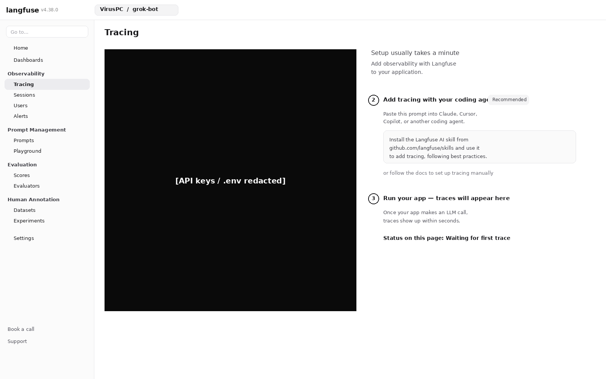

# 2026-09-23--Langfuse-自建实例与grok-bot项目接入

【背景】

2026-09-23，用户要把已经跑在 minigtr 上的自建 Langfuse，接到 Grok Bot 正在用的项目上。实例用 Docker 跑在这台迷你主机上，对外入口是 Cloudflare Tunnel 的 `https://langfuse.viruspc.tech`。Grok Bot 这边已经装着官方 Langfuse 插件技能，命令行通过 `npx langfuse-cli` 调用。

用户在 Langfuse 界面里打开组织 VirusPC 下的项目 grok-bot。当时版本是 v4.38.0，Tracing 页停在 Waiting for first trace。引导还停在三步：先创建 API key，再让编码代理把 tracing 加进应用，最后跑一次应用，trace 才会出现。这次对话要确认实例是活的、CLI 能看见同一个项目，并把引导页和接入方式记下来。公钥和私钥只放在 Langfuse 界面、盒子的 secret 存储和环境变量里，笔记不写取值。

【过程】

1. 先确认这台自建实例从外面打得开。访问 `https://langfuse.viruspc.tech` 返回 HTTP 200。再用 CLI 做健康检查，状态是 OK，报的版本是 4.38.0，和界面左上角一致。

2. 公钥和私钥没有以正文贴进聊天。用户通过 Grok Bot 的安全密钥请求提交了 `LANGFUSE_PUBLIC_KEY` 和 `LANGFUSE_SECRET_KEY`。这两份值进了盒子的 secret card。给 CLI 用的加载脚本是 `/home/box/.config/langfuse/env.sh`，脚本把它们 source 进环境。主机地址单独放在环境变量里：`LANGFUSE_HOST=https://langfuse.viruspc.tech`。Langfuse SDK 文档里常见的变量名是 `LANGFUSE_BASE_URL`，这次填的是同一个网址。

3. 环境就绪后执行 CLI 的 `projects list`。返回的项目是 grok-bot，所属组织是 VirusPC，和界面上打开的项目是同一个。

4. 用户要求把这次接入写成对话笔记，并带上 Tracing 引导页的截图。

5. 原始截图的引导页里，`.env` 片段直接写出了公钥和私钥。入库前把这块涂黑，公开仓库只留涂黑后的图。密钥既然进过截图，就按已经暴露处理：到该项目的设置里轮换，换下来的新值只回写 secret card 以及 `env.sh` 所加载的环境，不写进笔记。

【所学】

- 自建 Langfuse 的 CLI 和 SDK 都要显式知道主机地址。地址漏了或指到别的环境，健康检查和项目列表会对不上浏览器里打开的那一个实例。
- 界面引导写的是 `LANGFUSE_BASE_URL`，CLI 读的是 `LANGFUSE_HOST`。这是两个变量名，值是同一个 base URL。只设其中一个，另一侧仍然连不到这台自建实例。
- Waiting for first trace 表示项目已经在，但还没有一次被打点的 LLM 调用。空列表说明 tracing 还没发生，不说明 Docker 或 Tunnel 挂了。
- Tracing 引导页的 `.env` 代码块就是密钥正文。这类截图进公开仓库之前，密钥区域必须已经涂黑或裁掉。
- 密钥一旦出现在聊天或截图里，旧值就不再适合继续当私钥用。轮换发生在 Langfuse 项目设置里，仓库和笔记都不是存放新值的地方。

【行动指南】

- **若**要用 CLI 或 SDK 连接这台自建 Langfuse：  
  **则**把主机设为 `https://langfuse.viruspc.tech`。CLI 写入 `LANGFUSE_HOST`，SDK 按文档写入 `LANGFUSE_BASE_URL`，两处使用同一个网址。公钥和私钥只从 Langfuse 界面、secret 存储或环境变量读取，不写进仓库、笔记或 PR。

- **若**要在这台盒子上跑 `npx langfuse-cli`：  
  **则**先让 `/home/box/.config/langfuse/env.sh` 把 secret card 里的公钥和私钥 source 进当前环境，再执行命令。不要把密钥正文粘贴到聊天里。

- **若**Tracing 页仍显示 Waiting for first trace：  
  **则**先让应用发出一次带 Langfuse 打点的 LLM 调用，再回到 Tracing 页查看。在这次调用发生之前，列表为空是引导页的预期。

- **若**要把 Tracing 引导页截图放进公开仓库：  
  **则**先看画面里有没有 `.env` 密钥。有的话整块涂黑或裁掉，只提交涂黑后的图。

- **若**公钥或私钥已经出现在聊天、截图或日志里：  
  **则**打开 Langfuse 里 grok-bot 的项目设置，轮换这两把钥匙，把新值放回盒子的 secret card，并让 `env.sh` 加载新值。旧值作废后不要再抄进任何文件。

【补充说明】

**这次接入的对照**

| 项 | 这次的情况 |
| --- | --- |
| 宿主 | minigtr，Docker 自建 |
| 公网入口 | `https://langfuse.viruspc.tech`（Cloudflare Tunnel） |
| 组织 / 项目 | VirusPC / grok-bot |
| 界面与 CLI 版本 | 4.38.0；CLI 健康检查 status OK |
| 可达性 | 入口 HTTP 200 |
| Grok Bot 侧 | 官方 Langfuse 插件技能，命令为 `npx langfuse-cli` |
| 主机变量 | CLI 用 `LANGFUSE_HOST`；SDK 文档常见 `LANGFUSE_BASE_URL`。值都是上面的入口网址 |
| 密钥放哪 | Langfuse 项目界面、盒子 secret card、由 `env.sh` 注入的环境变量。笔记不记录取值 |
| CLI 加载脚本 | `/home/box/.config/langfuse/env.sh` |
| 当时界面 | Waiting for first trace。引导停在创建密钥、加 tracing、跑应用 |

**配图**

图中是 v4.38.0 的 Tracing 引导页：顶栏组织 VirusPC、项目 grok-bot。API key 和 `.env` 取值整块涂黑，标注为 API keys / .env redacted。右侧留下的是不含密钥的步骤：让编码代理按 `github.com/langfuse/skills` 加 tracing，以及跑应用之后 trace 才会出现。页面状态仍是 Waiting for first trace。

**仓内已有决策（供对照，不是这次新做的部署）**

- [ADR 0014](../../docs/adr/0014-self-hosted-langfuse-on-minigtr.md) — 宿主是物理机 minigtr。
- [ADR 0016](../../docs/adr/0016-langfuse-docker-compose.md) — v1 用官方 docker compose。
- [ADR 0018](../../docs/adr/0018-langfuse-secrets-stay-on-minigtr.md) — 密钥留在 minigtr 本机，不进本仓。
- [ADR 0017](../../docs/adr/0017-langfuse-tailscale-only-access.md) — 2026-09-20 把 v1 访问面记成仅 Tailscale，公网 HTTPS 当时还是后续。这次对话里实际打开的入口已经是 Cloudflare Tunnel 上的 `https://langfuse.viruspc.tech`。

**参考链接**

- [Langfuse self-hosting](https://langfuse.com/self-hosting) — 官方自建说明。这次实例跑在 minigtr 的 Docker 上，公网经 Cloudflare Tunnel。
- [langfuse/skills](https://github.com/langfuse/skills) — 引导页第二步让编码代理安装的官方 skill 仓库。Grok Bot 已有对应插件技能，CLI 走 `npx langfuse-cli`。
