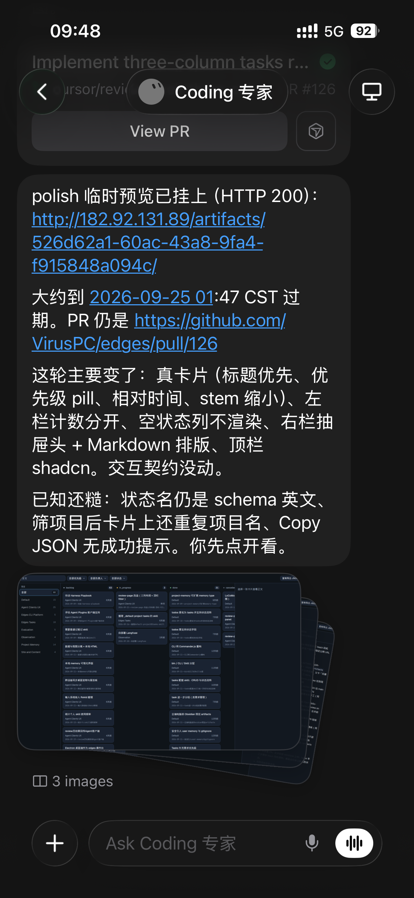
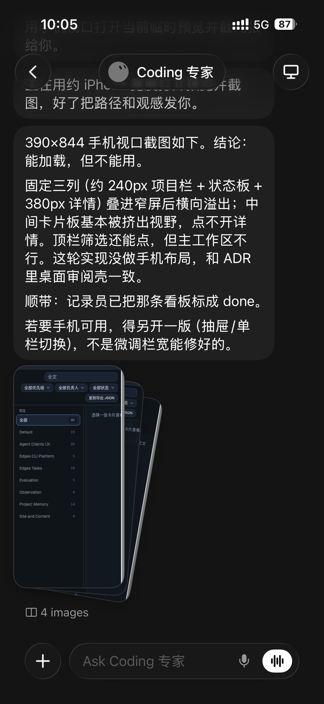
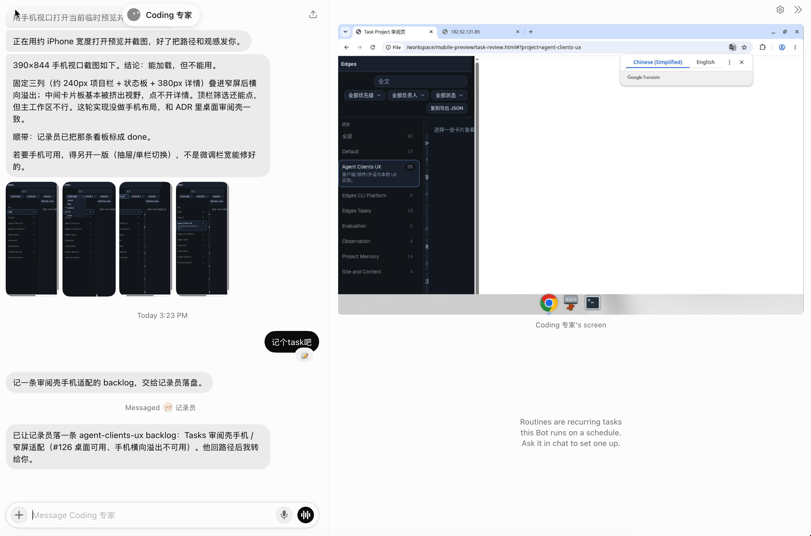

# Grok Bot 手机模拟器与在线预览体验

> Ingested on 2026-09-24
>
> 来自 peng cheng 的即时火花 + Cursor 手机端与 Grok Bot 手机端截图（云端 agent 汇报 PR #126 VirusPC/edges 三列 Tasks 看板更新，聊天内嵌多张 UI 截图与 View PR 按钮）。已确认无凭据、无内网地址。

【背景】

在 Cursor 手机端看 cloud agent 做页面/看板类改动时，截图预览已经能用；火花点在于：静态图只回答「看起来对不对」，交互与手机布局还缺一层预览能力——进而想到 Grok Bot 是否该提供手机模拟器或可分享的 mobile viewport 预览。

【新增移动视口证据】
(事实 / Facts)

- 390×844 viewport：能加载，但不能用。
- 固定三列（约 240px project 栏 + status 看板 + 380px 详情）在窄屏横向溢出；中间卡板被顶出可视区，点不开任务详情；顶栏 filter 能动，但主工作区不可用。
- 本轮按桌面审阅壳 / ADR 做，未做独立移动布局；微调列宽不够，需要 drawer 导航或单列切换等真正移动设计。
- 顺带：记录员已把相关看板项标 done。

【新增洞察】

- 这正是「截图/在线预览」的价值：在真窄视口上暴露桌面三列不可用，强化「需要手机模拟器或可切换 viewport 预览」的产品火花。

【新增洞察：聊天旁的 computer 侧栏】
(事实 / Facts + 产品火花)

- 现状：Grok Bot 右边的 computer 需要**点击进入二级页**后才能互动。
- 期望：能在聊天旁**原地操作**，交互体验会大幅提升；这会把已有的在线预览、移动模拟器，以及桌面 Chrome via cloud computer 的思路推进到**聊天内侧栏交互**。
- 判断：computer + 内置浏览器、桌面应用，能**超越一切 artifacts 浏览能力**（可交互 vs 只看）。
- 证据图：左 chat（Coding 专家、窄屏结论 + backlog 卡）+ 右 computer 桌面 Chrome 打开 `file:///workspace/mobile-preview/task-review.html?project=agent-clients-ux`。

【主要结论】
(事实 / Facts)

- Cursor 手机端侧重聊天内截图预览，可用来查看视觉效果。
- Grok Bot 手机端（Coding 专家会话）已能给临时在线预览链接 + 截图；该链接约于 2026-09-25 01:47 CST 过期，关联 PR #126。
- 更好的是给**在线链接预览**，以便同时体验交互，而不只看静帧。
- 网页端与手机端布局往往不同；只看桌面截图容易漏掉移动端问题。
- 电脑端：可结合 Grok Bot cloud computer 打开 Chrome 做可视化预览。
- 手机端：也可给手机模拟器环境预览 → 因此 **Grok Bot 可考虑提供手机模拟器**（或等价的 mobile viewport 预览能力）。

【认知更新】
(洞察 / Insights)

- Cursor 侧重聊天内截图预览；Grok Bot 侧已能给临时在线预览链接 + 截图。
- 火花仍是：要更好的可交互预览，以及手机模拟器 / 桌面 Chrome 分端预览能力。
- 静态截图解决「看起来对不对」；在线预览 / 模拟器解决「点得动、布局对不对」。
- 桌面预览与移动预览是两条能力：前者已有 cloud computer + Chrome 路径可想象；后者需要模拟器，或可分享的 mobile viewport URL。
- 与现有 edges Tasks 审阅壳 / PR 视觉验收工作流相关：PR 里贴多张板面截图 vs 可点开交互预览——后者更接近真实验收。

【行动指南】
(可选 backlog，不指派)

- 产品侧评估：Grok Bot 是否提供内置手机模拟器 / 可切换 viewport 的预览。
- 短期：云电脑 Chrome 设备模式 / 窄窗是否够用。
- 长期：真模拟器，或可分享的预览链接（含 mobile viewport）。

【相关链接】

- 触发上下文 PR（三列 Tasks 看板视觉）：[VirusPC/edges#126](https://github.com/VirusPC/edges/pull/126)
- 同主题调研笔记：[2026-09-24--Tasks审阅壳三列布局-grill与Playwright嵌入调研](./2026-09-24--Tasks审阅壳三列布局-grill与Playwright嵌入调研.md)
