# 任务发布看板的状态流转设计：主流工具一手资料调研

> 日期: 2026-09-10
> 专题: task-board-lifecycle
> 方法: 只采信一手来源（官方文档、官方规则原文、官方源码），每条关键结论附来源链接；查不到官方一手资料的地方明确标注。

## TL;DR：业界一般怎么定义「发布—认领—交付/验收」的状态流转

1. **最小骨架是三态分组，不是三态本身。** 几乎所有团队级工具都把任意数量的具体状态归到三个类别（category）里：待办 / 进行中 / 完成。Jira 官方定义所有状态必须属于 To Do / In Progress / Done 三个 status category；Azure DevOps 用 Proposed / In Progress / Resolved / Completed（外加 Removed）五个 state category 统一四种不同流程的状态。报表、过滤、燃尽图都挂在类别上，具体状态名只是团队用语。
2. **默认状态集是「4~5 个状态 + 一个验收中间态」。** Jira 默认 workflow 的状态是 Open / Reopened / In Progress / Resolved / Closed；Azure Agile 流程的 User Story 是 New / Active / Resolved / Closed。「Resolved（已解决但未验证）」是验收环节的标准建模——Azure 官方对 Resolved 类别的定义就是「a solution is implemented but not yet verified」。
3. **有认领语义的平台把「认领」建成显式状态甚至子实体。** Amazon MTurk 把任务（HIT：Assignable / Unassignable / Reviewable / Reviewing / Disposed）和承接（Assignment：Submitted / Approved / Rejected）拆成两个状态机，认领、提交、审批各有时间戳；OpenStreetMap Tasking Manager 用 LOCKED_FOR_MAPPING / LOCKED_FOR_VALIDATION 表达「被某人锁定认领中」。认领（claim/accept）就是 Kanban Guide 里的 commitment point——lead time 从这里起算。
4. **终态一般三个：完成 / 取消 / 过期，正向完成终态只保留一个**（Azure 明文规定每个工作项类型「can have only one state mapped to this [Completed] category」）。退回分两种建模：交付被拒（Rejected / INVALIDATED，回到进行中）和完成后重开（Reopened——Jira 把它作为一等默认状态，默认映射回 To Do 列）。
5. **挂起/阻塞几乎从不做成独立状态**，而是列内标志/标签/原因字段（Jira 官方文档甚至警告：Blocked、Canceled 这类状态如果列映射不当，会导致 sprint 无法完成）；Azure Scrum 流程的极端做法是把阻塞物建成独立工作项类型 Impediment。
6. **状态与看板列是两个概念。** Jira 和 Azure 是「状态为一等公民，列是团队级的视图分组」（一列可映射多个状态，未映射的状态不上板）；GitHub Projects 居中——Status 只是一个内置单选字段，任何单选/迭代字段都能当列；Trello 是「列即状态、无内置状态语义」；GitLab 是「列 = 标签」的极端。
7. **给「发布—认领—交付/验收」看板的综合建议状态机**（详见第 6 节）：`草稿 Draft → 已发布 Published → 已认领 Claimed → 进行中 In Progress → 待验收 Submitted → 已完成 Completed`，旁路 `已取消 Cancelled` / `已过期 Expired`，退回走 `Submitted → In Progress`（验收拒绝）和 `Completed → In Progress`（重开），「挂起」用 blocked 标志而非状态。用户的草稿骨架（草稿→已发布→进行中→待验收→已完成 + 已取消/退回/挂起）与业界高度吻合，主要修正在于：把「认领」显式化、把「退回」拆成两种、把「挂起」移出状态机。
8. **Agent 原生协作产品在状态机上走向两个相反极端（2026-09 快照，详见 1.7 Multica/Buzz 小节）。** Multica 把传统看板完整搬进 agent 世界并加厚：issue 层 7 个一等类别（验收 in_review、blocked、cancelled 全是状态而非标志）、状态间无固定流转、由人或 agent 直接改；执行层另建 8 态 run 队列，认领发生在机器层（runtime 从队列 claim，run 绑定机器永不迁移），瞬态失败带内建自动重试。Buzz 则几乎不建任务状态机：工作项层零状态（issue 跟踪、job dispatch 均为「designed」愿景），唯一成型的是 workflow 自动化的 6 态 run 机——无自动重试、并发满即失败，验收审批门 waiting_approval 已定义但 executor 未接线（撞上即 failed）。两家的共同新共识：**failed 是一等终态且配稳定错误码、执行状态机与协作状态机分离**；分歧在验收环节——Multica 升为一等类别，Buzz 降为未启用的 workflow 步骤间确认点。

---

## 1. 各工具的状态全集与默认流转

> 每小节附 mermaid 状态机图与图解。图只画有官方出处的状态与主干流转，不画各家允许自行配置的额外边（如 Jira 任意两状态间可加 transition）；状态与类别的完整归属以各小节表格和引文为准。

### 1.1 Atlassian Jira

**默认 workflow 的状态与列映射**（一手：Atlassian Support「Configure board columns」）：

| 看板列（默认） | 映射到的默认 Jira 状态 |
|---|---|
| To Do | **Open, Reopened** |
| In Progress | **In Progress** |
| Done | **Resolved, Closed** |

- 原文：「By default, a board's columns are mapped to the default Jira statuses」；团队简化 workflow（simplified workflow）则直接是 **To Do / In Progress / Done** 三个同名状态。
- 默认 Kanban 板列为 **Backlog / Selected for Development / In Progress / Done**（Scrum 板默认 To Do / In Progress / Done）。
- 完成语义挂在列上：「Jira only considers work items in the right-most column of your board as complete」——Blocked、Canceled 等自定义状态若不映射到最右列，会出现"无法完成 sprint 的未完成工作项"。
- 来源: [Configure board columns | Atlassian Support](https://support.atlassian.com/jira-software-cloud/docs/configure-columns/)

**Status / Transition 模型**（一手：Atlassian Support）：

- 「Statuses are the steps of a team's workflow」（状态是工作流的步骤）。每个状态必须属于三个 **status category** 之一：**To do（灰）/ In progress（蓝）/ Done（绿）**，颜色不可自定义，类别影响列表、报表和板的可视化。来源: [What is a workflow status?](https://support.atlassian.com/jira-cloud-administration/docs/what-is-a-workflow-status/)
- 「Workflows in Jira define how work items move between statuses. Transitions define which statuses a work item can move to from its current status. For a work item to move between two statuses, a transition must exist. Transitions are also **one-way**. To move a work item back and forth, you need two separate transitions.」Transition 还可以 **loop**（状态不变但弹屏/触发动作）。来源: [Create workflow transitions](https://support.atlassian.com/jira-cloud-administration/docs/create-workflow-transitions/)
- 状态是站点级共享实体：改名会传播到所有使用它的 workflow，报表基于状态名。

**状态机图（默认 workflow 主干）**：

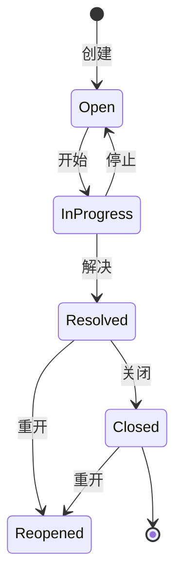

图解：五个默认状态按类别分进三列（Open+Reopened → To Do 列，In Progress → In Progress 列，Resolved+Closed → Done 列）。注意两点：Reopened 是一等状态，重开回到 To Do 类别；Resolved 虽未最终关闭，但已经落在最右列里——Jira 的完成语义挂在列上而不是状态上。

### 1.2 Azure DevOps Boards

**四种内置流程的默认状态**（一手：Microsoft Learn「Workflow and state categories」）：

| 流程 | 工作项 | 默认状态序列 |
|---|---|---|
| Agile | User Story / Bug | **New → Active → Resolved → Closed**（+ Removed） |
| Basic | Issue | **To Do → Doing → Done** |
| Scrum | Product Backlog Item | **New / Approved → Committed → Done**（+ Removed） |
| CMMI | Requirement | **Proposed → Active → Resolved → Closed** |

**State categories（状态类别）**——Azure 最有参考价值的设计：

- **Proposed**：新加状态；出现在 backlog，映射到板第一列（如 New、To Do、Proposed、Approved）。
- **In Progress**：活跃状态；映射到板中间列（如 Active、Doing、Committed）。
- **Resolved**：「states where **a solution is implemented but not yet verified** (commonly for bugs)」——这就是「待验收」中间态的官方定义。Resolved 项默认仍在 backlog、可计入燃尽图，多数工具中行为等同 In Progress。
- **Completed**：完成态；不再出现在 backlog，映射到板最后一列，**每个工作项类型只能有一个状态映射到该类别**。
- **Removed**：用 Removed 状态把条目从 backlog/板上隐藏。
- 系统字段自动维护：进入 In Progress 类别时写 `Activated By/Date`，进入 Resolved 类别时写 `Resolved By/Date`，**回退时自动清空**。
- 来源: [How workflow category states are used in Azure Boards](https://learn.microsoft.com/en-us/azure/devops/boards/work-items/workflow-and-state-categories?view=azure-devops)

**状态机图（Agile 流程主干）**：

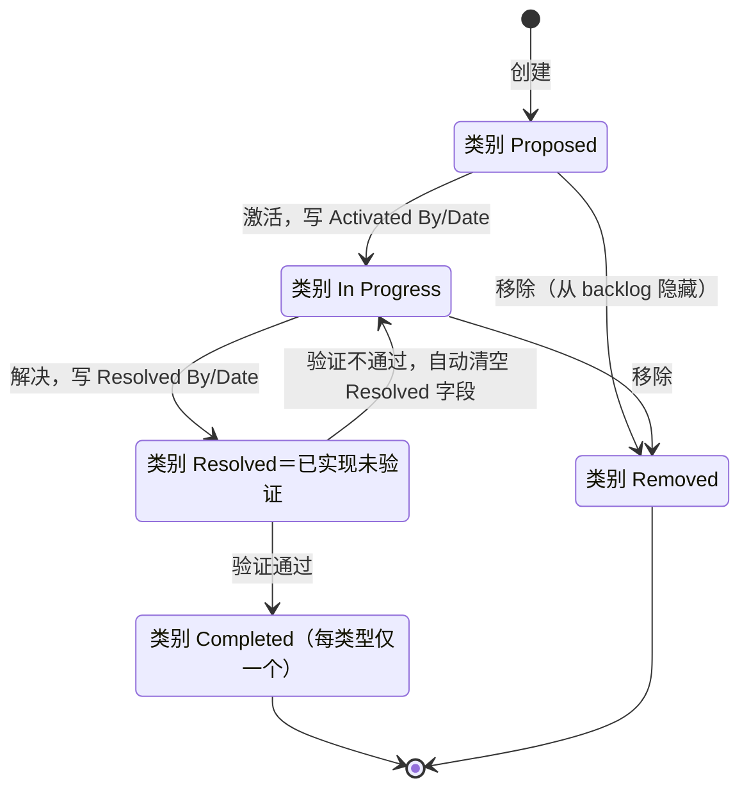

图解：这是「做—交付—验收」语义最完整的一条官方链：Active（做）→ Resolved（已实现未验证）→ Closed（验证通过）。回退边伴随字段自动清空——回退不只是改状态，还撤销「谁解决过」的记录。Basic 流程是它的极简版三态直线 To Do → Doing → Done；Scrum 为 New/Approved → Committed → Done（+Removed）；CMMI 为 Proposed → Active → Resolved → Closed，形状同主干。

### 1.3 GitHub Projects（v2）与 GitHub Issues

**Projects（一手：GitHub Docs）**：

- 内置 **Status 字段**是单选字段（single select）；板视图的列来自列字段——「setting your column field to a 'Status' field or set any other single select or iteration field as the column field」，拖动卡片即写入该字段值。来源: [Customizing the board layout](https://docs.github.com/en/issues/planning-and-tracking-with-projects/customizing-views-in-your-project/customizing-the-board-layout)
- 「The board layout is based on the status field by default」；内置 workflow「Item added to project」可配置为 **Set: Status:Todo**——即新条目默认进 Todo。来源: [Quickstart for Projects](https://docs.github.com/en/issues/planning-and-tracking-with-projects/learning-about-projects/quickstart-for-projects)
- 默认启用的自动化：「When issues or pull requests in your project are closed, their status is set to **Done**」「when pull requests in your project are merged, their status is set to **Done**」。来源: [Using the built-in automations](https://docs.github.com/en/issues/planning-and-tracking-with-projects/automating-your-project/using-the-built-in-automations)
- **草稿项**（draft issue）：「Draft issues are useful to quickly capture ideas」「draft issues exist only in your project」，需要转成真 issue 才有仓库/标签/里程碑——对应「草稿→已发布」的轻量版。按 Status 分组视图中新建条目会自动继承分组值。来源: [Adding items to your project](https://docs.github.com/en/issues/planning-and-tracking-with-projects/managing-items-in-your-project/adding-items-to-your-project)
- 注：GitHub Docs 没有一页单独枚举 Status 字段的默认选项全集；Todo / In Progress / Done 这三个值散见于 quickstart、automations 与过滤语法（`status:todo`、`status:done`）的官方用例中。

**Issues（一手：GitHub REST API 与 Docs）**：

- Issue 本体只有两态：`state: open | closed`；关闭原因放在独立字段 `state_reason`：**completed / reopened / not_planned / duplicate**——「The reason for the state change」。来源: [REST API - Issues](https://docs.github.com/en/rest/issues/issues)
- 这是「状态极少 + 原因字段」的极简范式：完成、不做、重复都是 closed，用 reason 区分；reopen 是从 closed 回 open 的 reason 而非独立状态。关闭时可选择理由（close as completed / not planned）。来源: [Closing an issue](https://docs.github.com/en/issues/tracking-your-work-with-issues/administering-issues/closing-an-issue)

**状态机图（Issues 本体）**：

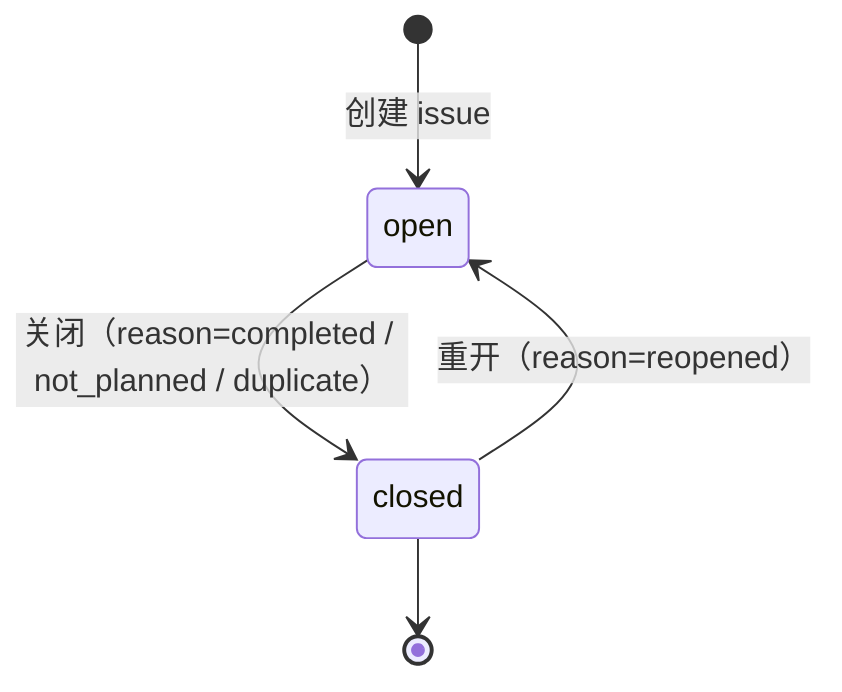

图解：本体只有两态，四种结局全部塞进 closed + reason 字段；统计完成率时应只算 reason=completed。

**状态机图（Projects 的 Status 字段）**：

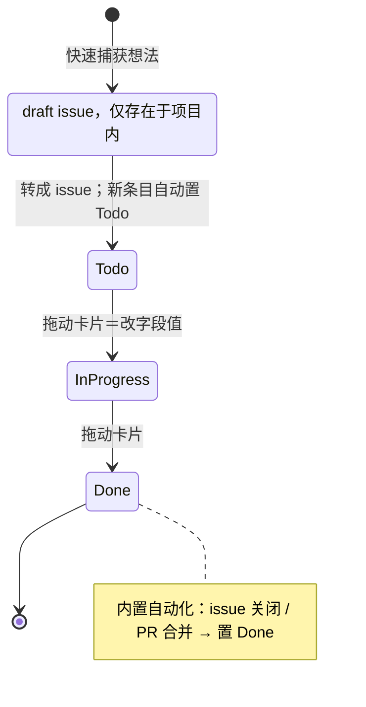

图解：状态被降维成单选字段——列可以换成任意单选/迭代字段，同一批条目换个字段就是另一种视图。draft issue 是「草稿 → 已发布」的轻量版（draft 只存在于项目内，转成 issue 才有仓库/标签/里程碑）；验收环节（In Review）没有内置，需要自建选项。

### 1.4 Trello（Atlassian）

- Trello **没有内置状态概念**：官方文档里列表（list）就是板上的自由容器，卡片在列表间移动、列表可改名/移动/归档，「Changing a list's color to enhance workflow stages or aesthetics」。来源: [Add and customize cards and lists | Trello](https://support.atlassian.com/trello/docs/add-and-customize-cards-and-lists/)
- 官方（母公司 Atlassian）对看板列的实践建议：基础板「To Do / In Progress / Done」，扩展板「'To Do,' 'In Progress,' 'Review,' and 'Done'」，软件团队示例四个 workflow 状态 To Do / In Progress / Code Review / Done 并给 Code Review 设 WIP limit 2；卡片从左到右流动。来源: [Kanban | Atlassian Agile Coach](https://www.atlassian.com/agile/kanban)
- WIP limit 官方指引：「work in progress (WIP) limits set the maximum amount of work that can exist in each status of a workflow」；列超限变红，团队应「swarm around blocking issues」而不是拉新活；Done 列不需要 WIP limit。来源: [WIP limits | Atlassian](https://www.atlassian.com/agile/kanban/wip-limits)
- 诚实说明：Trello 官方 kanban 专页（trello.com/kanban）为纯 JS 渲染，无法引用正文；上面用 Atlassian 官方敏捷教练文档（Atlassian 为 Trello 母公司）+ Trello 支持文档替代。

**状态机图（Atlassian 官方建议的列布局）**：

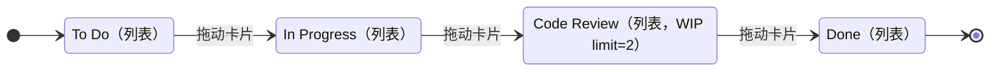

图解：Trello 没有状态机，产品不校验任何流转——图画的其实是 Atlassian 官方建议的列布局，「状态」全靠团队约定。WIP limit 挂在列上，超限变红；Done 列不需要 WIP limit。

### 1.5 GitLab Issue Boards

- 板的列表（列）由**标签/负责人/里程碑/迭代**定义：「display issues as cards in customizable lists based on labels, milestones, or assignees」；最左固定 **Open** 列、最右固定 **Closed** 列，拖到 Closed 即关闭、拖回 Open 即重开；普通标签列只显示 open issues；「Moving an issue between lists removes the label from the list it came from and adds the label」到目标列。GitLab 18.4 起新增真正映射 workflow 状态的 status lists。来源: [Issue boards | GitLab Docs](https://docs.gitlab.com/ee/user/project/issue_board.html)
- 这是「列 = 标签」的建模范型：把 In Progress / In Review 建成互斥标签，而不是状态字段。

**状态机图**：

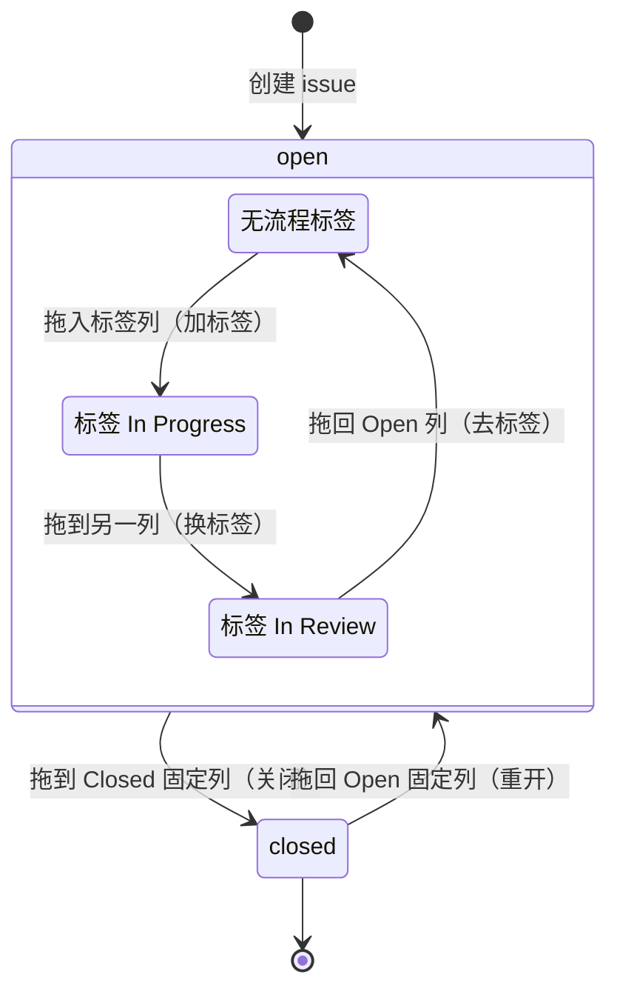

图解：真正的状态只有外层两个（open / closed，对应左右两个固定列）；中间列全是标签——在中间列之间拖动卡片只是换标签，issue 始终停在 open 里。

### 1.6 Kanban University《Kanban Guide》（官方在线版）

一手来源: [The Official Guide to The Kanban Method | Kanban University](https://kanban.university/kanban-guide/)

- **Commitment point（承诺点）**：工作被拉入系统、放弃其他选项的时刻——「Once you decided to enter the motorway, you are "in the system" and the lead time clock starts ticking」。**Lead time「is the time it takes for a single work item to pass through the system from the start (commitment point) to completion」**。
- **Delivery point（交付点）**：板的右端出口——「on the left, new work items enter the board. When they exit on the right, value is delivered to customers」；「In a Kanban system, there is **at least one clear commitment and delivery point** as well as a representation of the permitted amount of work (Work in progress, WIP)」。
- **WIP limit**：「the maximum number of work items allowed at a time, can be defined per work state(s), per person, per lane, per type of work, for a whole Kanban system」；WIP limits 是建立 pull system 的关键（enabling constraint）。
- **列与流程**：「The individual steps in the workflow and buffers are shown in **columns**. **Lanes** are often used for different work types」；并且明确反对过度简化：「Your Kanban board should reflect your specific workflow, which is usually **more than columns labeled as To Do, Doing, Done**」。
- 对任务看板的含义：**认领（claim/accept）就是 commitment point**，验收通过就是 delivery point；两个点都必须是显式、可打时间戳的事件。

**概念模型图**：


图解：概念模型而非产品——指南不定义状态清单，只强制两个显式、可打时间戳的点位：认领进系统（lead time 从这里起算）与验收出系统（价值交付）。

### 1.7 有「认领」语义的平台

#### Amazon Mechanical Turk（一手：AWS 官方 API 文档）

MTurk 把「任务」和「承接」拆成**两个实体、两个状态机**：

- **HIT（任务）** 的 `HITStatus`：**Assignable（可认领）| Unassignable（已无可认领名额）| Reviewable（有待审核的提交）| Reviewing（审核中）| Disposed（已处置）**。注意：没有 "Completed" 这个 HITStatus——任务完成度由 assignment 计数（`NumberofAssignmentsPending/Available/Completed`）和 `Expiration`（`LifetimeInSeconds` 到期后即使名额未满也不再可认领）表达。来源: [HIT data structure](https://docs.aws.amazon.com/AWSMechTurk/latest/AWSMturkAPI/ApiReference_HITDataStructureArticle.html)
- **Assignment（承接）** 的 `AssignmentStatus`：**Submitted（已提交待审）| Approved（通过）| Rejected（拒绝）**；`MaxAssignments` 定义可认领次数；时间戳一应俱全：`AcceptTime`（认领）/`SubmitTime`（提交）/`ApprovalTime`/`RejectionTime`/`Deadline`。来源: [Assignment data structure](https://docs.aws.amazon.com/AWSMechTurk/latest/AWSMturkAPI/ApiReference_AssignmentDataStructureArticle.html)
- **自动验收定时器**：`AutoApprovalDelayInSeconds` =「This is the amount of time the Requester has to reject an assignment submitted by a Worker before the assignment is **auto-approved** and the Worker is paid」——验收超时自动通过是平台内建语义。

**HIT（任务）状态机图**：

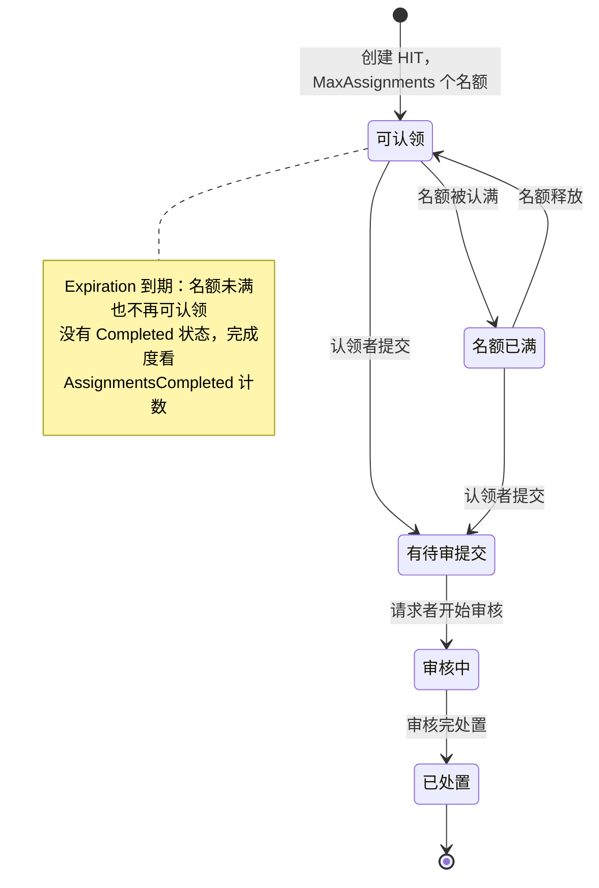

**Assignment（承接）状态机图**：

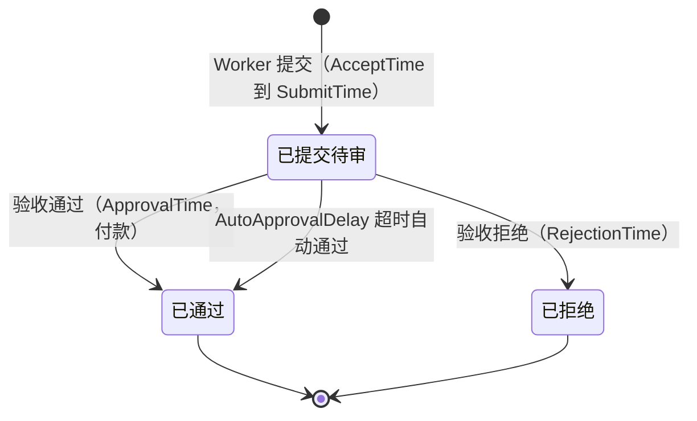

图解：任务（HIT）和承接（Assignment）是两个实体、两个状态机，多人认领同一任务（`MaxAssignments`）天然支持。认领是 Assignment 上的 AcceptTime 事件而不是 HIT 状态；Rejected 是终态（不退回重做，重做靠发新 HIT 或扩名额）；验收超时自动通过并付款。主干流转为示意，HIT 状态间的具体边以 API 行为为准。

#### HOT / OpenStreetMap Tasking Manager（一手：官方源码与文档）

- `ProjectStatus`：**DRAFT / PUBLISHED / ARCHIVED**——项目级的「草稿→发布→归档」。
- `TaskStatus`：**READY（可认领）/ LOCKED_FOR_MAPPING（已被绘图者锁定）/ MAPPED（已绘图待验证）/ LOCKED_FOR_VALIDATION（已被验证者锁定）/ VALIDATED（验证通过）/ INVALIDATED（被打回）/ BADIMAGERY（影像不可用，不可做）/ SPLIT（被拆分）**。
- 认领语义 = **LOCK（锁定）状态 + 锁定者**；退回 = INVALIDATED（记录进专门的 task invalidation history 表）。来源: [tasking-manager/backend/models/postgis/statuses.py（官方仓库源码）](https://github.com/hotosm/tasking-manager/blob/main/backend/models/postgis/statuses.py)、[Database Schema | Tasking Manager Docs](https://hotosm.github.io/tasking-manager/developers/tmschema/)

**项目级状态机图**：

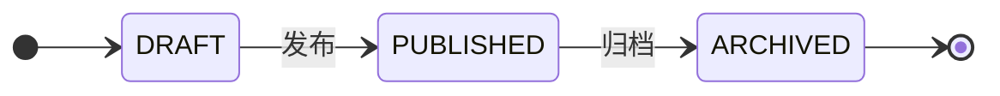

**任务级状态机图（TaskStatus）**：

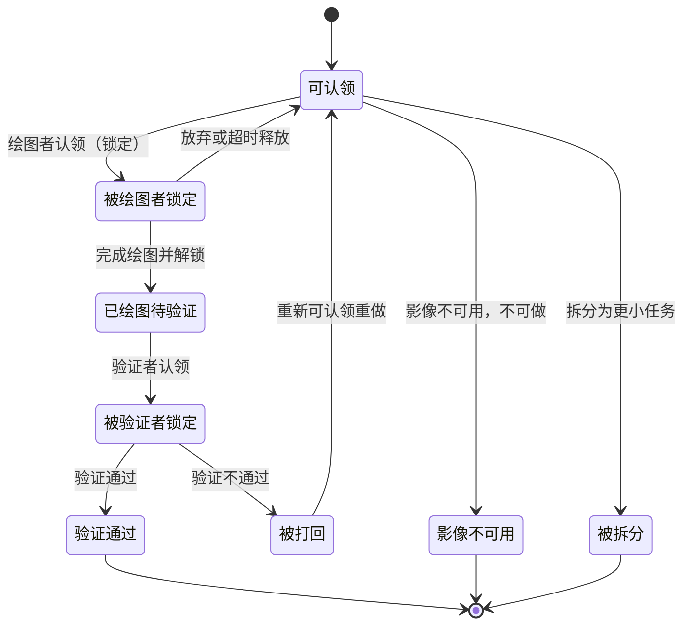

图解：「谁正拿着任务」被直接建进状态机——做和验两个环节各有一把锁（LOCKED_FOR_MAPPING / LOCKED_FOR_VALIDATION）。INVALIDATED 不是终态，打回后回到 READY 可重做，打回历史单独建表审计。状态枚举出自官方源码，主干流转为示意，锁定释放/超时的具体边以源码实现为准。

#### 猪八戒网（一手：平台官方交易规则）

官方《猪八戒平台交易规则》（ZBJ-GZ-20250102 版）给出的链路：**发布需求并托管全额赏金 → 服务商投标 → 雇主选标 → 服务商交付 → 雇主验收 → 支付赏金 → 双方评价**。

- 发布+托管：「雇主发布一个需求并**托管全额赏金**，面向平台上所有服务商征集作品」；平台口号「资金全程托管，验收后付款」。
- 认领（选标）有硬时限：「投标期结束后，雇主需要在 **7 天内**进行选标」。
- 交付：「服务商应在完成工作之后主动将源文件或源代码**交付**给雇主」。
- 验收 + 自动验收：「在所有模式下，雇主验收通过后支付赏金，如果服务商发起验收申请起 **7 天内**，雇主未有任何操作，到期**系统自动验收通过**」「比稿模式下……系统将在 7 天后自动验收通过并支付赏金」。
- 来源: [猪八戒平台交易规则 | rule.zbj.com](https://rule.zbj.com/ruleshow-0?categoryId=278&pid=716)

**状态机图（交易主干）**：

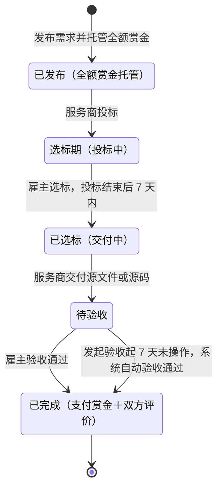

图解：发布与资金托管是同一个动作（「发布需求并托管全额赏金」），这是有真金白银的平台与内部工单最大的差别；认领（选标）有 7 天硬时限；验收超时系统自动通过并付款——与 MTurk 的 AutoApprovalDelay 同构。比稿模式的流标/退款分支见上文引文。

#### 飞书任务（一手：官方帮助中心）

- 走极简路线：任务 = 创建人与负责人 + 勾选框。「如果你是任务的创建人或负责人，你可以**勾选**任务前的复选框来**完成**任务，也可以**取消勾选**来**重启**任务」（即 done/undone 二态 + reopen）。来源: [完成与重启任务](https://www.feishu.cn/hc/zh-CN/articles/206035228614)、[快速上手任务](https://www.feishu.cn/hc/zh-CN/articles/798052212434)
- 局限说明：帮助中心正文为 JS 渲染，以上引文取自文章开头段落（页面元信息），未取到完整状态清单；飞书任务本身不是发布-认领模型，仅作「简单模型 + 认领人字段」的对照。

**状态机图**：

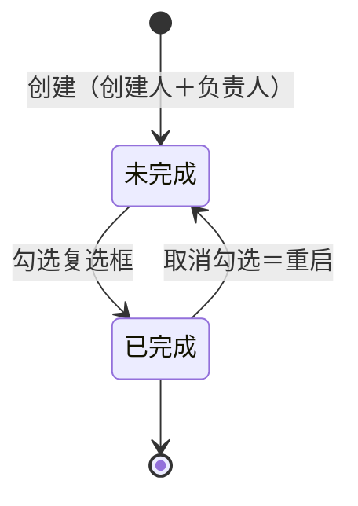

图解：二态勾选模型，认领是负责人字段而非状态；作为「最简模型 + 认领人字段」的对照样本。

#### Multica（一手：官方文档 multica.ai/docs 与 multica-ai/multica 官方源码）

Multica（官网 multica.ai，中文站 multica.xinghuoxiezuo.com 同页；代码开源）是「issue 看板 + agent 执行队列」的**双层状态机**：issue 是工作项层，run 是执行层——「An issue holds the goal, discussion, assignee, and final status of a piece of work; a run records one agent execution against that work」「One issue can span many runs」。来源: [Runs | Multica Docs](https://multica.ai/docs/tasks)、[Issues | Multica Docs](https://multica.ai/docs/issues)

**Issue 层：7 个内置状态 = 7 个类别（category），无固定流转**（一手：官方文档 + 源码 `STATUS_ORDER`）：

| 状态/类别 | 官方定义 |
|---|---|
| `backlog` | Not starting yet——指派 agent 也不建 run，移出 backlog 才触发 |
| `todo` | Scoped and waiting to start——指派 agent 立即入队 |
| `in_progress` | Being worked on |
| `in_review` | Has a result waiting for review（交付待评审） |
| `done` | Finished |
| `blocked` | Cannot continue for now |
| `cancelled` | No longer pursued; the record stays（留档） |

- 「There is **no fixed flow between statuses** — members and agents can change them directly」——不是 Jira 式受控 workflow，而是任意两状态可直接切换的松散看板。
- 状态由谁写：agent 在 run 中通过 CLI 显式写状态——「starting on the issue's own ask moves it to `in_progress` right away, delivery moves it to `in_review`… the server does not flip issue status when a run starts or complete」；「`done` is usually a human confirmation, or an integration such as a PR with close intent that merges」。
- 仅有的两条系统自动流转：「When a run fails, the issue has no other runs, and no retry is triggered, `in_progress` rolls back to `todo`」「When a linked GitHub PR merges with close intent… the issue becomes `done`」。
- 自定义状态挂在 7 类别之下，**类别即行为**（源码注释原话：「The 7 categories map one-to-one onto the 7 built-in statuses… the category is the behavior」）；看板列 = 类别而非状态，同列内自定义状态用小徽章区分。
- 来源: [Issues | Multica Docs](https://multica.ai/docs/issues)、[config/status.ts（官方仓库源码）](https://github.com/multica-ai/multica/blob/main/packages/core/issues/config/status.ts)

**Run 层：8 态执行队列**（一手：官方文档「Execution lifecycle」与「State and timeout quick reference」）：

| 状态 | 官方定义 |
|---|---|
| `deferred` | Scheduled to fire later; enters the queue at the appointed time |
| `queued` | Waiting for a runtime to claim it |
| `dispatched` | A runtime has claimed it and is starting the AI coding tool（超 5 分钟视为 failed） |
| `waiting_local_directory` | The target local directory is held by another run; waiting for the directory lock to release |
| `running` | The AI coding tool is executing |
| `completed` | The run finished normally |
| `failed` | The run errored or was interrupted |
| `cancelled` | The run was stopped manually |

**认领语义 = 「指派 + runtime 队列认领」，不是 agent 抢单**：用户把 issue 指派给 agent 或 squad → Multica 创建 run 入队 →「a runtime claims it」（runtime 是跑在执行机器上的 daemon）。「If the runtime is temporarily offline, the run waits in the queue; **a run is bound to its runtime and never moves to another machine**」。官网首页原话：「Every task flows through **enqueue → claim → start → complete/fail**」。指派给 squad 时 leader 先接、由 leader 决定是否分派成员，且「dispatching members is not delivery — a dispatch turn leaves the parent issue `in_progress`」。来源: [Assign issues to agents | Multica Docs](https://multica.ai/docs/assigning-issues)、[Multica 官网](https://multica.ai)

**失败与重试**（一手：官方文档「Failures and automatic retries」）：瞬态故障（runtime 掉线、daemon 重启、执行超时、网络中断）自动重试，「A regular run executes **at most twice** by default; tool network interruptions get up to three attempts」；agent 侧错误（凭证过期、配额耗尽、配置错误、模型问题）**不自动重试**，修因后手动重试，且「the retry does not switch to the new assignee」——沿用当时处理该 run 的 agent。失败原因建成两套分类码（平台侧 `runtime_offline` / `queued_expired` / `timeout`… 与工具侧 `agent_error.provider_*` 等十余种）。

**Issue 状态机图（自由流转，仅画文档点名的边）**：

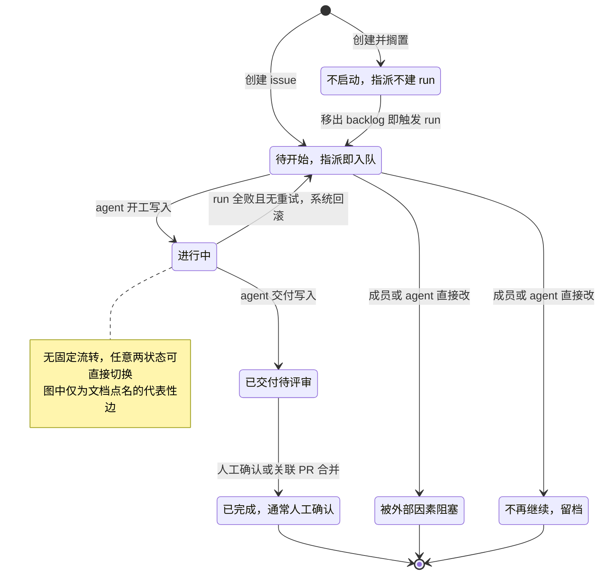

**Run 状态机图**：

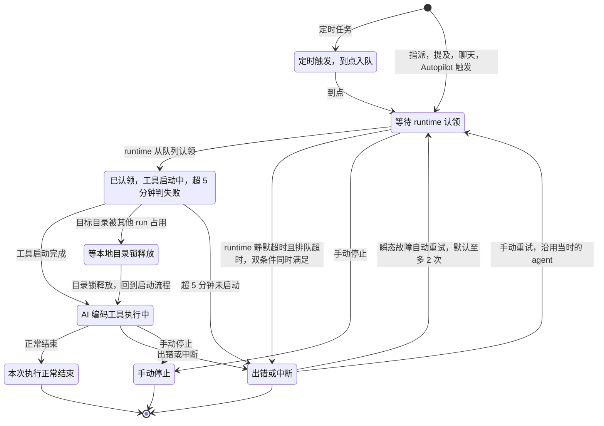

图解：与 Jira/Azure 最大的差别有两点。其一，「状态机」被拆成两层——issue 层是**无固定流转**的 7 类别松散看板（验收中间态 in_review、blocked、cancelled 都是一等类别，而 Jira/Azure 把 blocked 当标签、cancelled 当隐藏态），run 层才是严格排队的执行状态机；两层刻意解耦，「a run completing does not by itself change the issue status」。其二，认领不在 agent 之间发生（无抢单、无 MTurk 式多人承接），而在**机器层**发生——run 绑定 runtime、永不迁移机器，认领语义是「哪台执行机器的 daemon 从队列取走了这个 run」。自动重试是状态机内建语义（瞬态默认 2 次尝试、网络 3 次），与 MTurk「验收超时自动通过」同属「系统兜底」家族，但方向相反——MTurk 兜底的是验收方，Multica 兜底的是执行方。

#### Buzz（一手：block/buzz 官方仓库源码 + Block 官方公告）

Buzz（github.com/block/buzz，Apache 2.0，Block 2026-07 开源）是 Nostr relay 上的协作工作台，人与 agent 同一身份模型（keypair）——README 原话：「every message, reaction, workflow step, review approval, and git event is a signed event in one log」「Agents are members, not bots. Add an agent to a channel the same way you add a person」。来源: [README（官方仓库）](https://github.com/block/buzz/blob/main/README.md)、[Introducing Buzz | Block 官方公告](https://block.xyz/inside/introducing-buzz-where-humans-and-agents-work-together)

**核心结论：工作项层面没有任务状态机。** README 与官方公告均无 task/issue/job 的 pending/running/completed 之类状态概念；issue 跟踪（NIP-34 kind:1621）与 job dispatch（kind:43001-43006「Delegation trees」）在官方 VISION 文档状态表里均标「📋 Designed」未实现。唯一成型的状态机是 **workflow 自动化**（`buzz-workflow` crate，YAML 定义、触发器 message_posted / reaction_added / diff_posted / schedule(cron|interval) / webhook），共三套枚举，全部出自 [crates/buzz-db/src/store/workflow.rs（官方仓库源码）](https://github.com/block/buzz/blob/main/crates/buzz-db/src/store/workflow.rs)：

| 枚举 | 取值（源码注释） |
|---|---|
| `WorkflowStatus`（workflow 定义） | **active**（live and will fire on matching events）/ **disabled**（paused and will not fire）/ **archived**（retired） |
| `RunStatus`（一次 workflow 运行） | **pending**（queued but not yet started）/ **running**（actively executing steps）/ **waiting_approval**（suspended waiting for an approval gate）/ **completed** / **failed**（terminated with an error）/ **cancelled**（cancelled before completion） |
| `ApprovalStatus`（审批请求，子实体） | **pending** / **granted**（the run may proceed）/ **denied**（the run should fail）/ **expired**（the approval window elapsed without a decision） |

**认领语义：不存在 claim/assignment 机制。** 触发后引擎直接创建 run（落库为 pending）并执行——「Transitions the run to `Running` after acquiring a permit」，并发许可满则立即 CapacityExceeded 失败（源码注释：「Fail fast if all concurrency permits are in use — no queuing」，注意这是引擎内存信号量，不是 agent 认领队列）。agent 的「被安排」靠 **@mention 唤醒**：workflow 发消息时把 `@Name` 反解析成成员 pubkey 打上 p tag，被提及的 agent 才被唤醒——是消息驱动，不是任务分派。来源: [executor.rs（官方仓库源码）](https://github.com/block/buzz/blob/main/crates/buzz-workflow/src/executor.rs)、[workflow_sink.rs（官方仓库源码）](https://github.com/block/buzz/blob/main/crates/buzz-relay/src/workflow_sink.rs)

**验收/评审：审批门已定义、未启用（有效的一手结论，非缺资料）。** YAML 里有 `RequestApproval` action（挂起执行请求审批，默认 24h 超时），ApprovalStatus 四态、审批走签名事件（grant kind:46030 / deny kind:46031，desktop 与 buzz-cli 均有 approve/deny 命令）；**但**执行器当前撞上审批门直接置 failed——源码原话：「Approval gates are not yet implemented (WF-08). Fail explicitly rather than creating unreachable WaitingApproval rows」（error_code=`approval_not_supported`）。即 `waiting_approval` 在枚举中存在、当前不可达。README 成熟度表同样标注「Workflow approval gates (infra exists, glue still drying)」。来源: [lib.rs（官方仓库源码）](https://github.com/block/buzz/blob/main/crates/buzz-workflow/src/lib.rs)、[schema.rs（官方仓库源码）](https://github.com/block/buzz/blob/main/crates/buzz-workflow/src/schema.rs)、[buzz-cli commands（官方仓库源码）](https://github.com/block/buzz/blob/main/crates/buzz-cli/src/commands/workflows.rs)

**失败重试：无自动重试机制**；失败建成稳定分类码——migration 原话：「Stable workflow failure classification, kept separate from redacted human diagnostics」（`workflow_runs.error_code` 列，历史数据回填 `legacy_unclassified`）。run 历史存 Postgres 表 `workflow_runs` 而非 Nostr 事件（CLI 源码注释：「Run history is stored in the workflow_runs DB table, not as Nostr events」）；workflow 执行事件（kinds 46001-46012）作为签名事件发布，但被禁止触发其他 workflow（防循环）。来源: [migrations/0031（官方仓库源码）](https://github.com/block/buzz/blob/main/migrations/0031_workflow_run_error_codes.sql)

**Run 状态机图（三枚举中的执行主干）**：

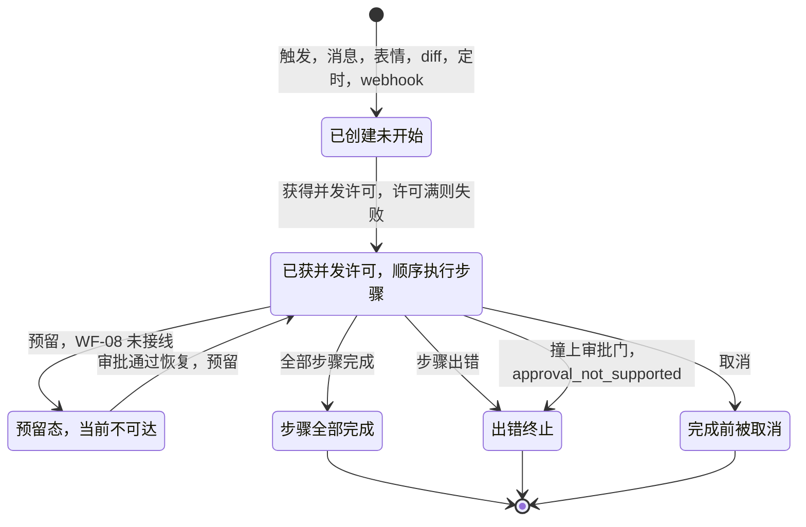

**ApprovalStatus 子状态机**：

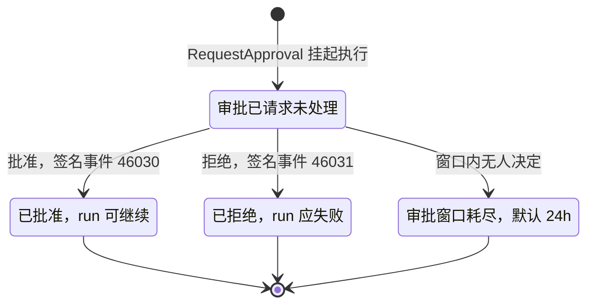

图解：Buzz 是「协作优先、状态机最小化」的样本——它假设协调发生在对话里（channel、@mention、reaction），所以工作项层不建状态机；workflow 自动化层的 run 机比传统 CI 还简（无自动重试、无队列、并发满即失败），唯一超出「运行/完成/失败」的状态是审批门 waiting_approval，而它恰恰是全仓最诚实的「设计了但没接线」的一态。与 MTurk 对照最鲜明：MTurk 把验收（Reviewable/Reviewing/Submitted→Approved）建成平台核心；Buzz 把验收降级为 workflow 步骤间的一个人工确认点（审批门），甚至暂未启用；Multica 则站在两者中间，把验收（in_review）建成 issue 一等类别。三家共同点：**执行失败（failed）都是一等终态、都配稳定错误码**，这是 agent 产品相对传统看板的新增共识。

---

## 2. 「状态（state）」vs「看板列（column）」

| 工具 | 状态是什么 | 列是什么 | 关系 |
|---|---|---|---|
| **Jira** | 站点级实体，workflow 的步骤；必属 To Do / In Progress / Done 三类别 | 板配置：把若干状态映射进一列 | **列是状态的分组视图**；一列可含多状态（如 To Do 列 = Open + Reopened）；未映射状态不上板 |
| **Azure DevOps** | 项目级（process 定义），跨团队共享 | **团队级**板可视化 | 官方明说：「**State**: Project-level workflow logic shared across teams. **Column**: Team-level board visualization.」「Map each workflow state to a column. Unmapped states don't appear on the board.」 |
| **GitHub Projects** | Status 是内置**单选字段** | 列 = 任意单选/迭代字段的值 | 状态被降维成字段；换一个字段当列，同一批条目就是另一种视图 |
| **Trello** | 无内置状态 | 列 = 自由命名的 list | **列即状态**，语义全靠团队约定与自动化 |
| **GitLab** | issue 只有 open/closed | 列 = 标签/负责人/里程碑/迭代 + 固定 Open/Closed 列 | **列 = 查询条件**；拖动 = 换标签 |

设计启示（均有上表一手出处）：**把「状态机」放进数据层、把「列」放进视图层**，是 Jira/Azure/GitHub 三家的共同选择；这样多团队/多视图可以共用一套状态但各摆各的板，且 WIP limit、DoD、拆列等概念可以挂在列上而不污染状态机。

---

## 3. 验收/评审环节的建模（「Resolved 但未 Closed」）

- **中间态命名**：Jira 默认 Resolved（在 Done 列里！），Azure Agile/CMMI 的 Resolved 单独成类别（「implemented but not yet verified」），Atlassian 看板示例的 Review / Code Review 列，GitHub 社区惯例的 In Review，MTurk 的 Reviewable/Reviewing，猪八戒的「待验收」。**共识：交付≠完成，必须有一个「已交付、等验收」的显式状态/列。**
- **谁有权终结**：Azure 的 Completed 类别每类型只能一个状态；Jira 只认最右列为完成。验收通过是唯一的正向出口。
- **列内再拆 Doing/Done**（Azure 特有）：一列可拆成 Doing / Done 两半，表「做完了本阶段但下游还没拉走」——「Split columns help your team implement a pull mechanism」，且 `Board Column Done` 字段可查询。来源: [Manage columns on your board](https://learn.microsoft.com/en-us/azure/devops/boards/boards/add-columns?view=azure-devops)
- **列级 Definition of Done**：Azure 支持给每列写 DoD 文本，鼠标悬停可查——对应 Kanban Guide 的「Make Policies Explicit」（pull criteria 显式化）。
- **自动验收定时器**：MTurk `AutoApprovalDelayInSeconds`（到期自动 Approved 并付款）、猪八戒「发起验收申请起 7 天未操作，系统自动验收通过」。**验收方不响应时系统兜底，是有真金白银的平台的标准做法。**

## 4. 终态、退回与取消

- **正向终态唯一**：Done / Closed / Completed（Azure 限定每类型一个）；语义由「最右列」（Jira）或 Completed 类别（Azure）或 state_reason=completed（GitHub）承载。
- **取消 ≠ 过期**：Azure 有独立 Removed 状态（隐藏条目）；MTurk 用 `LifetimeInSeconds`/`Expiration` 表达「到期未满额即失效」——发布方主动撤回（Cancelled）与无人认领到期（Expired）是两个不同事件，后者还牵涉退款/释放逻辑（猪八戒对比稿模式有整套退款与系统选稿规则）。
- **不做/重复也是终态**：GitHub `state_reason: not_planned / duplicate`——closed 但不是完成；统计完成率时应排除。
- **退回两种**：
  - 交付被拒（验收不通过）：MTurk `Rejected`（终态，计入 worker 信用）、Tasking Manager `INVALIDATED`（回到可重做）、Azure/Jira 无专用状态（走回退 transition）。
  - 完成后重开：Jira 的 **Reopened** 是默认一等状态（默认映射回 To Do 列，灰类别）；GitHub 用 `state_reason: reopened`；Azure 回退时自动清空 Resolved By/Date 字段。
- **回退是显式 transition**：Jira transition 单向，来回需要两条 transition；这保证每次回退都能挂条件/校验/审计。

## 5. 挂起/阻塞（blocked）怎么建模

- **主流做法：不是状态，是标志**。Jira 文档侧证：Blocked/Canceled 作为自定义状态存在时，映射到哪一列会成为坑（不映射到最右列会卡 sprint 完成）——官方没有「Blocked 列/状态」的内置概念，社区做法是标签/旗标。Atlassian WIP limit 文档的说法是「WIP limits make blockers and bottlenecks visible」——阻塞靠 WIP 与在制品堆积暴露，不靠状态。
- **Azure Scrum 的极端做法**：阻塞物是独立工作项类型 **Impediment**（Open 状态，In Progress 类别）——把「被什么阻塞」提升为一等工作项，而不是给原任务加状态。
- **Kanban Guide**：只定义 workflow/columns/WIP，没有 blocked 状态；阻塞属于可视化实践（标注 + 原因 + 日期）。
- **建议**：`blocked: boolean + blocked_reason + blocked_since` 字段或标签，配合卡片上的视觉标记；任务仍留在原状态（通常是 In Progress），恢复时清标志。好处：不污染状态机、可统计阻塞时长、不会出现「进了一个没人管的状态就消失」的黑洞。

---

## 6. 综合建议：任务发布看板的状态机

> 本节是通用建议（面向有认领竞争的平台场景）。本仓库「knowledge/todos/ → task」场景的最终应用结论见同目录 [Conclusion](Conclusion.md)：套用 Multica 双层并裁剪（指派制无 Claimed/Expired/Draft，failed 移入 Run 层）。

结合以上一手资料，对「发布—认领—交付/验收」语义的推荐设计：

**状态全集（9 个，含 3 个终态）**

| 状态 | 对应业界原型 | 关键数据（进入该状态时落库） |
|---|---|---|
| `Draft` 草稿 | Tasking Manager `DRAFT`、GitHub draft issue | — |
| `Published` 已发布/待认领 | Tasking Manager `PUBLISHED`、MTurk `Assignable`、猪八戒「发布需求」 | `published_at`；认领截止/过期时间 |
| `Claimed` 已认领 | MTurk Assignment `AcceptTime`、TM `LOCKED_FOR_MAPPING`、Kanban commitment point | `claimer_id`、`claimed_at`、认领超时 |
| `InProgress` 进行中 | Jira `In Progress`、Azure `Active` | `started_at`（小系统可与 Claimed 合并） |
| `Submitted` 待验收 | Azure `Resolved`、MTurk `Reviewable`、猪八戒「待验收」 | `submitted_at`、交付物链接、自动验收截止 |
| `Completed` 已完成 | Jira `Closed`、Azure `Completed` 类别 | `completed_at`、验收人（唯一正向终态） |
| `Cancelled` 已取消 | Azure `Removed`、发布方撤回 | `cancelled_at`、原因、退款/释放逻辑 |
| `Expired` 已过期 | MTurk `Expiration`、无人认领到期 | `expired_at` |
| （重开）`Reopened` | Jira `Reopened`、GitHub `state_reason:reopened` | 建议做成 Completed→InProgress 的 transition + 计数，而非常驻状态 |

**正交维度（不进状态机）**：`blocked` 标志 + 原因；状态类别（To Do / In Progress / Done 三分组，报表挂类别）；WIP limit 挂在看板列（如「已认领+进行中」合计限 3）；认领可多份（`max_claims`，MTurk `MaxAssignments` 模式）。

**流转图**

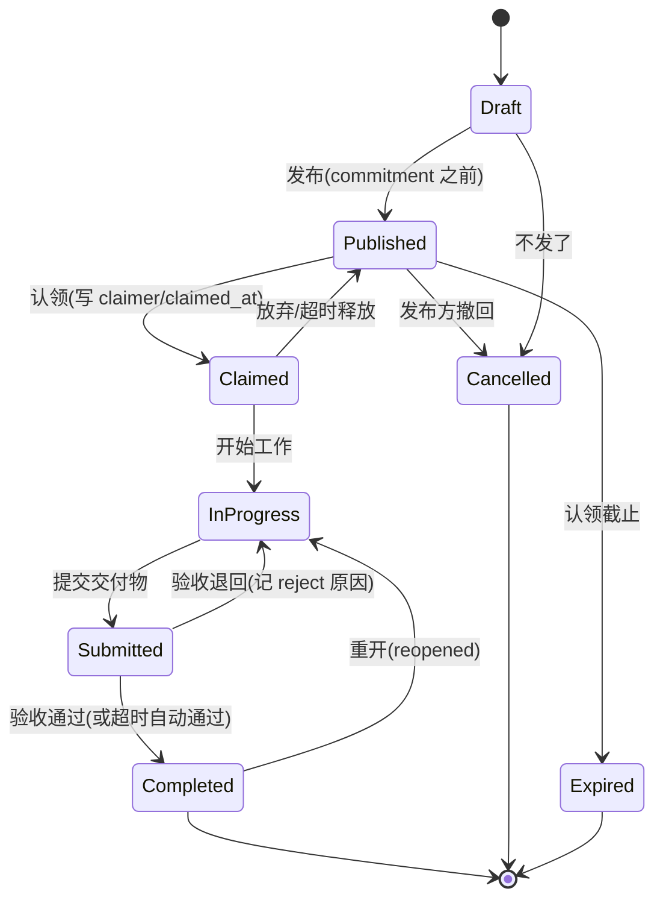

ASCII 版：

```
Draft ──发布──▶ Published ──认领──▶ Claimed ──开始──▶ InProgress ──提交──▶ Submitted ──验收通过──▶ Completed
                 │   ▲                │                    ▲  ▲                 │
                 │   └──── 放弃/超时释放 ┘                  │  └── 验收退回 ──────┘
                 ├── 认领截止/到期 ──▶ Expired            └──── 完成后重开 ─────┘
                 └── 发布方撤回 ──▶ Cancelled        （blocked=标志位，不是状态）
```

**与用户草稿的对照与修正**

| 用户草稿 | 验证结果 | 建议 |
|---|---|---|
| 草稿 → 已发布 | 成立 | 直接对应 TM `DRAFT→PUBLISHED`、GitHub draft issue |
| （缺）已认领 | 需补充 | 认领是 commitment point，需要独立的 claimer/claimed_at；要么加 `Claimed` 状态，要么把认领建成子实体（MTurk Assignment 模式，支持多人认领） |
| 进行中 | 成立 | 即 Jira In Progress / Azure Active |
| 待验收 | 成立且重要 | 即 Resolved / Reviewable；**建议加自动验收定时器**（MTurk、猪八戒都有） |
| 已完成 | 成立 | 保持唯一正向终态（Azure 明文限制） |
| 已取消 | 成立 | 与「已过期」分开建模（MTurk Expiration 语义） |
| 退回 | 成立但应拆分 | 交付被拒（Submitted→InProgress）与完成后重开（Completed→InProgress，Jira Reopened）是两个不同事件 |
| 挂起 | **不建议做成状态** | 业界主流是 blocked 标志/标签/原因字段；Azure 甚至用独立 Impediment 工作项 |

---

## 7. 各产品建模方式全景对照

| 产品 | 建模范式 | 认领怎么建 | 验收中间态 | 退回怎么建 | 终态 |
|---|---|---|---|---|---|
| Jira | workflow 状态机＋三类别，单向 transition | assignee 字段 | Resolved（Done 列内） | Reopened 一等状态 | Closed（最右列语义） |
| Azure DevOps | 状态机＋五类别，字段随流转维护 | assignee 字段 | Resolved 类别 | 回退 transition＋自动清空 Resolved 字段 | Completed 类别（每类型唯一）＋Removed |
| GitHub Issues | 两态＋state_reason 字段 | assignee 字段 | 无（靠 label / PR review） | state_reason=reopened | closed（reason 区分 completed/not_planned/duplicate） |
| GitHub Projects | Status＝单选字段 | 自建选项 | 自建 In Review 选项 | 手动改字段 | Done（自动化：closed/merged→Done） |
| Trello | 无状态机，列即状态 | 卡片成员 | Review 列 | 拖回左列 | Done 列 |
| GitLab | 两态＋标签，列＝标签 | assignee | In Review 标签列 | 拖回 Open 列 | closed |
| Kanban Guide | 概念模型 | commitment point（lead time 起点） | — | — | delivery point |
| Amazon MTurk | 双实体双状态机（HIT＋Assignment） | Assignment AcceptTime，子实体 | Reviewable / Reviewing＋Submitted | Rejected（终态，不重做） | Approved；HIT 侧 Disposed＋Expiration |
| Tasking Manager | 单状态机＋锁定 | LOCKED_FOR_*（状态即锁） | MAPPED | INVALIDATED（可重做，有审计表） | VALIDATED / BADIMAGERY / SPLIT |
| 猪八戒 | 交易流程状态机 | 选标（投标期，7 天时限） | 待验收（7 天自动通过） | 规则见平台原文 | 已完成（支付＋评价） |
| 飞书任务 | 二态勾选 | 负责人字段 | 无 | 取消勾选＝重启 | 已完成 |
| Multica | 双层＝issue 7 类别松散看板（无固定流转）＋run 8 态执行队列 | 指派 agent/squad 建 run 入队；runtime（执行机器 daemon）从队列 claim，run 绑定机器永不迁移 | in_review 类别（agent 交付时写入；run 完成不改 issue 状态） | run 全败且无重试→系统回滚 in_progress 到 todo | issue 侧 done（人工确认/PR 合并）/cancelled；run 侧 completed/failed/cancelled（瞬态自动重试默认 2 次） |
| Buzz | 工作项层无状态机；仅 workflow 自动化有 定义/运行/审批 三套枚举，过程皆为 Nostr 签名事件 | 无 claim 队列；agent 是 channel 成员，@mention（p tag）唤醒；并发许可满即失败不排队 | waiting_approval＋ApprovalStatus 四态（已定义未启用，撞门即 failed，WF-08） | 审批 denied/expired→run failed（设计意图，未接线） | run 侧 completed/failed/cancelled；无自动重试，失败配稳定 error_code |

**读表方法**：范式沿两条轴展开——「重状态机（Jira/Azure）→ 字段化（GitHub）→ 无状态机（Trello/GitLab）」是内部协作工具的轴；「MTurk / Tasking Manager / 猪八戒」是有认领与验收语义的平台轴。做任务发布看板时，状态机骨架参考前一条轴，认领、验收、超时兜底这些关键事件参考后一条轴。

---

## 8. 来源清单

**一手来源（全部论据出自这里）**

1. [Configure board columns | Atlassian Support](https://support.atlassian.com/jira-software-cloud/docs/configure-columns/) — Jira 默认状态/列映射、最右列完成语义、WIP（column constraints）、Kanban 默认列
2. [What is a workflow status? | Atlassian Support](https://support.atlassian.com/jira-cloud-administration/docs/what-is-a-workflow-status/) — 状态=步骤、三个 status category 及颜色
3. [Create workflow transitions | Atlassian Support](https://support.atlassian.com/jira-cloud-administration/docs/create-workflow-transitions/) — transition 单向、可回环
4. [How workflow category states are used in Azure Boards | Microsoft Learn](https://learn.microsoft.com/en-us/azure/devops/boards/work-items/workflow-and-state-categories?view=azure-devops) — 四流程默认状态、Proposed/InProgress/Resolved/Completed/Removed 类别、State vs Column、Activated/Resolved 字段规则
5. [Manage columns on your board | Microsoft Learn](https://learn.microsoft.com/en-us/azure/devops/boards/boards/add-columns?view=azure-devops) — 状态映射列、拆列 Doing/Done、列级 DoD
6. [Quickstart for Projects | GitHub Docs](https://docs.github.com/en/issues/planning-and-tracking-with-projects/learning-about-projects/quickstart-for-projects) — 板布局默认基于 Status 字段、Item added→Status:Todo
7. [Using the built-in automations | GitHub Docs](https://docs.github.com/en/issues/planning-and-tracking-with-projects/automating-your-project/using-the-built-in-automations) — closed/merged→Done 默认自动化
8. [Customizing the board layout | GitHub Docs](https://docs.github.com/en/issues/planning-and-tracking-with-projects/customizing-views-in-your-project/customizing-the-board-layout) — 列字段可为任意单选/迭代字段
9. [Adding items to your project | GitHub Docs](https://docs.github.com/en/issues/planning-and-tracking-with-projects/managing-items-in-your-project/adding-items-to-your-project) — draft issue、分组视图状态继承
10. [REST API — Issues | GitHub Docs](https://docs.github.com/en/rest/issues/issues) — state: open/closed；state_reason: completed/reopened/not_planned/duplicate
11. [Closing an issue | GitHub Docs](https://docs.github.com/en/issues/tracking-your-work-with-issues/administering-issues/closing-an-issue) — 关闭理由
12. [Kanban | Atlassian Agile Coach](https://www.atlassian.com/agile/kanban) — To Do/In Progress/(Review)/Done 列建议、左到右流动
13. [WIP limits | Atlassian](https://www.atlassian.com/agile/kanban/wip-limits) — WIP limit 语义与调优
14. [Add and customize cards and lists | Trello - Atlassian Support](https://support.atlassian.com/trello/docs/add-and-customize-cards-and-lists/) — Trello 列为自由容器
15. [Issue boards | GitLab Docs](https://docs.gitlab.com/ee/user/project/issue_board.html) — 列=标签/固定 Open/Closed 列、18.4 status lists
16. [The Official Guide to The Kanban Method | Kanban University](https://kanban.university/kanban-guide/) — commitment point、delivery point、lead time、WIP limit、列/泳道、To Do/Doing/Done 不够
17. [HIT data structure | AWS Mechanical Turk API](https://docs.aws.amazon.com/AWSMechTurk/latest/AWSMturkAPI/ApiReference_HITDataStructureArticle.html) — HITStatus 枚举、Expiration、AutoApprovalDelay
18. [Assignment data structure | AWS Mechanical Turk API](https://docs.aws.amazon.com/AWSMechTurk/latest/AWSMturkAPI/ApiReference_AssignmentDataStructureArticle.html) — AssignmentStatus 枚举、Accept/Submit/Approve/Reject 时间戳
19. [tasking-manager statuses.py | HOT 官方仓库](https://github.com/hotosm/tasking-manager/blob/main/backend/models/postgis/statuses.py) — TaskStatus / ProjectStatus 枚举
20. [Database Schema | Tasking Manager Docs](https://hotosm.github.io/tasking-manager/developers/tmschema/) — task history / invalidation history
21. [猪八戒平台交易规则 | rule.zbj.com](https://rule.zbj.com/ruleshow-0?categoryId=278&pid=716) — 托管赏金、投标/选标 7 天、交付、验收 7 天自动通过
22. [完成与重启任务 | 飞书帮助中心](https://www.feishu.cn/hc/zh-CN/articles/206035228614) 与 [快速上手任务](https://www.feishu.cn/hc/zh-CN/articles/798052212434) — 勾选完成/取消重启、创建人与负责人
23. [Runs | Multica Docs](https://multica.ai/docs/tasks) — run 8 态生命周期（deferred/queued/dispatched/waiting_local_directory/running/completed/failed/cancelled）、超时表、自动/手动重试规则、两套失败原因分类码
24. [Issues | Multica Docs](https://multica.ai/docs/issues) — 7 内置状态＝7 类别、无固定流转、agent 写状态规则、两条系统自动流转、自定义状态与「看板列=类别」
25. [Assign issues to agents | Multica Docs](https://multica.ai/docs/assigning-issues) — 指派即建 run、runtime claim、run 绑定机器不迁移、squad leader 分派不算交付、--no-start
26. [packages/core/issues/config/status.ts | multica-ai/multica 官方仓库](https://github.com/multica-ai/multica/blob/main/packages/core/issues/config/status.ts) — STATUS_ORDER/STATUS_CONFIG 源码，7 类别与「类别即行为」注释
27. [Multica 官网](https://multica.ai)（中文站 multica.xinghuoxiezuo.com 同页） — 「enqueue → claim → start → complete/fail」、agent 自主改状态
28. [crates/buzz-db/src/store/workflow.rs | block/buzz 官方仓库](https://github.com/block/buzz/blob/main/crates/buzz-db/src/store/workflow.rs) — WorkflowStatus / RunStatus / ApprovalStatus 三枚举及注释
29. [crates/buzz-workflow/src/schema.rs | block/buzz 官方仓库](https://github.com/block/buzz/blob/main/crates/buzz-workflow/src/schema.rs) — 五类触发器、RequestApproval action（默认 24h 超时）
30. [crates/buzz-workflow/src/lib.rs | block/buzz 官方仓库](https://github.com/block/buzz/blob/main/crates/buzz-workflow/src/lib.rs) — finalize_run 单点收口；审批门未实现撞门即 failed（WF-08，approval_not_supported）
31. [crates/buzz-workflow/src/executor.rs | block/buzz 官方仓库](https://github.com/block/buzz/blob/main/crates/buzz-workflow/src/executor.rs) — pending→running 需并发许可、fail-fast 不排队、审批恢复路径
32. [README.md | block/buzz 官方仓库](https://github.com/block/buzz/blob/main/README.md) — 「every … workflow step, review approval … is a signed event in one log」「Agents are members, not bots」、成熟度表「Workflow approval gates (infra exists, glue still drying)」
33. [VISION_PROJECTS.md | block/buzz 官方仓库](https://github.com/block/buzz/blob/main/VISION_PROJECTS.md) — job dispatch（kind:43001-43006「Delegation trees」）与 NIP-34 issues（kind:1621）均标「Designed」未实现
34. [Introducing Buzz | Block 官方公告](https://block.xyz/inside/introducing-buzz-where-humans-and-agents-work-together) — 定位为协作平台（channels/threads/DMs/voice/repos/workflows），无任务状态机表述

**二手来源**：未采用任何二手转述作为论据。

**未取得的计划来源（明确说明）**

- **GitHub Projects Status 字段默认选项的完整枚举页**：官方文档无单独页面罗列；Todo/In Progress/Done 依据 quickstart/自动化/过滤语法的官方用例归纳，classic GraphQL 的 `ProjectColumnPurpose` 枚举页面未能抓取到正文，故未引用。
- **Trello 官方 kanban 专页正文**（trello.com/kanban）：纯 JS 渲染无法抓取，以 Atlassian（母公司）官方敏捷文档 + Trello 支持文档替代。
- **飞书任务完整状态清单**：帮助中心正文 JS 渲染，仅取得文章开头段落原文。
- **Jira Service Management（工单系统）默认状态**：官方文档 URL 变动后未能定位到现行页面，本次未采用；如需工单场景（如 Queued/Waiting for customer）可后续补查。
- **Multica Go 后端（server/）的 run 状态枚举源码**：官方文档（multica.ai/docs/tasks）与前端 TS 源码（packages/core）已交叉一致，本次未逐文件核对 Go 侧定义（后端约 1690 个 Go 文件，run 状态散布于 handler/service 层）。
- **Multica 中文文档引文**：仓库含 tasks.zh.mdx / issues.zh.mdx 等中文版，本次引用以英文版为准，未逐句比对中英差异。
- **Buzz 的 job dispatch 协议（kind:43001-43006）**：官方 VISION 文档仅一行提及「Delegation trees」，docs/nips/ 下无对应 NIP 规格文档（已逐一核对现有 19 个 NIP 文件名），故无从引用其状态定义——按「未实现的设计意图」处理。
- **Buzz 工程博客（engineering.block.xyz/blog/buzz）**：本次仅取得 Block 官方公告（block.xyz/inside）正文，工程博客未逐字引用；其定位论据已由公告与 README 覆盖。
- **Buzz workflow 运行的取消（cancelled）入口**：枚举与「cancelled before completion」注释为一手出处，但触发取消的具体 API/命令路径未在源码中定位到（desktop/CLI 仅见 approve/deny），流转图中 cancelled 边以枚举语义为准。
