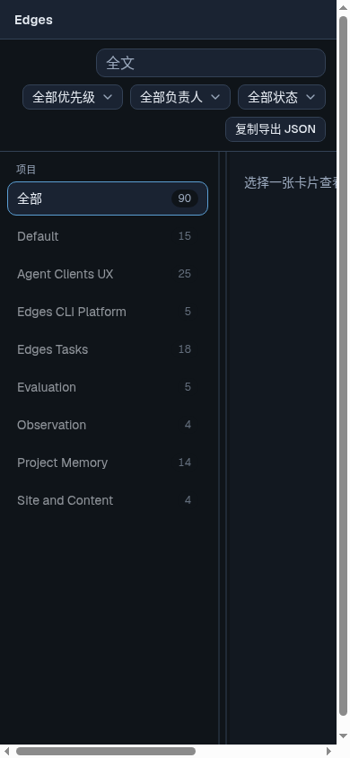
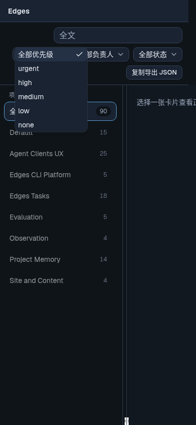
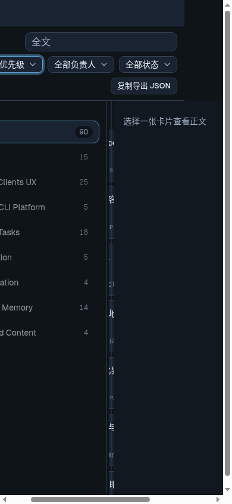
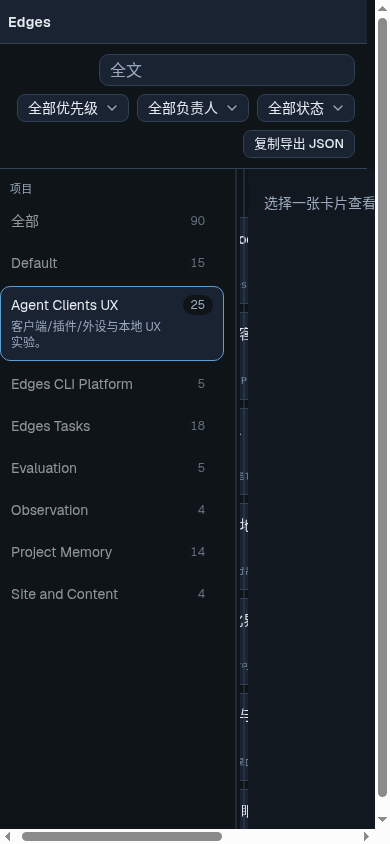

#126（三列审阅壳）已合入 main。桌面可用；Coding 专家在 390×844 手机视口实测不可用——固定三列（约 240px 项目栏 + 状态板 + 380px 详情）横向溢出，中间卡片板几乎看不见，点不开详情；顶栏筛选尚可点。当前实现未做 responsive，与「桌面审阅壳」定位一致。用户只说「记个 task」，未开实现。

**Why:**
手机 / 窄屏需要另开一版可用布局，否则移动端打不开详情、看板几乎不可用。

**How to apply:**
- 另开手机可用布局（抽屉 / 单栏切换等），**不是**微调栏宽
- 派发前默认先 grill-with-docs
- 实现时以本卡截图 + 实机/视口复核为准（临时预览链接可能已过期）

**证据（390×844，Coding 专家 2026-09-24 截于 box）：**

附件目录：`img/2026-09-24--Tasks-审阅壳手机-窄屏适配/`

**关联：**
- 已 done：`done/2026-09-21--review-page-改造三列布局-顶栏-filter`
- 实现 PR：https://github.com/VirusPC/edges/pull/126
- 相关 backlog：`backlog/2026-09-24--Tasks-审阅壳-deploy-分支-GitHub-Actions-预览部署`（本条不改其状态）
